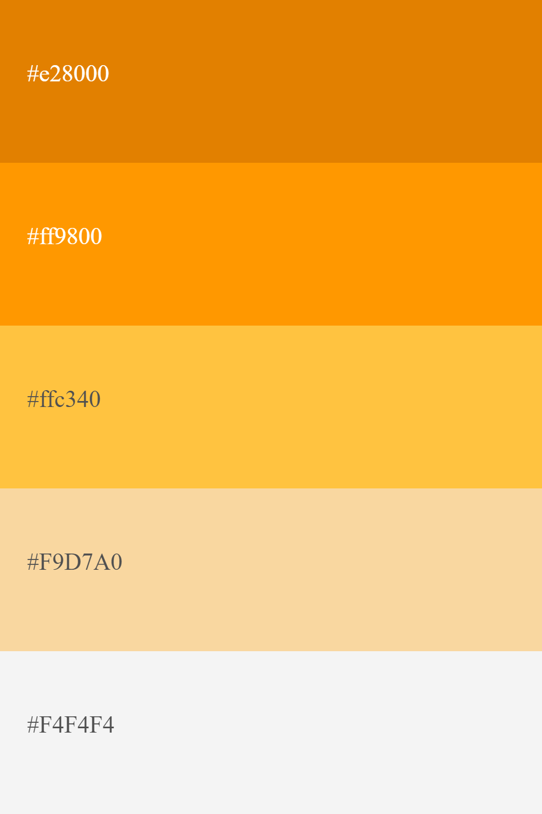

<h3 align="center"> Universidad Peruana de Ciencias Aplicadas </h3>

<h3 align="center"> Ingeniería de Software </h3>
<h3 align="center"> Ciclo 2024 - 1 </h3>

 

  

 

<h1 align="center"> TB1 Report </h1>

<h3 align="center"> Aplicaciones Web - WX53 </h3>

<h3 align="center"> Docente: Alberto Wilmer Sanchez Seña </h3>

<h3> Startup: WebPioneers </h3>

<h3> Product: TakeMyCar</h3>

<h3> Team Members: </h3>

| Member                           |    Code    |
| :------------------------------- | :--------: |
| Chavez Uribe, Ario Joel | U202213468 |
| Cruz Ticona, Aaron Alejandro | U202213502 |
| Oshiro Yamashita, Daiki Oscar | U20201F846 |
| Rivera Ayala, Gabriel Alejandro | U202223279 |
| Zuniga Calle, Sebastian Gabriel | U20221b479 |

<h3 align="center">Agosto, 2024</h3>

  

# Registro de Versiones del Informe

| Versión | Fecha | Autor | Descripción de modificación |
| :-----: | :---: | :---: | :-------------------------- |

  

# Project Report Collaboration Insights

  

# Contenido

## Tabla de Contenidos

### [Registro de versiones del informe](#registro-de-versiones-del-informe)

### [Project Report Collaboration Insights](#project-report-collaboration-insights)

### [Contenido](#contenido)

### [Student Outcome](#student-outcome-1)

### [Capítulo I: Introducción](#capc3adtulo-i-introduccic3b3n-1)

- [1.1. Startup Profile](#11-startup-profile)
  - [1.1.1. Descripción de la Startup](#111-description-de-la-startup)
  - [1.1.2. Perfiles de integrantes del equipo](#112-perfiles-de-integrantes-del-equipo)
- [1.2. Solution Profile](#12-solution-profile)
  - [1.2.1 Antecedentes y problemática](#121-antecedentes-y-problemática)
  - [1.2.2 Lean UX Process](#122-lean-ux-process)
    - [1.2.2.1. Lean UX Problem Statements](#1221-lean-ux-problem-statements)
    - [1.2.2.2. Lean UX Assumptions](#1222-lean-ux-assumptions)
    - [1.2.2.3. Lean UX Hypothesis Statements](#1223-lean-ux-hypothesis-statements)
    - [1.2.2.4. Lean UX Canvas](#1224-lean-ux-canvas)
- [1.3. Segmentos objetivo](#13-segmentos-objetivo)

### [Capítulo II: Requirements Elicitation & Analysis](#capc3adtulo-ii-requirements-elicitation--analysis-1)

- [2.1. Competidores](#21-competidores)
  - [2.1.1. Análisis competitivo](#211-análisis-competitivo)
  - [2.1.2. Estrategias y tácticas frente a competidores](#212-estrategias-y-tácticas-frente-a-competidores)
- [2.2. Entrevistas](#22-entrevistas)
  - [2.2.1. Diseño de entrevistas](#221-diseño-de-entrevistas)
  - [2.2.2. Registro de entrevistas](#222-registro-de-entrevistas)
  - [2.2.3. Análisis de entrevistas](#223-análisis-de-entrevistas)
- [2.3. Needfinding](#23-needfinding)
  - [2.3.1. User Personas](#231-user-personas)
  - [2.3.2. User Task Matrix](#232-user-task-matrix)
  - [2.3.3. User Journey Mapping](#233-user-journey-mapping)
  - [2.3.4. Empathy Mapping](#234-empathy-mapping)
  - [2.3.5. As-is Scenario Mapping](#235-as-is-scenario-mapping)

### [Capítulo III: Requirements Specification](#capc3adtulo-iii-requirements-specification-1)

- [3.1. To-Be Scenario Mapping](#31-to-be-scenario-mapping)
- [3.2. User Stories](#32-user-stories)
- [3.3. Impact Mapping](#33-impact-mapping)
- [3.4. Product Backlog](#34-product-backlog)

### [Capítulo IV: Product Design](#capc3adtulo-iv-product-design-1)

- [4.1. Style Guidelines](#41-style-guidelines)
  - [4.1.1. General Style Guidelines](#411-general-style-guidelines)
  - [4.1.2. Web Style Guidelines](#412-web-style-guidelines)
- [4.2. Information Architecture](#42-information-architecture)
  - [4.2.1. Organization Systems](#421-organization-systems)
  - [4.2.2. Labeling Systems](#422-labeling-systems)
  - [4.2.3. SEO Tags and Meta Tags](#423-seo-tags-and-meta-tags)
  - [4.2.4. Searching Systems](#424-searching-systems)
  - [4.2.5. Navigation Systems](#425-navigation-systems)
- [4.3. Landing Page UI Design](#43-landing-page-ui-design)
  - [4.3.1. Landing Page Wireframe](#431-landing-page-wireframe)
  - [4.3.2. Landing Page Mock-up](#432-landing-page-mock-up)
- [4.4. Web Applications UX/UI Design](#44-web-applications-uxui-design)
  - [4.4.1. Web Applications Wireframes](#441-web-applications-wireframes)
  - [4.4.2. Web Applications Wireflow Diagrams](#442-web-applications-wireflow-diagrams)
  - [4.4.3. Web Applications Mock-ups](#443-web-applications-mock-ups)
  - [4.4.4. Web Applications User Flow Diagrams](#444-web-applications-user-flow-diagrams)
- [4.5. Web Applications Prototyping](#45-web-applications-prototyping)
- [4.6. Domain-Driven Software Architecture](#46-domain-driven-software-architecture)
  - [4.6.1. Software Architecture Context Diagram](#461-software-architecture-context-diagram)
  - [4.6.2. Software Architecture Container Diagrams](#462-software-architecture-container-diagrams)
  - [4.6.3. Software Architecture Components Diagrams](#463-software-architecture-components-diagrams)
- [4.7. Software Object-Oriented Design](#47-software-object-oriented-design)
  - [4.7.1. Class Diagrams](#471-class-diagrams)
  - [4.7.2. Class Dictionary](#472-class-dictionary)
- [4.8. Database Design](#48-database-design)
  - [4.8.1. Database Diagram](#481-database-diagram)

### [Capítulo V: Product Implementation, Validation & Deployment](#capc3adtulo-v-product-implementation-validation--deployment-1)

- [5.1. Software Configuration Management](#51-software-configuration-management)
  - [5.1.1. Software Development Environment Configuration](#511-software-development-environment-configuration)
  - [5.1.2. Source Code Management](#512-source-code-management)
  - [5.1.3. Source Code Style Guide & Conventions](#513-source-code-style-guide--conventions)
  - [5.1.4. Software Deployment Configuration](#514-software-deployment-configuration)
- [5.2. Landing Page, Services & Applications Implementation](#52-landing-page-services--applications-implementation)
  - [5.2.1. Sprint 1](#521-sprint-1)
    - [5.2.1.1. Sprint Planning 1](#5211-sprint-planning-1)
    - [5.2.1.2. Sprint Backlog 1](#5212-sprint-backlog-1)
    - [5.2.1.3. Development Evidence for Sprint Review](#5213-development-evidence-for-sprint-review)
    - [5.2.1.4. Testing Suite Evidence for Sprint Review](#5214-testing-suite-evidence-for-sprint-review)
    - [5.2.1.5. Execution Evidence for Sprint Review](#5215-execution-evidence-for-sprint-review)
    - [5.2.1.6. Services Documentation Evidence for Sprint Review](#5216-services-documentation-evidence-for-sprint-review)
    - [5.2.1.7. Software Deployment Evidence for Sprint Review](#5217-software-deployment-evidence-for-sprint-review)
    - [5.2.1.8. Team Collaboration Insights during Sprint](#5218-team-collaboration-insights-during-sprint)

### [Conclusiones](#conclusiones-1)

- [Conclusiones y recomendaciones](#conclusiones-y-recomendaciones)

### [Bibliografía](#bibliografc3ada-1)

### [Anexos](#anexos-1)

  

# Student Outcome

| Criterio específico                                                                                                                                 | Acciones realizadas | Conclusiones |
| :-------------------------------------------------------------------------------------------------------------------------------------------------- | :------------------ | :----------- |
|  |                     |              |
|  |                     |              |

  

## Capítulo I: Introducción

## 1.1. StartUp Profile

### 1.1.1. Description de la StartUp

### 1.1.2. Perfiles de integrantes del equipo

## 1.2. Solution Profile

### 1.2.1. Antecedentes y problemática

### 1.2.2. Lean UX Process

#### 1.2.2.1. Lean UX Problem Statements

#### 1.2.2.2. Lean UX Assumptions

#### 1.2.2.3. Lean UX Hypothesis Statements

#### 1.2.2.4. Lean UX Canvas

# 1.3. Segmentos Objetivo

  

# Capítulo II: Requirements Elicitation & Analysis

## 2.1. Competidores

### 2.1.1. Análisis competitivo

### 2.1.2. Estrategias y tácticas frente a competidores

## 2.2. Entrevistas

### 2.2.1. Diseño de entrevistas

### 2.2.2. Registro de entrevistas

### 2.2.3. Análisis de entrevistas

## 2.3. Needfinding

### 2.3.1. User Personas

### 2.3.2. User Task Matrix

### 2.3.3. User Journey Mapping

### 2.3.4. Empathy Mapping

### 2.3.5. As-is Scenario Mapping

## 2.4. Ubiquitous Language

  

# Capítulo III: Requirements Specification

## 3.1. To-Be Scenario Mapping

## 3.2. User Stories

## 3.3. Impact Mapping

## 3.4. Product Backlog

  

# Capítulo IV: Product Design

## 4.1. Style Guidelines.

<b>Branding:</b> El logo de nuestra start-up se representa concisamente con el nombre de nuestra aplicación, el servicio que ofreces y una imagen identificable bajo la imagen de un auto, que busca expresar una imagen recordable y fácil de entender. 

  

 

<b>Tipografía:</b> Nuestro logotipo posee la fuente predeterminado, resaltando la sencillez, el cual es la imagen que deseamos dar a nuestros clientes, el cual es un estilo simple, interactivo y moderno. Buscando promover atracción a nuestro público objetivo. Si bien es cierto, vamos a incluir una extensa lista de tipografias para el mejor desarrollo, pero para esta primera versión fue todo desarrollado con el tipo de letra predeterminado.

<b>Colores:</b> El brindar una imagen que influya principalmente la facilidad y confianza. Decidimos optar por una paleta que transmita facilidad y confianza. Por lo que usaremos tonos de xxxxxx que va a variar para usar blanco, el cual es un color bastante útil para lo que a interfaces se refiere. En adición buscamos una forma de que para los usuarios se cree una atmosfera de profesionalismo. 

Paleta de colores:

  

### 4.1.1. General Style Guidelines

Es necesario mencionar que, tanto para la web como para los móviles, utilizaremos la misma tipografía y paleta de colores. Por lo que a continuación voy a especificar las pautas que vamos a implementar exclusivamente para el diseño de la interfaz web de PeaceApp. 

Esto incluye asegurar que, dentro de la interfaz, el mapa interactivo tiene que ser intuitivo y, por ende, con una navegación fácil, administrando bien los colores que reflejen los niveles de seguridad dependiendo de las zonas. La página debe de ser accesible y funcional, en cualquier navegador o sistema operativo que use nuestro cliente. De la misma forma, debemos de mantener la coherencia de la información con el diseño de la versión móvil. 

### 4.1.2. Web Style Guidelines

Es importante destacar que, para la plataforma web, mantendremos una coherencia visual utilizando la misma tipografía y paleta de colores a lo largo de todo el sitio. A continuación, detallaré las pautas específicas que aplicaremos para el diseño del frontend de nuestra plataforma de arrendamiento de vehículos.

Nos enfocaremos en garantizar que la interfaz sea intuitiva, especialmente en la navegación del catálogo de vehículos disponibles, permitiendo a los arrendatarios encontrar fácilmente lo que buscan. Además, se utilizarán colores estratégicos que faciliten la distinción entre tipos de vehículos y sus niveles de disponibilidad. La página debe ser completamente accesible y funcional en cualquier navegador, brindando una experiencia uniforme para todos los usuarios. En adición, el diseño debe ser adaptable para cualquier dispositivo desde el cual se acceda al sitio.

<!---
estaría genial poner imagenes
-->

## 4.2. Information Architecture

En nuestra plataforma TakeMyCar, ofrecemos una interfaz fácil de usar y confiable, centrada en conectar propietarios de vehículos con arrendatarios potenciales. Aunque nuestro enfoque no es la seguridad ciudadana como en el ejemplo anterior, sí nos aseguramos de proporcionar una experiencia sin complicaciones para ambas partes, destacando la facilidad de navegación, acceso rápido a información de los vehículos y un proceso de alquiler eficiente. A continuación, se describe la arquitectura de información planeada.

<b> Página de Inicio: </b>

- Catálogo de Vehículos: Sección que muestra los vehículos disponibles para alquiler, con imágenes, descripciones detalladas, y opciones de filtrado por marca, modelo o tipo de vehículo.

- Formulario de Alquiler: Cada vehículo tiene un formulario de alquiler asociado  que permite a los arrendatarios seleccionar el número de días, seguros adicionales, y opciones extras (como GPS o asistencia en carretera).

- Información sobre la Plataforma: Una breve introducción sobre TakeMyCar, cómo funciona la plataforma, beneficios tanto para propietarios como arrendatarios, y formas de contacto para consultas.

<b> Catálogo de Vehículos: </b>

- Vehículos Disponibles: Los vehículos se organizan en una cuadrícula, cada uno con una imagen destacada, su marca, modelo y una breve descripción de sus características principales.

- Filtros de Búsqueda: Herramientas que permiten filtrar el catálogo según marca, modelo, precio y disponibilidad, facilitando a los usuarios encontrar el vehículo adecuado.

- Formulario de Alquiler Integrado: Cada vehículo tiene un formulario directamente accesible desde el catálogo para alquilarlo de manera rápida y eficiente.

<b> Proceso de Alquiler: </b>

- Formulario de Alquiler Detallado: El formulario de alquiler permite a los arrendatarios especificar los detalles del alquiler, como días de uso, seguro adicional, y otras opciones, ofreciendo una experiencia intuitiva y directa.

- Confirmación del Alquiler: Al finalizar, el usuario visualiza un resumen del alquiler antes de confirmar, asegurando que toda la información proporcionada es correcta.

<b> Registro: </b>

- Registro de Usuarios: Un formulario para que los arrendatarios se registren en la plataforma, proporcionando su información de contacto básica.

### 4.2.1. Organization Systems

El sistema de organización de la plataforma se centra en ofrecer una experiencia fluida y eficiente tanto para propietarios como para arrendatarios, priorizando la facilidad de navegación y la claridad en el proceso de alquiler.

- Catálogo de Vehículos: Categorizado por marca, modelo y tipo de vehículo para facilitar la navegación y selección de vehículos por parte de los usuarios.

- Alquiler de Vehículos: El proceso de alquiler está organizado en pasos claros y sencillos, desde la selección del vehículo hasta la confirmación del alquiler.

- Filtros de Búsqueda: Los usuarios pueden filtrar los vehículos disponibles por precio, modelo, marca y opciones adicionales, asegurando que encuentran lo que buscan de manera rápida.

### 4.2.2. Labeling Systems

Utilizaremos un sistema de etiquetado claro y conciso para asegurar que los usuarios puedan navegar por la plataforma sin complicaciones. Las etiquetas clave incluirán:

- Ver Autos (Catálogo de Vehículos): Para visualizar todos los vehículos disponibles.
- Alquilar (Formulario de Alquiler): Para acceder al proceso de alquiler de cada vehículo.
- Iniciar Sesión/Registro: Para que los usuarios puedan iniciar sesión o registrarse en la plataforma.
- Contacto: Información de contacto para soporte y consultas.

### 4.2.3. SEO Tags and Meta Tags

Los SEO Tagas tanto como los Meta Tags, lo entendemos como las palabras clave necesarias para caracterizar nuestro servicio y con ello, acercarlo a las búsquedas de nuestros usuarios. A continuación mostraremos los SEO Tags y Meta Tags para nuestro mejor posicionamiento:

<b>Landing Page:</b>

- Title: TakeMyCar - Plataforma de Alquiler de Vehículos
- Description: TakeMyCar - Alquila vehículos de manera fácil y rápida con nuestra plataforma. Encuentra el vehículo ideal y disfruta de precios competitivos.
- Keywords: alquiler de vehículos, arrendar auto, rentar carro, plataforma de alquiler de autos
- Authors: TakeMyCar Team

<b>Web Application:</b>

- Title: TakeMyCar - Alquiler de Autos
- Description: TakeMyCar - Plataforma para propietarios y arrendatarios de vehículos.
- Keywords: alquiler de autos, rentar vehículos, plataforma de arrendamiento
- Authors: TakeMyCar Team

### 4.2.4. Searching Systems

El sistema de búsqueda permitirá a los usuarios encontrar vehículos disponibles de manera eficiente:

- Búsqueda por Modelo: Los usuarios pueden buscar vehículos específicos como "Toyota Corolla" o "Ford Mustang".
- Búsqueda por Marca: Permite encontrar todos los vehículos disponibles de una marca en particular.
- Búsqueda por Disponibilidad: Los usuarios pueden filtrar vehículos disponibles por fechas y duración del alquiler.

### 4.2.5. Navigation Systems

El sistema de navegación de TakeMyCar debe ofrecer una experiencia fluida y directa para que los usuarios puedan navegar fácilmente por la plataforma. Se describe de la siguiente forma:

- Menú Principal: Ubicado en la parte superior, con enlaces a las secciones clave: "Ver Autos", "Alquilar", "Registro", "Iniciar Sesión" y "Contacto".
- Botones de Acción Destacados: En el catálogo de vehículos, cada opción de alquiler tiene un botón destacado para iniciar el proceso de reserva de inmediato.
- Filtros y Búsqueda Visibles: Los filtros de búsqueda son visibles y accesibles desde cualquier página, facilitando la búsqueda de vehículos específicos.

## 4.3. Landing Page UI Design

### 4.3.1. Landing Page Wireframe

### 4.3.2. Landing Page Mock-up

Iniciar sesión en la aplicación.:

Uso del menú principal:

Ver autos a alquilar:

Colocar las opciones del alquiler:

Seleccionar pago:

Alquiler exitoso:

Ver registro de alquiler:

Ver sobre la empresa:

Preguntas frecuentes:

Redes sociales:

Contacto:

## 4.4. Web Applications UX/UI Design

### 4.4.1. Web Applications Wireframes

Principios Heurísticos aplicados en los wireframes de TakeMyCar:

#### Visibilidad del estado del sistema:

TakeMyCar utiliza notificaciones visuales claras, como barras de progreso o mensajes de confirmación, para indicar al usuario en qué etapa del proceso de alquiler se encuentra. Las secciones como "Autos disponibles", "Historial de alquileres" o "Pago completado" están claramente diferenciadas con íconos y colores.

#### Coincidencia entre el sistema y el mundo real:

Se utilizan palabras sencillas y términos comunes relacionados con el alquiler de autos para que los usuarios no se sientan abrumados por tecnicismos. Por ejemplo, términos como "Reservar ahora" en lugar de "Procesar transacción" hacen que la interacción sea más amigable.

#### Libertad y control por parte del usuario:

Un menú emergente en la esquina superior izquierda permite al usuario navegar rápidamente entre las secciones clave: “Explorar autos”, “Mis alquileres”, “Soporte” y “Perfil”. El usuario puede regresar fácilmente a la página principal o cancelar acciones sin quedar atrapado en pasos innecesarios.

#### Consistencia y estándares:

El diseño visual sigue una estructura coherente en todo el sistema. Los botones, colores y tipografías son uniformes, garantizando que los usuarios entiendan fácilmente la funcionalidad de los elementos, como el uso de un botón azul para "Reservar" y un botón rojo para "Cancelar".

#### Flexibilidad y eficiencia de uso:

TakeMyCar incluye accesos rápidos en la pantalla principal para acciones frecuentes como “Buscar autos cercanos” y “Mis reservas actuales”. Estos accesos permiten a los usuarios experimentados realizar tareas rápidamente sin pasar por múltiples pantallas.

### 4.4.2. Web Applications Wireflow Diagrams

### 4.4.3. Web Applications Mock-ups

### 4.4.4. Web Applications User Flow Diagrams

## 4.5. Web Applications Prototyping

## 4.6. Domain-Driven Software Architecture

Este enfoque enfatiza la importancia de un análisis exhaustivo del dominio del problema,
permitiendo así construir software que no solo cumpla con los requisitos funcionales,
sino que también se integre de manera óptima en los procesos de negocio.

### 4.6.1. Software Architecture Context Diagram

A través del esquema de contexto, podemos entender cómo TakeMyCar se integra en un ecosistema más amplio,
estableciendo relaciones con los distintos actores que influyen en su funcionamiento.

  

### 4.6.2. Software Architecture Container Diagrams

### 4.6.3. Software Architecture Components Diagrams

## 4.7. Software Object-Oriented Design

### 4.7.1. Class Diagrams

### 4.7.2. Class Dictionary

## 4.8. Database Design

### 4.8.1. Database Diagram

  

# Capítulo V: Product Implementation, Validation & Deployment

## 5.1. Software Configuration Management

### 5.1.1. Software Development Environment Configuration

### 5.1.2. Source Code Management

### 5.1.3. Source Code Style Guide & Conventions

### 5.1.4. Software Deployment Configuration

## 5.2. Landing Page, Services & Applications Implementation

### 5.2.1. Sprint 1

#### 5.2.1.1. Sprint Planning 1

#### 5.2.1.2. Sprint Backlog 1

#### 5.2.1.3. Development Evidence for Sprint Review

#### 5.2.1.4. Testing Suite Evidence for Sprint Review

#### 5.2.1.5. Execution Evidence for Sprint Review

#### 5.2.1.6. Services Documentation Evidence for Sprint Review

#### 5.2.1.7. Software Deployment Evidence for Sprint Review

#### 5.2.1.8. Team Collaboration Insights during Sprint

## 5.3. Validation Interviews 

### 5.3.1. Diseño de Entrrevistas
### 5.3.2. Registro de Entrevistas
### 5.3.3. Evaluaciones según heurísticas

## 5.4. Video About-the-Product

  

# Conclusiones

## Conclusiones y recomendaciones

  

# Bibliografía

  

# Anexos
