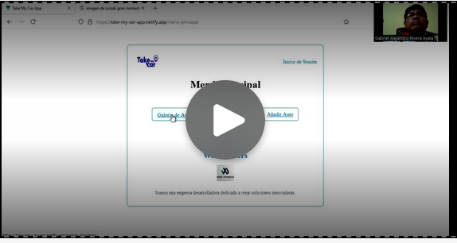

<h3 align="center"> Universidad Peruana de Ciencias Aplicadas </h3>

<h3 align="center"> Ingeniería de Software </h3>
<h3 align="center"> Ciclo 2024 - 1 </h3>

 

  

 

<h1 align="center"> TB1 Report </h1>

<h3 align="center"> Aplicaciones Web - WX53 </h3>

<h3 align="center"> Docente: Alberto Wilmer Sanchez Seña </h3>

<h3> Startup: WebPioneers </h3>

<h3> Product: TakeMyCar</h3>

<h3> Team Members: </h3>

| Member                           |    Code    |
| :------------------------------- | :--------: |
| Chavez Uribe, Ario Joel | U202213468 |
| Cruz Ticona, Aaron Alejandro | U202213502 |
| Oshiro Yamashita, Daiki Oscar | U20201F846 |
| Rivera Ayala, Gabriel Alejandro | U202223279 |
| Zuniga Calle, Sebastian Gabriel | U20221b479 |

<h3 align="center">Agosto, 2024</h3>

  

# Registro de Versiones del Informe

| Versión | Fecha | Autor | Descripción de modificación |
| :-----: | :---: | :---: | :-------------------------- |

  

# Project Report Collaboration Insights

  

# Contenido

## Tabla de Contenidos

### [Registro de versiones del informe](#registro-de-versiones-del-informe)

### [Project Report Collaboration Insights](#project-report-collaboration-insights)

### [Contenido](#contenido)

### [Student Outcome](#student-outcome-1)

### [Capítulo I: Introducción](#capc3adtulo-i-introduccic3b3n-1)

- [1.1. Startup Profile](#11-startup-profile)
  - [1.1.1. Descripción de la Startup](#111-description-de-la-startup)
  - [1.1.2. Perfiles de integrantes del equipo](#112-perfiles-de-integrantes-del-equipo)
- [1.2. Solution Profile](#12-solution-profile)
  - [1.2.1 Antecedentes y problemática](#121-antecedentes-y-problemática)
  - [1.2.2 Lean UX Process](#122-lean-ux-process)
    - [1.2.2.1. Lean UX Problem Statements](#1221-lean-ux-problem-statements)
    - [1.2.2.2. Lean UX Assumptions](#1222-lean-ux-assumptions)
    - [1.2.2.3. Lean UX Hypothesis Statements](#1223-lean-ux-hypothesis-statements)
    - [1.2.2.4. Lean UX Canvas](#1224-lean-ux-canvas)
- [1.3. Segmentos objetivo](#13-segmentos-objetivo)

### [Capítulo II: Requirements Elicitation & Analysis](#capc3adtulo-ii-requirements-elicitation--analysis-1)

- [2.1. Competidores](#21-competidores)
  - [2.1.1. Análisis competitivo](#211-análisis-competitivo)
  - [2.1.2. Estrategias y tácticas frente a competidores](#212-estrategias-y-tácticas-frente-a-competidores)
- [2.2. Entrevistas](#22-entrevistas)
  - [2.2.1. Diseño de entrevistas](#221-diseño-de-entrevistas)
  - [2.2.2. Registro de entrevistas](#222-registro-de-entrevistas)
  - [2.2.3. Análisis de entrevistas](#223-análisis-de-entrevistas)
- [2.3. Needfinding](#23-needfinding)
  - [2.3.1. User Personas](#231-user-personas)
  - [2.3.2. User Task Matrix](#232-user-task-matrix)
  - [2.3.3. User Journey Mapping](#233-user-journey-mapping)
  - [2.3.4. Empathy Mapping](#234-empathy-mapping)
  - [2.3.5. As-is Scenario Mapping](#235-as-is-scenario-mapping)

### [Capítulo III: Requirements Specification](#capc3adtulo-iii-requirements-specification-1)

- [3.1. To-Be Scenario Mapping](#31-to-be-scenario-mapping)
- [3.2. User Stories](#32-user-stories)
- [3.3. Impact Mapping](#33-impact-mapping)
- [3.4. Product Backlog](#34-product-backlog)

### [Capítulo IV: Product Design](#capc3adtulo-iv-product-design-1)

- [4.1. Style Guidelines](#41-style-guidelines)
  - [4.1.1. General Style Guidelines](#411-general-style-guidelines)
  - [4.1.2. Web Style Guidelines](#412-web-style-guidelines)
- [4.2. Information Architecture](#42-information-architecture)
  - [4.2.1. Organization Systems](#421-organization-systems)
  - [4.2.2. Labeling Systems](#422-labeling-systems)
  - [4.2.3. SEO Tags and Meta Tags](#423-seo-tags-and-meta-tags)
  - [4.2.4. Searching Systems](#424-searching-systems)
  - [4.2.5. Navigation Systems](#425-navigation-systems)
- [4.3. Landing Page UI Design](#43-landing-page-ui-design)
  - [4.3.1. Landing Page Wireframe](#431-landing-page-wireframe)
  - [4.3.2. Landing Page Mock-up](#432-landing-page-mock-up)
- [4.4. Web Applications UX/UI Design](#44-web-applications-uxui-design)
  - [4.4.1. Web Applications Wireframes](#441-web-applications-wireframes)
  - [4.4.2. Web Applications Wireflow Diagrams](#442-web-applications-wireflow-diagrams)
  - [4.4.3. Web Applications Mock-ups](#443-web-applications-mock-ups)
  - [4.4.4. Web Applications User Flow Diagrams](#444-web-applications-user-flow-diagrams)
- [4.5. Web Applications Prototyping](#45-web-applications-prototyping)
- [4.6. Domain-Driven Software Architecture](#46-domain-driven-software-architecture)
  - [4.6.1. Software Architecture Context Diagram](#461-software-architecture-context-diagram)
  - [4.6.2. Software Architecture Container Diagrams](#462-software-architecture-container-diagrams)
  - [4.6.3. Software Architecture Components Diagrams](#463-software-architecture-components-diagrams)
- [4.7. Software Object-Oriented Design](#47-software-object-oriented-design)
  - [4.7.1. Class Diagrams](#471-class-diagrams)
  - [4.7.2. Class Dictionary](#472-class-dictionary)
- [4.8. Database Design](#48-database-design)
  - [4.8.1. Database Diagram](#481-database-diagram)

### [Capítulo V: Product Implementation, Validation & Deployment](#capc3adtulo-v-product-implementation-validation--deployment-1)

- [5.1. Software Configuration Management](#51-software-configuration-management)
  - [5.1.1. Software Development Environment Configuration](#511-software-development-environment-configuration)
  - [5.1.2. Source Code Management](#512-source-code-management)
  - [5.1.3. Source Code Style Guide & Conventions](#513-source-code-style-guide--conventions)
  - [5.1.4. Software Deployment Configuration](#514-software-deployment-configuration)
- [5.2. Landing Page, Services & Applications Implementation](#52-landing-page-services--applications-implementation)
  - [5.2.1. Sprint 1](#521-sprint-1)
    - [5.2.1.1. Sprint Planning 1](#5211-sprint-planning-1)
    - [5.2.1.2. Sprint Backlog 1](#5212-sprint-backlog-1)
    - [5.2.1.3. Development Evidence for Sprint Review](#5213-development-evidence-for-sprint-review)
    - [5.2.1.4. Testing Suite Evidence for Sprint Review](#5214-testing-suite-evidence-for-sprint-review)
    - [5.2.1.5. Execution Evidence for Sprint Review](#5215-execution-evidence-for-sprint-review)
    - [5.2.1.6. Services Documentation Evidence for Sprint Review](#5216-services-documentation-evidence-for-sprint-review)
    - [5.2.1.7. Software Deployment Evidence for Sprint Review](#5217-software-deployment-evidence-for-sprint-review)
    - [5.2.1.8. Team Collaboration Insights during Sprint](#5218-team-collaboration-insights-during-sprint)

### [Conclusiones](#conclusiones-1)

- [Conclusiones y recomendaciones](#conclusiones-y-recomendaciones)

### [Bibliografía](#bibliografc3ada-1)

### [Anexos](#anexos-1)

  

# Student Outcome

| Criterio específico                                                                                                                                 | Acciones realizadas | Conclusiones |
| :-------------------------------------------------------------------------------------------------------------------------------------------------- | :------------------ | :----------- |
|  |                     |              |
|  |                     |              |

  

## Capítulo I: Introducción

## 1.1. StartUp Profile

### 1.1.1. Description de la StartUp

### 1.1.2. Perfiles de integrantes del equipo

## 1.2. Solution Profile

### 1.2.1. Antecedentes y problemática

### 1.2.2. Lean UX Process

#### 1.2.2.1. Lean UX Problem Statements

#### 1.2.2.2. Lean UX Assumptions

#### 1.2.2.3. Lean UX Hypothesis Statements

#### 1.2.2.4. Lean UX Canvas

# 1.3. Segmentos Objetivo

  

# Capítulo II: Requirements Elicitation & Analysis

## 2.1. Competidores

### 2.1.1. Análisis competitivo

### 2.1.2. Estrategias y tácticas frente a competidores

## 2.2. Entrevistas

### 2.2.1. Diseño de entrevistas

### 2.2.2. Registro de entrevistas

### 2.2.3. Análisis de entrevistas

## 2.3. Needfinding

### 2.3.1. User Personas

### 2.3.2. User Task Matrix

### 2.3.3. User Journey Mapping

### 2.3.4. Empathy Mapping

### 2.3.5. As-is Scenario Mapping

## 2.4. Ubiquitous Language

  

# Capítulo III: Requirements Specification

## 3.1. To-Be Scenario Mapping

## 3.2. User Stories

## 3.3. Impact Mapping

## 3.4. Product Backlog

  

# Capítulo IV: Product Design

## 4.1. Style Guidelines.

### 4.1.1. General Style Guidelines

### 4.1.2. Web Style Guidelines

## 4.2. Information Architecture

### 4.2.1. Organization Systems

### 4.2.2. Labeling Systems

### 4.2.3. SEO Tags and Meta Tags

### 4.2.4. Searching Systems

### 4.2.5. Navigation Systems

## 4.3. Landing Page UI Design

### 4.3.1. Landing Page Wireframe

### 4.3.2. Landing Page Mock-up

## 4.4. Web Applications UX/UI Design

### 4.4.1. Web Applications Wireframes

### 4.4.2. Web Applications Wireflow Diagrams

### 4.4.3. Web Applications Mock-ups

### 4.4.4. Web Applications User Flow Diagrams

## 4.5. Web Applications Prototyping

## 4.6. Domain-Driven Software Architecture

### 4.6.1. Software Architecture Context Diagram

### 4.6.2. Software Architecture Container Diagrams

### 4.6.3. Software Architecture Components Diagrams

## 4.7. Software Object-Oriented Design

### 4.7.1. Class Diagrams

### 4.7.2. Class Dictionary

## 4.8. Database Design

### 4.8.1. Database Diagram

  

# Capítulo V: Product Implementation, Validation & Deployment

## 5.1. Software Configuration Management

Esta guía define las decisiones y acuerdos fundamentales para el desarrollo, mantenimiento y despliegue de la aplicación Take My Car, que gestiona el alquiler de vehículos. El objetivo es asegurar la coherencia, eficiencia y calidad a lo largo del ciclo de vida del proyecto.

### 5.1.1. Software Development Environment Configuration

<table border="1">

  <tr>
    <td>Project Management</td>
    <td>Microsoft 365 Alojamiento de los videos de entrevistas, explicación de prototipos y otros relacionados al proyecto</td>
  </tr>
  <tr>
    <td></td>
    <td>Whatsapp Red Social destinada a la comunicación donde se realizaron acuerdos y recordatorios de las reuniones.</td>
  </tr>
  <tr>
    <td></td>
    <td>Trello Software de administración y gestión de proyectos que se utilizó para establecer y designar las tareas</td>
  </tr>
  <tr>
    <td>Requirements Management</td>
    <td>Structurizr Structurizr es una herramienta de modelado y documentación que permitió el desarrollo de los diagramas C4</td>
  </tr>
  <tr>
    <td></td>
    <td>LucidChart Herramienta de diseño para el modelado de diagramas UML.</td>
  </tr>
  <tr>
    <td></td>
    <td>Miro Herramienta de diseño para la creación de los As-Is y To-Be Scenario Mapping</td>
  </tr>
  <tr>
    <td>Product UX/UI Design</td>
    <td>Figma Herramienta que se utilizó para la creación de wireframes, mockups y prototipos.</td>
  </tr>
  <tr>
    <td>Software Development</td>
    <td>Git Es un software de control de versiones para los trabajos en equipos y confiabilidad del desarrollo.</td>
  </tr>
  <tr>
    <td></td>
    <td>Node.js Node.js es un entorno de ejecución de JavaScript del lado del servidor, que permite desarrollar aplicaciones web escalables y de alto rendimiento fuera del navegador.</td>
  </tr>
  <tr>
    <td></td>
    <td>GitHub Sistema de control de versiones Git.</td>
  </tr>
  <tr>
    <td></td>
    <td>HTML5 Lenguaje de etiquetas, utilizado para la estructuración y la presentación de contenido.</td>
  </tr>
  <tr>
    <td></td>
    <td>CSS CSS es un lenguaje utilizado para estilizar y dar formato a documentos HTML.</td>
  </tr>
  <tr>
    <td></td>
    <td>JavaScript JavaScript es un lenguaje de programación de alto nivel, interpretado y multi-paradigma, utilizado para crear interactividad en páginas web.</td>
  </tr>
  <tr>
    <td></td>
    <td>VScode Es un editor de código fuente con extensiones que ayudan al desarrollo.</td>
  </tr>
    <tr>
    <td></td>
    <td>WebStorm Es un IDE centrado en el desarrollo frontend, por su variedad de herramientas que agilizan el proceso de desarrollo.</td>
  </tr>
  <tr>
    <td></td>
    <td>Vue.js Framework Framework basado en Single Page Applications para el desarrollo de frontend</td>
  </tr>
  <tr>
    <td>Software Deployment</td>
    <td>Netlify Plataforma que nos permite realizar el despliegue de nuestro landing page.</td>
  </tr>
</table>

### 5.1.2. Source Code Management

Para "Take My Car", utilizaremos el enfoque Gitflow con GitHub para gestionar el desarrollo del proyecto, con la finalidad de implementar correctamente el proyecto con la elaboración del reporte.

GitHub facilitará la colaboración en equipo mediante pull requests para revisar y aprobar cambios, y issues para gestionar tareas y errores. Además, GitHub Pages permitirá la visualización de una versión de ejemplo de la aplicación. Esta estructura garantiza un desarrollo organizado, seguimiento efectivo del progreso y una integración continua de cambios, mejorando la eficiencia y calidad del proyecto.

URL del repositorio del Report en GitHub: [https://github.com/WebPioneers-Grupo-1/Report](https://github.com/WebPioneers-Grupo-1/Report)

URL del repositorio del Landing Page en GitHub: [https://github.com/WebPioneers-Grupo-1/Landing-page](https://github.com/WebPioneers-Grupo-1/Landing-page)

URL del repositorio del FrontEnd en GitHub: [https://github.com/WebPioneers-Grupo-1/frontend](https://github.com/WebPioneers-Grupo-1/frontend)

URL del repositorio del Backend en GitHub: https://github.com/WebPioneers-Grupo-1/backend

### 5.1.3. Source Code Style Guide & Conventions

Para Take My Car, implementaremos una guía de estilo de código y convenciones utilizando HTML y CSS, buscando implementar una interfaz sencilla e interactica.

**HTML**: Lenguaje que hemos utilizado para el desarrollo de nuestra Landing Page. Este lenguaje utiliza etiquetas para marcar y definir el contenido de la página web. Como textos, imagenes, videos, etc.

Convenciones:

- Se tiene que declarar el tipo de archivo en la primera fila de cada documento ("Doctype HTML o Styles CSS").
- Las etiquetas deben de mostrarse en minuscula, ya que es más sencillo identificar y por ende, será más sencillo detectar los contenidos para los desarrolladores.

**CSS**: Lenguaje que se vincula a un proyecto, en este caso, proyecyto html, que nos permite dar estilos a los elementos html. Con este lenguaje se pueden crear diseños web agradables e intuitivos para el usuario, que es lo que buscamos lograr en nuestra Landing Page.

Convenciones:

- Al momento de definir una clase para editar estilos, y esta necesito el uso de más de una pabra, utilizar clases compuestas divididas con guiones: **welcome-section**
- Usar la unidad de medida rem para mantener un diseño responsive: **1rem**

### 5.1.4. Software Deployment Configuration

Para el despliegue de nuestro Landing Page, usamos las siguientes herramientas.

- **Git**: Para realizar el manejo de las versiones del proyecto.
- **GitHub**: Dentro de la plataforma tenemos un repositorio, lo usamos para almacenar todo el proyecto con sus respectivas versiones.
- **GitFlow**: Esto permite visualizar y controlar el flujo de trabajo hecho por el equipo de desarrollo.
- **Netlify**: Nos permite desplegar nuestro Landing Page bajo el dominio de "netlify.app".

A continuación, guía inicial de como desplegamos nuestra interfaz, cabe mencionar que ya debemos de tener nuestro Landing Page dentro de un repositorio en nuestra organización:

<b>1. Registramos en Netlify</b>

<b>2. Importamos desde Git nuestro repositorio</b>

<b>3. Seguir los pasos y desplegar la Landing Page</b>

Estas convenciones nos ayudan a mantener el código organizado, legible y coherente a lo largo del proyecto.

- US01:

- US02:

- US03:

- US04:

- US05:

- US06:

- US07:

- US08:

- US09:

- US010:

- US11:

- US12:

- US13:

- US014:

- US15:

## 5.2. Landing Page, Services & Applications Implementation

### 5.2.1. Sprint 1

#### 5.2.1.1. Sprint Planning 1

<table align="center"  border="1" width="90%" style="text-align:center;">
    <tr align="left">
        <td>
            <b>Sprint #</b>
        </td>
        <td>
            <b>Sprint 1</b>           
        </td>
    </tr>
    <tr align="left">
        <td colspan="2">
            <b>Sprint Planning Background</b>
        </td>
    </tr>
    <tr align="left">
        <td>
            <b>Date</b>
        </td>
        <td>
            23/09/24         
        </td>
    </tr>
       <tr align="left">
        <td>
            <b>Time</b>
        </td>
        <td>
            10:00         
        </td>
    </tr>
       <tr align="left">
        <td>
            <b>Location</b>
        </td>
        <td>
            Modalidad Remota por Whatsapp  
        </td>
    </tr>
     </tr>
       <tr align="left">
        <td>
            <b>Prepared By</b>
        </td>
        <td>
            Integrantes Web Pioneers    
        </td>
    </tr>
    </tr>
       <tr align="left">
        <td>
            <b>Attendess (to planning meeting)</b>
        </td>
        <td>
            - Chavez Uribe, Ario Joel	 
            - Cruz Ticona, Aaron Alejandro  
            - Oshiro Yamashita, Daiki Oscar  
            - Rivera Ayala, Gabriel Alejandro  
            - Zuniga Calle, Sebastian Gabriel  
        </td>
    </tr>
    </tr>
       <tr align="left">
        <td>
            <b>Sprint n - 1</b>
            <b>Review Summary</b>
        </td>
        <td>
            No existe un sprint anterior para realizar el review, siendo este el primer sprint a desarrollar.  
        </td>
    </tr>
    <tr align="left">
        <td>
            <b>Sprint n - 1</b>
            <b>Retrospective Summary</b>
        </td>
        <td>
          No existe un sprint anterior para realizar una retrospectiva. Sin embargo en base a lo avanzado debemos considerar prioridad en el buen desarrollo de las User Stories y el Product Backlog.
        </td>
    </tr>
    <tr align="left">
        <td colspan="2">
            <b>Sprint Goal & User Stories</b>
        </td>
    </tr>
      <tr align="left">
        <td>
            <b>Sprint 1 Velocity</b>
        </td>
        <td>
            6
        </td>
    </tr>
       <tr align="left">
        <td>
            <b>Sum of Story Points</b>
        </td>
        <td>
            6
        </td>
  </tr>
</table>
 

#### 5.2.1.2. Sprint Backlog 1

 

<table align="center" border="1" width="90%" style="text-align:center">
    <tr>
       <td colspan="1"><b>Sprint #</b></td>
       <td colspan="7"><b>Sprint 1</b></td>
     </tr>
     <tr>
       <td colspan="2"><b>User Story</b></td>
       <td colspan="6"><b>Work-Item / Task</b></td>
     </tr>
     <tr>
       <td><b>Id</b></td>
       <td><b>Title</b></td>
       <td><b>Id</b></td>
       <td><b>Title</b></td>
       <td><b>Description</b></td>
       <td><b>Estimation(Hours)</b></td>
       <td><b>Assigned To</b></td>
       <td><b>Status(To-do/ In-Process/ To-Review/ Done)</b></td>
     </tr>
     <tr>
       <td rowspan="2">HU15</td>
       <td rowspan="2">Visualizar página informativa</td>
       <td>T01</td>
       <td>Estructura de la landing</td>
       <td>Programar el landing page comenzando por el HTML </td>
       <td>0.1</td>
       <td>Aaron Cruz</td>
       <td>Done</td>
    </tr>
    <tr>
       <td>T02</td>
       <td>Agregar CSS styles</td>
       <td>Asignar stilos generales para la página</td>
       <td>0.1</td>
       <td>Aaron Cruz</td>
       <td>Done</td>
    </tr>
       <td rowspan="2">HU17</td>
       <td rowspan="2">Landing Page intuitiva</td>
       <td>T10</td>
       <td>Estructura Navbar</td>
       <td>Crear HTML del navbar con direccionamiento a secciones</td>
       <td>0.5</td>
       <td>Aaron Cruz</td>
       <td>Done</td>
    </tr>
    <tr>
       <td>T11</td>
       <td>Estilos Navbar</td>
       <td>Asignar stilos al navbar</td>
       <td>0.5</td>
       <td>Aaron Cruz</td>
       <td>Done</td>
    </tr>
    <tr>
       <td rowspan="2">HU18</td>
       <td rowspan="2">Landing Page responsiva</td>
       <td>T12</td>
       <td>Main responsive</td>
       <td>Agregar CSS media queries a las diferentes secciones del main</td>
       <td>1.0</td>
       <td>Aaron Cruz</td>
       <td>Done</td>
    </tr>
    <tr>
       <td>T13</td>
       <td>Navbar responsive</td>
       <td>Agregar CSS media queries al navbar</td>
       <td>0.5</td>
       <td>Aaron Cruz</td>
       <td>Done</td>
    </tr>
</table>

#### 5.2.1.3. Development Evidence for Sprint Review

A continuación, se muestran los commits realizados en el repositorio para el Landing Page, en el cual se puede observar el trabajo realizado por cada integrante del equipo.

Repositorio de la Landing Page en GitHub: <a href="https://github.com/WebPioneers-Grupo-1/Landing-page">Enlace</a>

<table  align="left" border="1" width="100%">
    <tr>
        <th>Repository</th>
        <th>Branch</th>
        <th>Commit ID</th>
        <th>Author</th>
        <th>Message</th>
        <th>Time ago</th>
    </tr>
    <tr>
        <td rowspan=19>Landing Page</td>
        <td>main</td>
        <td>2044326934c4ac531428e1ba263b580d4f04b357</td>
        <td>Aaron Cruz</td>
        <td>Initial commit</td>
        <td>23/09/2024</td>
    </tr>
    <tr>
        <td>main</td>
        <td>35caf4950655a69409e33e9c4cc2417cf8f04d8e</td>
        <td>Aaron Cruz</td>
        <td>feat: add images, initial html and css files</td>
        <td>23/09/2024</td>
    </tr>
    <tr>
        <td>main</td>
        <td>77eec4831eee43035c2e934c52876fb82d4bab25</td>
        <td>Aaron Cruz</td>
        <td>feat: add html seccions and info</td>
        <td>23/09/2024</td>
    </tr>
    <tr>
        <td>main</td>
        <td>65c1ef1b4a900fefc3a6bb74c9838a2046c9c6da</td>
        <td>Aaron Cruz</td>
        <td>feat: add css styles</td>
        <td>23/09/2024</td>
    </tr>
    <tr>
        <td>main</td>
        <td>29a54826598cbb8dfcf651e0412040b8c3a4c796</td>
        <td>Aaron Cruz</td>
        <td>fix: footer links</td>
        <td>23/09/2024</td>
    </tr>
    <tr>
        <td>main</td>
        <td>f12100f51b13bf008ea673365198ed67b098add4</td>
        <td>Aaron Cruz</td>
        <td>ffeat: add favicon logo</td>
        <td>23/09/2024</td>
    </tr>
    
</table>
  

#### 5.2.1.4. Testing Suite Evidence for Sprint Review

Al ser el primer sprint, y solo haber desarrollado el Landing Page no creemo necesario realizar testing de una Landing Page. Por lo que en la sección a continuación se muestra el Landing ya desplegado.

#### 5.2.1.5. Execution Evidence for Sprint Review

Tras el desarrolo de la Landing Page en el Sprint 1, obtuvimos el siguiente resultado:

<b>Seccion Inicio</b>

    

<b>Seccion ¿Que Ofrecemos?</b>

    

<b>Seccion Nosotros</b>

    

<b>Seccion Contactanos</b>

    

#### 5.2.1.6. Services Documentation Evidence for Sprint Review

En el Sprint 1, se ha desplegado el Landing Page, usando Netlify bajo el dominio ".netlify.app" de forma gratuita. Y se puede visualizar bajo el siguiente link: <a href="https://takemycar.netlify.app">Landing page</a>

#### 5.2.1.7. Software Deployment Evidence for Sprint Review

Para el desarrollo de la Landing page, se utilizaron las siguientes tecnologías:

- HTML: Lenguaje base para la creación de la estructura de una página web. 
- CSS: Lenguaje de estilo para darle forma y diseño a las páginas web.
- Git: Sistema de control de versiones para gestionar el desarrollo de software.
- GitHub: Plataforma online para alojar repositorios Git. 

Asimismo, para el despliegue de la página, se utilizó el servicio de Netlify.

#### 5.2.1.8. Team Collaboration Insights during Sprint
Para llevar a cabo este proyecto se usaron distintas herramientas como Visual Studio Code; junto con manejo de versiones en Git. En este caso se dividio la landing page mostrada anteriormente en sectores, a partir de esto cada uno presentó su parte y luego un miembro juntó las partes para finalmente tener el resultado deseado.

### 5.2.2. Sprint 2

#### 5.2.2.1. Sprint Planning 2

<table>
  <tr>
    <th> Sprint # </th>
    <th> Sprint 2 </th>
  </tr>
  <tr>
    <td style="font-weight: bold;" colspan="2"> Sprint Planning Background </td>
  </tr>
  <tr>
    <td style="font-weight: bold;"> Date </td>
    <td> 26/09/2024 </td>
  </tr>
  <tr>
    <td style="font-weight: bold;"> Time </td>
    <td> 23:00 horas (GMT-5) </td>
  </tr>
  <tr>
    <td style="font-weight: bold;"> Location </td>
    <td> Virtual (Google Meet) </td>
  </tr>
  <tr>
    <td style="font-weight: bold;"> Prepared By </td>
    <td> Cruz Ticona, Aaron Alejandro </td>
  </tr>
  <tr>
    <td style="font-weight: bold;"> Attendees (to planning meeting) </td>
    <td>
      Cruz Ticona, Aaron Alejandro 
      Chavez Uribe, Ario Joel 
      Oshiro Yamashita, Daiki Oscar 
      Rivera Ayala, Gabriel Alejandro 
      Zuniga Calle, Sebastian Gabriel
    </td>
  </tr>
  <tr>
    <td style="font-weight: bold;"> Sprint 2 Review Summary </td>
    <td> Este sprint estuvo enfocado en el desarrollo del front-end y la implementación básica de la web app de TakeMyCar. Las funcionalidades claves de la landing page fueron completadas, permitiendo que los usuarios exploren el servicio. Las secciones desarrolladas incluyen el diseño de la barra de navegación, La selección de un vehículo y registro del mismo. </td>
  </tr>
  <tr>
    <td style="font-weight: bold;"> Sprint 2 Retrospective Summary </td>
    <td> Aunque fue un sprint de desarrollo, el equipo identificó algunas áreas de mejora en la comunicación durante el proceso de implementación. La retroalimentación se centró en ajustar los tiempos de reunión y mejorar la distribución de tareas en el equipo. Se propuso mayor enfoque en la planificación de tareas individuales para evitar cuellos de botella. </td>
  </tr>
  <tr>
    <td style="font-weight: bold;" colspan="2"> Sprint Goal & User Stories </td>
  </tr>
  <tr>
    <td style="font-weight: bold;"> Sprint 2 Goal </td>
    <td> El objetivo de este sprint es desarrollar e implementar el front-end de la aplicación web, permitiendo a los usuarios navegar de manera intuitiva y explorar las principales características de TakeMyCar. Se busca tener una Landing Page completamente funcional que muestre los beneficios del servicio. </td>
  </tr>
  <tr>
    <td style="font-weight: bold;"> Sprint 2 Velocity </td>
    <td> <strong>8 </strong>  El equipo ha establecido una capacidad de 8 Story Points para este Sprint, tomando en cuenta el alcance del desarrollo del front-end y la carga estimada de trabajo. </td>
  </tr>
  <tr>
    <td style="font-weight: bold;"> Sum of Story Points </td>
    <td> 8 </td>
  </tr>
</table>

#### 5.2.2.2. Sprint Backlog 2

| id   | Title                  | Id  | Title                                                    | Description                                                                                                   | Estimations(Hours) | Assigned To   | Status(To-do /InProcess/ToReview/Done) |
| ---- | ---------------------- | --- | -------------------------------------------------------- | ------------------------------------------------------------------------------------------------------------- | ------------------ | ------------- | -------------------------------------- |
| HU06 | Publicar un vehículo para alquiler  | TS01 | Componente de Publicación de un vehículo para alquiler	 | Implementación de la funcionalidad para publicar el vehículo del propietario. | 3 | Daiki | Done                                   |
| HU07 | Buscar vehículos disponibles   | TS02 | Implementación de la Búsqueda de vehículos disponibles  	 | Creación de la Búsqueda de vehiculos, permitiendo un acceso a diferentes opciones en base a disponibilidad. | 5               | Aaron   | Done                          |
| HU13 | 	Ver historial de alquileres | TS03 | Implementación de historial de alquileres	| Implementación de historial respecto a la entrega del vehículo | 5 | José  | Done
| HU11 | 	Calcular tarifas de alquiler  | TS04 | 	Desarrollo del cálculo respecto a las tarifas de alquiler | Creación del método de disponibilidad de un vehículo. | 12   | Daiki | Done                                   |

En este sprint se implementaron funcionalidades clave como la realización de ingresoa la aplicación, opciones básicas de interacción como búsqueda, selección y entrega del vehículo, mantenemos un enfoque de facilidad para el usuario, de modo que no le tome mucho tiempo realizar dichas operaciones.

#### 5.2.2.3. Development Evidence for Sprint Review

| Repository | Branch | Commit Id | Commit  Message | Commit  Message Body | Commited  on (Date) |
|:-------------:|:---------------:|:-------------:|:-------------:|:---------------:|:-------------:|
| [TakeMyCar   FrontEnd](https://take-my-car-app.netlify.app/) | main | 888051d | initial commit |  | 23/09/2024 |
| FrontEnd | main | 3a26b2c | Updated InicioSesion | 93f6427 | 23/09/2024 |
| FrontEnd | main | 3a26b2c | Updated README   | 696f064 | 23/09/2024 |
| FrontEnd | main | 3a26b2c | Updated RegistroSesion   | 2af556c | 23/09/2024 |

#### 5.2.2.4. Testing Suite Evidence for Sprint Review
Durante este sprint, hemos llevado a cabo las pruebas de aceptación utilizando la herramienta Gherkin. Puedes encontrar los escenarios de estas pruebas dando click aqui: [https://github.com/WebPioneers-Grupo-1/TakeMyCar-Acceptance-Tests](https://github.com/WebPioneers-Grupo-1/TakeMyCar-Acceptance-Tests)

| Repository | Branch | Commit Id | Commit  Message | Commit  Message Body | Commited  on (Date) |
|:-------------:|:---------------:|:-------------:|:-------------:|:---------------:|:-------------:|
| TakeMyCar   Acceptance Tests | main | 4bbda94 | Initial commit |  | 30/10/2024 |
| TakeMyCar | main | 66c33e5 | feat: added acceptance tests |  | 30/10/2024 |
| TakeMyCar  | main | 91e4297 | feat: added images |  | 30/10/2024 |

#### 5.2.2.5. Execution Evidence for Sprint Review
En esta entrega, el equipo TakeMyCar ha logrado completar parcialmente la creación y el deployment de el FrontEnd de la Aplicación Web.

Enlace del deployment del FrontEnd: [https://snazzy-mooncake-161ed9.netlify.app/)

Registro de nuevo usuario:

  

Ingreso a la Galeria de Autos:

  

Visualización del auto que el usuario alquiló:

  

Cancelar el alquiler:

  

Añadir nuevo auto a la Galeria:

  

Visualización del nuevo auto en la Galeria:

  

#### 5.2.2.6. Services Documentation Evidence for Sprint Review
En el alcance del sprint 2, se ha dado prioridad al desarrollo del frontend de la aplicación web, lo que significa que en este sprint no se observa la utilización de servicios web.

  

#### 5.2.2.7. Software Deployment Evidence for Sprint Review
Durante este sprint, se ha completado el desarrollo del frontend de la aplicación web. Para el despliegue, se utilizaron las siguientes herramientas y servicios:

Git: Sistema de control de versiones que utilizamos para trabajar de forma colaborativa y monitorear las versiones de la aplicación web en un repositorio remoto.
Gitflow: Este flujo de trabajo colaborativo nos ha permitido dividir el trabajo en ramas dentro de nuestro repositorio, lo que facilita la colaboración en el desarrollo.
GitHub: La plataforma que nos proporcionó la herramienta para crear nuestro repositorio y almacenar las versiones de nuestro proyecto.

  

#### 5.2.2.8. Team Collaboration Insights during Sprint

El equipo organizó el desarrollo del frontend de la aplicación web en ramas para abordar cada sección de forma independiente, optimizando así el mantenimiento y la colaboración durante el sprint. Se siguieron las convenciones estándar de GitFlow, por lo que se crearon ramas de desarrollo y de funcionalidad (bounded-context) según la necesidad. A continuación, se detallan las tareas asignadas a cada miembro del equipo, así como los comentarios del equipo a través de la plataforma GitHub:

| Alumno                         | Actividad                                                                                                                                                                                        |
| ------------------------------ | ------------------------------------------------------------------------------------------------------------------------------------------------------------------------------------------------ |
| Chavez Uribe, Ario Joel  | Se encargo de la revisión y cumlinación del informe, cumpliendo con la mayor cantidad de requerimientos |
| Cruz Ticona, Aaron Alejandro | Se encargó de la gestión del equipo, asignación de trabajos y superivsión del proyecto |
| Oshiro Yamashita, Daiki Oscar | Se encargo de la implementación del código, su funcionamiento adecuado siguiendo los lineamientos estipulados |
| Rivera Ayala, Gabriel Alejandro | Se encargó de brindar soporte al código mediante funciones faltantes al programa |
| Zuniga Calle, Sebastian Gabriel | Apoyó en la creación de la lógica del negocio, desde el planteamineto de la idea inicial del proyecto como del contexto |

A continuación, se mostrará la tabla de colaboradores en el repositorio de GitHub, con el objetivo de identificar a cada miembro del equipo.

Tabla de integrantes:

| Username (GitHub) | Nombre                         |
| ----------------- | ------------------------------ |
| AaronAlejandrou  | Cruz Ticona, Aaron Alejandro |
| feg06             | Chavez Uribe, Ario Joel  |
| DaikiOY        | Oshiro Yamashita, Daiki Oscar |
| GabrielRiveraOfficial | Rivera Ayala, Gabriel Alejandro |
| SeZuu             | Zuniga Calle, Sebastian Gabriel   |

A continuación se mostrarán los gráficos de insights durante el sprint:

Anexo: Flujo de trabajo entre las ramas.

Anexo: Tablas de commits en el periodo de 1 mes.

### 5.2.3. Sprint 3

#### 5.2.3.1. Sprint Planning 3

<table>
  <tr>
    <th> Sprint # </th>
    <th> Sprint 3 </th>
  </tr>
  <tr>
    <td style="font-weight: bold;" colspan="2"> Sprint Planning Background </td>
  </tr>
  <tr>
    <td style="font-weight: bold;"> Date </td>
    <td> 30/10/2024 </td>
  </tr>
  <tr>
    <td style="font-weight: bold;"> Time </td>
    <td> 23:00 horas (GMT-5) </td>
  </tr>
  <tr>
    <td style="font-weight: bold;"> Location </td>
    <td> Virtual (Google Meet) </td>
  </tr>
  <tr>
    <td style="font-weight: bold;"> Prepared By </td>
    <td> Chavez Uribe, Ario Joel </td>
  </tr>
  <tr>
    <td style="font-weight: bold;"> Attendees (to planning meeting) </td>
    <td>
      Cruz Ticona, Aaron Alejandro 
      Chavez Uribe, Ario Joel 
      Oshiro Yamashita, Daiki Oscar 
      Rivera Ayala, Gabriel Alejandro 
      Zuniga Calle, Sebastian Gabriel
    </td>
  </tr>
  <tr>
    <td style="font-weight: bold;"> Sprint 3 Review Summary </td>
    <td> Este sprint estuvo enfocado en el desarrollo del back-end y la implementación básica para el registro de base de datos de TakeMyCar. Las funcionalidades claves de la landing page fueron completadas y el front-end presenta una labor del 90% de su totalidad, permitiendo que los usuarios exploren el servicio. Las secciones desarrolladas incluyen el diseño de la barra de navegación, La selección de un vehículo y registro del mismo. </td>
  </tr>
  <tr>
    <td style="font-weight: bold;"> Sprint 3 Retrospective Summary </td>
    <td> Aunque fue un sprint de desarrollo, el equipo identificó algunas áreas de mejora en la comunicación durante el proceso de implementación. La retroalimentación se centró en ajustar los tiempos de reunión y mejorar la distribución de tareas en el equipo. Se propuso mayor enfoque en la planificación de tareas individuales para evitar cuellos de botella. </td>
  </tr>
  <tr>
    <td style="font-weight: bold;" colspan="2"> Sprint Goal & User Stories </td>
  </tr>
  <tr>
    <td style="font-weight: bold;"> Sprint 3 Goal </td>
    <td> El objetivo de este sprint es desarrollar e implementar el back-end de la aplicación web, permitiendo el registro de información dentro del sistema, cabe recalcar que nos encontramos en una etapa temprana de desarrollo en este apratado, por ende las implementaciones aún no son 100% compatibles. </td>
  </tr>
  <tr>
    <td style="font-weight: bold;"> Sprint 3 Velocity </td>
    <td> <strong>8 </strong>  El equipo ha establecido una capacidad de 8 Story Points para este Sprint, tomando en cuenta el alcance del desarrollo del front-end y la carga estimada de trabajo. </td>
  </tr>
  <tr>
    <td style="font-weight: bold;"> Sum of Story Points </td>
    <td> 8 </td>
  </tr>
</table>

#### 5.2.3.2. Sprint Backlog 3

| id   | Title                  | Id  | Title                                                    | Description                                                                                                   | Estimations(Hours) | Assigned To   | Status(To-do /InProcess/ToReview/Done) |
| ---- | ---------------------- | --- | -------------------------------------------------------- | ------------------------------------------------------------------------------------------------------------- | ------------------ | ------------- | -------------------------------------- |
| HU06 | Publicar un vehículo para alquiler  | TS05 | Componente de Publicación de un vehículo para alquiler	 | Implementación de la funcionalidad para publicar el vehículo del propietario. | 3 | Daiki | Done                                   |
| HU07 | Buscar vehículos disponibles   | TS06 | Implementación de la Búsqueda de vehículos disponibles  	 | Creación de la Búsqueda de vehiculos, permitiendo un acceso a diferentes opciones en base a disponibilidad. | 5               | Aaron   | Done                          |
| HU13 | 	Ver historial de alquileres | TS07 | Implementación de historial de alquileres	| Implementación de historial respecto a la entrega del vehículo | 5 | José  | Done
| HU11 | 	Calcular tarifas de alquiler  | TS08 | 	Desarrollo del cálculo respecto a las tarifas de alquiler | Creación del método de disponibilidad de un vehículo. | 12   | Daiki | Done                                   |

En este sprint se implementaron funcionalidades clave como la realización de ingreso a la aplicación, opciones básicas de conexión con la base de datos que incluye búsqueda, selección y entrega del vehículo, mantenemos un enfoque de facilidad para el programador, de modo que no le tome mucho tiempo entender dichas operaciones.

#### 5.2.3.3. Development Evidence for Sprint Review

| Repository | Branch | Commit Id | Commit  Message | Commit  Message Body | Commited  on (Date) |
|:-------------:|:---------------:|:-------------:|:-------------:|:---------------:|:-------------:|
| [TakeMyCar   BackEnd](https://snazzy-mooncake-161ed9.netlify.app) | main | 888051d | initial commit |  | 27/10/2024 |
| BackEnd | main | 3a26b2c | Updated InicioSesion | 93f6427 | 31/10/2024 |
| BackEnd | main | 3a26b2c | Updated README   | 696f064 | 31/10/2024 |
| BackEnd | main | 3a26b2c | Updated RegistroSesion   | 2af556c | 31/10/2024 |

Link del Github del Backend: https://github.com/WebPioneers-Grupo-1/backend

#### 5.2.3.4. Testing Suite Evidence for Sprint Review
Durante este sprint, hemos llevado a cabo las pruebas de aceptación utilizando la herramienta Gherkin. Puedes encontrar los escenarios de estas pruebas dando click aqui: [https://github.com/WebPioneers-Grupo-1/TakeMyCar-Acceptance-Tests](https://github.com/WebPioneers-Grupo-1/TakeMyCar-Acceptance-Tests)

| Repository | Branch | Commit Id | Commit  Message | Commit  Message Body | Commited  on (Date) |
|:-------------:|:---------------:|:-------------:|:-------------:|:---------------:|:-------------:|
| TakeMyCar   Acceptance Tests | main | 4bbda94 | Initial commit |  | 30/10/2024 |
| TakeMyCar | main | 66c33e5 | feat: added acceptance tests |  | 30/10/2024 |
| TakeMyCar  | main | 91e4297 | feat: added images |  | 30/10/2024 |

#### 5.2.3.5. Execution Evidence for Sprint Review
En esta entrega, el equipo TakeMyCar ha logrado completar parcialmente la creación del BackEnd.

Enlace del deployment de la Landing Page: https://snazzy-mooncake-161ed9.netlify.app/
Enlace del deployment del FrontEnd: https://take-my-car-app.netlify.app/

Registro de nuevo usuario:

  

Visualización del nuevo usuario en la base de datos:

  

Ingreso a la Galeria de Autos:

  

Visualización del auto que el usuario alquiló:

  

Visualización del auto que el usuario alquiló en base de datos:

  

Cancelar el alquiler:

  

Visualización de cancelar el alquiler en base de datos:

  

Añadir nuevo auto a la Galeria:

  

Visualización del nuevo auto en la Galeria:

  

Visualización del nuevo auto en la base de datos:

  

#### 5.2.3.6. Services Documentation Evidence for Sprint Review
En el alcance del sprint 3, se ha dado prioridad a la mejora del FrontEnd y la implementación del BackEnd.

Capturas de pantalla que ilustran la implementación exitosa del backend en Railway:

  

Capura de pantalla de swagger de nuestra API:

  

Link del Backend en Github: https://github.com/WebPioneers-Grupo-1/backend

#### 5.2.3.7. Software Deployment Evidence for Sprint Review
Durante este sprint, se ha completado el desarrollo del frontend de la aplicación web. Para el despliegue, se utilizaron las siguientes herramientas y servicios:

Git: Sistema de control de versiones que utilizamos para trabajar de forma colaborativa y monitorear las versiones de la aplicación web en un repositorio remoto.
Gitflow: Este flujo de trabajo colaborativo nos ha permitido dividir el trabajo en ramas dentro de nuestro repositorio, lo que facilita la colaboración en el desarrollo.
GitHub: La plataforma que nos proporcionó la herramienta para crear nuestro repositorio y almacenar las versiones de nuestro proyecto.

  

  

  

  

  

#### 5.2.3.8. Team Collaboration Insights during Sprint

El equipo organizó el desarrollo del frontend de la aplicación web en ramas para abordar cada sección de forma independiente, optimizando así el mantenimiento y la colaboración durante el sprint. Se siguieron las convenciones estándar de GitFlow, por lo que se crearon ramas de desarrollo y de funcionalidad (bounded-context) según la necesidad. A continuación, se detallan las tareas asignadas a cada miembro del equipo, así como los comentarios del equipo a través de la plataforma GitHub:

| Alumno                         | Actividad                                                                                                                                                                                        |
| ------------------------------ | ------------------------------------------------------------------------------------------------------------------------------------------------------------------------------------------------ |
| Chavez Uribe, Ario Joel  | Se encargo de la revisión y culminación del informe, cumpliendo con los requerimientos solicitados |
| Cruz Ticona, Aaron Alejandro | Se encargó de la gestión del equipo y asignación de trabajos  |
| Oshiro Yamashita, Daiki Oscar | Se encargo de la implementación del código, su funcionamiento adecuado siguiendo los lineamientos estipulados |
| Rivera Ayala, Gabriel Alejandro | Se encargó de brindar soporte al código mediante funciones faltantes al programa |
| Zuniga Calle, Sebastian Gabriel | Apoyó en la creación de la lógica del negocio y mejoró los boundend context |

A continuación, se mostrará la tabla de colaboradores en el repositorio de GitHub, con el objetivo de identificar a cada miembro del equipo.

Tabla de integrantes:

| Username (GitHub) | Nombre                         |
| ----------------- | ------------------------------ |
| AaronAlejandrou  | Cruz Ticona, Aaron Alejandro |
| feg06             | Chavez Uribe, Ario Joel  |
| DaikiOY        | Oshiro Yamashita, Daiki Oscar |
| GabrielRiveraOfficial | Rivera Ayala, Gabriel Alejandro |
| SeZuu             | Zuniga Calle, Sebastian Gabriel   |

  

## 5.3. Validation Interviews 

### 5.3.1. Diseño de Entrevistas

#### Preguntas sobre la persona

¿Cuál es tu nombre completo?

¿Cuál es tu edad?

¿En qué distrito vives actualmente?

#### Preguntas realizadas luego de usar la aplicación

¿Te resultó clara y bien definida la tarea desde el inicio?

¿Hubo algún proceso que consideres podría ser optimizado o simplificado?

¿Hubo algún aspecto que encontraste particularmente desafiante o confuso?

### 5.3.2. Registro de Entrevistas

#### Entrevista 1:

Link de la entrevista: https://youtu.be/4fcSmhcB854

  

#### Entrevista 2:

Link de la entrevista: [Entrevista_Propietario](https://upcedupe-my.sharepoint.com/:v:/g/personal/u202213468_upc_edu_pe/ETHyuvLrZXhLmqV_pMxqQxIBUdHaBcifcz16Ryaiduyupw?e=mfLYPM&nav=eyJyZWZlcnJhbEluZm8iOnsicmVmZXJyYWxBcHAiOiJTdHJlYW1XZWJBcHAiLCJyZWZlcnJhbFZpZXciOiJTaGFyZURpYWxvZy1MaW5rIiwicmVmZXJyYWxBcHBQbGF0Zm9ybSI6IldlYiIsInJlZmVycmFsTW9kZSI6InZpZXcifX0%3D)

  

#### Entrevista 3: [Entrevista_Arrendatario](https://upcedupe-my.sharepoint.com/:v:/g/personal/u202213468_upc_edu_pe/ESA0OUCpDpRFg3iX2jSqVtUBJlfsqyW7zDXPzV3oDFnI1g?e=L3A2wX&nav=eyJyZWZlcnJhbEluZm8iOnsicmVmZXJyYWxBcHAiOiJTdHJlYW1XZWJBcHAiLCJyZWZlcnJhbFZpZXciOiJTaGFyZURpYWxvZy1MaW5rIiwicmVmZXJyYWxBcHBQbGF0Zm9ybSI6IldlYiIsInJlZmVycmFsTW9kZSI6InZpZXcifX0%3D)

  

#### Entrevista 4:

  

#### Entrevista 5:

  

#### Entrevista 5:

  

### 5.3.3. Evaluaciones según heurísticas

Problema de Redirección Incorrecta al Utilizar Botones del Navegador

  

Severidad: 3

Heurística Violada: Libertad y Control del Usuario

Descripción: Al intentar utilizar los botones "Atrás" o "Adelante" del navegador, los usuarios de TakeMyCar encuentran páginas de error 404. Esto afecta la experiencia de navegación libre, generando frustración.

Recomendación: Implementar un sistema de navegación consistente y mantener un historial de navegación claro, especialmente en el catálogo de vehículos, para evitar errores de redirección.

Problemas con la Personalización del Historial de Alquiler

  

Severidad: 3

Heurística Violada: Flexibilidad y Eficiencia de Uso

Descripción: La plataforma carece de opciones personalizables para el historial de alquileres, lo que limita la eficiencia en la gestión de información relevante para usuarios frecuentes.

Recomendación: Incorporar opciones que permitan a los usuarios agregar notas o marcar elementos importantes en el historial de alquileres para un acceso rápido. Este tipo de personalización mejoraría la funcionalidad para los usuarios avanzados.

Inconsistencias en el Menú de Navegación

  

Severidad: 3

Heurística Violada: Consistencia y Estándares

Descripción: En el menú de navegación de TakeMyCar, algunas opciones aparecen o desaparecen según el contexto, lo que genera confusión para los usuarios que esperan una estructura de menú constante en todas las páginas. 

Además, ciertos términos y estilos de botones cambian en diferentes secciones, afectando la experiencia de usuario.

Recomendación: Estandarizar el menú de navegación y asegurar que las opciones y estilos sean consistentes en todas las páginas. Es recomendable incluir un menú fijo y claro que permita al usuario acceder a las principales funciones de la aplicación en todo momento, evitando que elementos desaparezcan de forma inesperada.

Dificultad para Filtrar Vehículos en Función de Preferencias Específicas

  

Severidad: 3

Heurística Violada: Flexibilidad y Eficiencia de Uso

Descripción: La plataforma actualmente ofrece opciones de búsqueda limitadas, lo cual restringe la posibilidad de que los usuarios encuentren rápidamente vehículos que se ajusten a sus preferencias específicas, como 
tipo de transmisión, año o características de seguridad.

Recomendación: Ampliar los filtros de búsqueda con opciones avanzadas para personalizar la búsqueda según las necesidades del usuario, mejorando así la eficiencia de uso y adaptándose a las preferencias de cada cliente.

Problemas de Retroalimentación Inmediata al Seleccionar Opciones

  

Severidad: 2

Heurística Violada: Visibilidad del Estado del Sistema

Descripción: Al realizar acciones como elegir un vehículo o iniciar el proceso de alquiler, los usuarios no reciben confirmaciones visuales inmediatas, lo que provoca dudas sobre si la acción fue registrada correctamente.

Recomendación: Implementar mensajes de confirmación rápidos y claros para cada acción importante, como la selección de vehículos y confirmación de reservas. Este feedback inmediato mejoraría la confianza del usuario en la interacción con el sistema.

## 5.4. Video About-the-Product

  

 https://youtu.be/F0f1vnUtpII 

# Conclusiones

## Conclusiones y recomendaciones

 La startup TakeMyCar tiene un gran potencial en el mercado al aprovechar los vehículos particulares y responder a la creciente necesidad de opciones accesibles para el alquiler de automóviles. 

 TakeMyCar puede también reducir la congestión vehicular y promover prácticas de movilidad sostenibles, al maximizar el uso de vehículos existentes. La plataforma permite que los propietarios generen ingresos adicionales al alquilar sus autos cuando no los están usando, lo cual resulta en un incentivo financiero muy atractivo. 

 Diferenciarse de otras plataformas de alquiler es clave para TakeMyCar. Ofrecer características únicas y servicios innovadores ayudará a establecer una identidad sólida en el mercado y atraer a un público fiel. 

 Es vital solucionar cualquier problema técnico, como botones que no respondan adecuadamente en la sección "Añadir Vehículo", para asegurar que la experiencia de usuario sea óptima y sin frustraciones. 

# Bibliografía

 Williams, R. (2020). Trends in the car rental industry: An analysis of market developments. Journal of Transportation Management, 24(2), 89-101.

Brown, T. (2019). Automobile technology and management. Springer.

Avis Budget Group. (2024). Innovations in car rental services. Recuperado de https://www.avisbudgetgroup.com/innovationsEnterprise 

Holdings. (2024). Sustainability and technology in fleet management. Recuperado de https://www.enterpriseholdings.com/sustainability 

# Anexos
