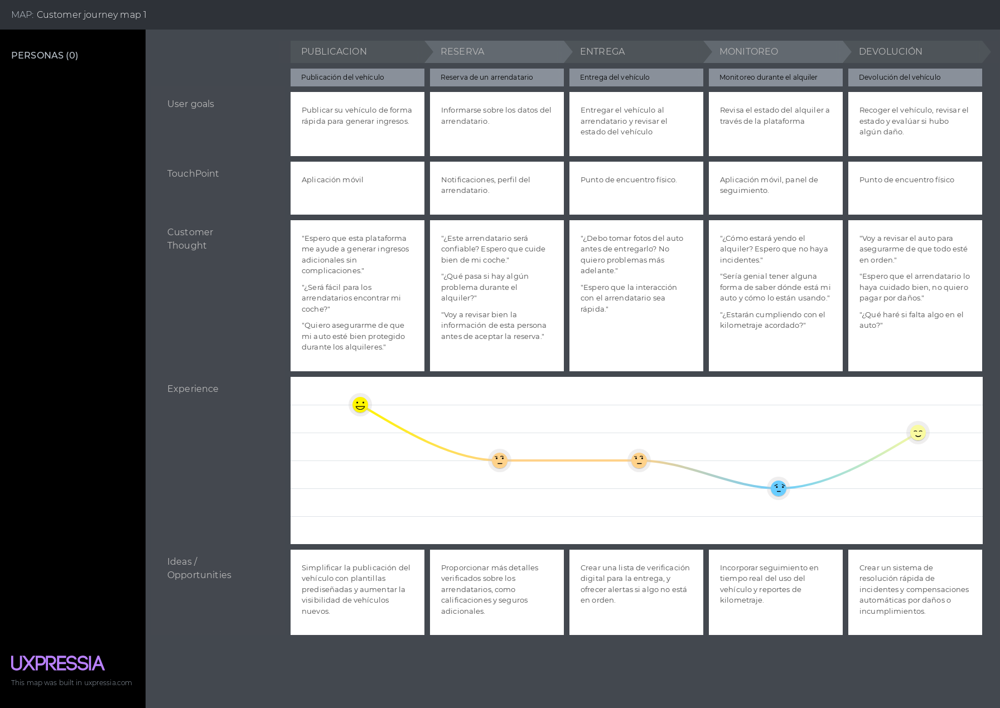

<h3 align="center"> Universidad Peruana de Ciencias Aplicadas </h3>

<h3 align="center"> Ingeniería de Software </h3>
<h3 align="center"> Ciclo 2024 - 2 </h3>

 

  

 

<h1 align="center"> TB1 Report </h1>

<h3 align="center"> Aplicaciones Web - WX53 </h3>

<h3 align="center"> Docente: Alberto Wilmer Sanchez Seña </h3>

<h3> Startup: WebPioneers </h3>

<h3> Product: TakeMyCar</h3>

<h3> Team Members: </h3>

| Member                           |    Code    |
| :------------------------------- | :--------: |
| Chavez Uribe, Ario Joel | U202213468 |
| Cruz Ticona, Aaron Alejandro | U202213502 |
| Oshiro Yamashita, Daiki Oscar | U20201F846 |
| Rivera Ayala, Gabriel Alejandro | U202223279 |
| Zuniga Calle, Sebastian Gabriel | U20221b479 |

<h3 align="center">Agosto, 2024</h3>

# Registro de Versiones del Informe

| Versión | Fecha | Autor | Descripción de modificación |
| :-------: | :---------: | :----------------: | :----------------------:|
|TB1|05/09/2024|Chavez,Cruz,Oshiro,Rivera y Zuniga|Se añadió los capítulos 1 al 4|
|TP1|29/09/2024|Chavez,Cruz,Oshiro,Rivera y Zuniga|Se añadió el capítulo 5|
|TB2|30/10/2024|Chavez,Cruz,Oshiro,Rivera|Se arreglares errores y nuevo contenido al capítulo 5 del backend|

# Project Report Collaboration Insights

# Contenido

## Tabla de Contenidos

[Registro de versiones del informe](#registro-de-versiones-del-informe)

[Project Report Collaboration Insights](#project-report-collaboration-insights)

[Contenido](#contenido)

[Student Outcome](#student-outcome-1)

[Capítulo I: Introducción](#capitulo-i-introduccion)

- [1.1. Startup Profile](#11-startup-profile)

  - [1.1.1. Descripción de la Startup](#111-description-de-la-startup)

  - [1.1.2. Perfiles de integrantes del equipo](#112-perfiles-de-integrantes-del-equipo)

- [1.2. Solution Profile](#12-solution-profile)
  - [1.2.1 Antecedentes y problemática](#121-antecedentes-y-problemática)
  - [1.2.2 Lean UX Process](#122-lean-ux-process)
    - [1.2.2.1. Lean UX Problem Statements](#1221-lean-ux-problem-statements)
    - [1.2.2.2. Lean UX Assumptions](#1222-lean-ux-assumptions)
    - [1.2.2.3. Lean UX Hypothesis Statements](#1223-lean-ux-hypothesis-statements)
    - [1.2.2.4. Lean UX Canvas](#1224-lean-ux-canvas)
- [1.3. Segmentos objetivo](#13-segmentos-objetivo)

[Capítulo II: Requirements Elicitation & Analysis](#capítulo-ii-requirements-elicitation--analysis-1)

- [2.1. Competidores](#21-competidores)
  - [2.1.1. Análisis competitivo](#211-análisis-competitivo)
  - [2.1.2. Estrategias y tácticas frente a competidores](#212-estrategias-y-tácticas-frente-a-competidores)
- [2.2. Entrevistas](#22-entrevistas)
  - [2.2.1. Diseño de entrevistas](#221-diseño-de-entrevistas)
  - [2.2.2. Registro de entrevistas](#222-registro-de-entrevistas)
  - [2.2.3. Análisis de entrevistas](#223-análisis-de-entrevistas)
- [2.3. Needfinding](#23-needfinding)
  - [2.3.1. User Personas](#231-user-personas)
  - [2.3.2. User Task Matrix](#232-user-task-matrix)
  - [2.3.3. User Journey Mapping](#233-user-journey-mapping)
  - [2.3.4. Empathy Mapping](#234-empathy-mapping)
  - [2.3.5. As-is Scenario Mapping](#235-as-is-scenario-mapping)

[Capítulo III: Requirements Specification](#capítulo-iii-requirements-specification-1)

- [3.1. To-Be Scenario Mapping](#31-to-be-scenario-mapping)
- [3.2. User Stories](#32-user-stories)
- [3.3. Impact Mapping](#33-impact-mapping)
- [3.4. Product Backlog](#34-product-backlog)

[Capítulo IV: Product Design](#capitulo-iv-product-design-1)

- [4.1. Style Guidelines](#41-style-guidelines)
  - [4.1.1. General Style Guidelines](#411-general-style-guidelines)
  - [4.1.2. Web Style Guidelines](#412-web-style-guidelines)
- [4.2. Information Architecture](#42-information-architecture)
  - [4.2.1. Organization Systems](#421-organization-systems)
  - [4.2.2. Labeling Systems](#422-labeling-systems)
  - [4.2.3. SEO Tags and Meta Tags](#423-seo-tags-and-meta-tags)
  - [4.2.4. Searching Systems](#424-searching-systems)
  - [4.2.5. Navigation Systems](#425-navigation-systems)
- [4.3. Landing Page UI Design](#43-landing-page-ui-design)
  - [4.3.1. Landing Page Wireframe](#431-landing-page-wireframe)
  - [4.3.2. Landing Page Mock-up](#432-landing-page-mock-up)
- [4.4. Web Applications UX/UI Design](#44-web-applications-uxui-design)
  - [4.4.1. Web Applications Wireframes](#441-web-applications-wireframes)
  - [4.4.2. Web Applications Wireflow Diagrams](#442-web-applications-wireflow-diagrams)
  - [4.4.3. Web Applications Mock-ups](#443-web-applications-mock-ups)
  - [4.4.4. Web Applications User Flow Diagrams](#444-web-applications-user-flow-diagrams)
- [4.5. Web Applications Prototyping](#45-web-applications-prototyping)
- [4.6. Domain-Driven Software Architecture](#46-domain-driven-software-architecture)
  - [4.6.1. Software Architecture Context Diagram](#461-software-architecture-context-diagram)
  - [4.6.2. Software Architecture Container Diagrams](#462-software-architecture-container-diagrams)
  - [4.6.3. Software Architecture Components Diagrams](#463-software-architecture-components-diagrams)
- [4.7. Software Object-Oriented Design](#47-software-object-oriented-design)
  - [4.7.1. Class Diagrams](#471-class-diagrams)
  - [4.7.2. Class Dictionary](#472-class-dictionary)
- [4.8. Database Design](#48-database-design)
  - [4.8.1. Database Diagram](#481-database-diagram)

[Capítulo V: Product Implementation, Validation & Deployment](#capítulo-v-product-implementation-validation--deployment-1)

- [5.1. Software Configuration Management](#51-software-configuration-management)
  - [5.1.1. Software Development Environment Configuration](#511-software-development-environment-configuration)
  - [5.1.2. Source Code Management](#512-source-code-management)
  - [5.1.3. Source Code Style Guide & Conventions](#513-source-code-style-guide--conventions)
  - [5.1.4. Software Deployment Configuration](#514-software-deployment-configuration)
- [5.2. Landing Page, Services & Applications Implementation](#52-landing-page-services--applications-implementation)
  - [5.2.1. Sprint 1](#521-sprint-1)
    - [5.2.1.1. Sprint Planning 1](#5211-sprint-planning-1)
    - [5.2.1.2. Sprint Backlog 1](#5212-sprint-backlog-1)
    - [5.2.1.3. Development Evidence for Sprint Review](#5213-development-evidence-for-sprint-review)
    - [5.2.1.4. Testing Suite Evidence for Sprint Review](#5214-testing-suite-evidence-for-sprint-review)
    - [5.2.1.5. Execution Evidence for Sprint Review](#5215-execution-evidence-for-sprint-review)
    - [5.2.1.6. Services Documentation Evidence for Sprint Review](#5216-services-documentation-evidence-for-sprint-review)
    - [5.2.1.7. Software Deployment Evidence for Sprint Review](#5217-software-deployment-evidence-for-sprint-review)
    - [5.2.1.8. Team Collaboration Insights during Sprint](#5218-team-collaboration-insights-during-sprint)

[Conclusiones](#conclusiones-1)

- [Conclusiones y recomendaciones](#conclusiones-y-recomendaciones)

[Bibliografía](#bibliografc3ada-1)

[Anexos](#anexos-1)

# Student Outcome

|Criterio específico| Acciones realizadas | Conclusiones |
|:------ | :--------------------------- | :--------- |
| Trabaja en equipo para proporcionar liderazgo en forma conjunta | *Chavez Uribe, Ario Joel*   *TB1*: Consulté con mi equipo la problemática que enfrentaría nuestra startup.   *TP1*:     *Cruz Ticona, Aaron Alejandro*   *TB1*: Establecí junto al equipo las metas que nuestro Startup debe enfrentar en el Lean UX Process Empathy Map y As-Is Scenario. También establecí un Style Guidelines que se adecúe a los objetivos de nuestro equipo.   *TP1*: Realicé una Landing Page que se adecúa a las metas del equipo.     *Oshiro Yamashita, Daiki Oscar*   *TB1*: Definí junto a mi equipo un Landing Page UI Design y un Web Applications UX Design que brinde la mejor experiencia para nuestros usuario.s   *TP1*: Realicé una Front End Web Application que se adecúa a las metas del equipo.  *TB2*: Realizé el desarrollo del backend y mejoras en las partes anteriores del trabajo.     *Rivera Ayala, Gabriel Alejandro*   *TB1*: Realicé junto a mi equipo un análisis de los competidores de nuestra startup para formular tácticas para destacar.   *TP1*: Definí el Ubiquitous Language necesario para mantener una comunicación clara.     Zuniga Calle, Sebastian Gabriel   *TB1*: Definí junto a mi equipo los componentes a incluir en el Domain Driven Software Architecture   *TP1*:     | Se concluye que la plataforma debe priorizar la seguridad tanto de los vehículos como de los usuarios. Esto incluye funciones que permitan realizar inspecciones técnicas automáticas y verificaciones del historial del automóvil para asegurar que los vehículos alquilados cumplan con las normativas de seguridad vial. Además, la plataforma puede incluir alertas sobre mantenimiento necesario para evitar accidentes.|
|Crea un entorno colaborativo e inclusivo, establece metas, planifica tareas y cumple objetivos| *Chavez Uribe, Ario Joel*   *TB1*: Establecí las metas que debe alcanzar nuestra empresa en el Impact Mapping. Tambien planifiqué las tareas a realizar en el desarrollo de la Landing Page a través del Product Backlog.   *TP1*:     *Cruz Ticona, Aaron Alejandro*   *TB1*: Establecí la Information Architecture necesaria para lograr un producto web que brinde un entorno inclusivo. *TP1*: Realicé una Landing Page que se adecúa a las metas del equipo.     *Oshiro Yamashita, Daiki Oscar*   *TB1*: Definí la misión y visión de nuestra Startup.   *TP1*: Realicé una Front End Web Application que se adecúa a las metas del equipo.   *TP1*: Establecí la creación del backend y el api de nuestra aplicación.     *Rivera Ayala, Gabriel Alejandro*   *TB1*: Establecí la User Task Matrix que serviría para definir las features a incluir en las User Stories.   *TB2*: Definí el Ubiquitous Language necesario para mantener una comunicación clara.     *Zuniga Calle, Sebastian Gabriel*   *TB1*: Establecí los Segmentos Objetivo que nuestro producto atenderá.   *TB2*: Definí los User Stories que regirán las funcionalidades de nuestro producto.   |Validar el diseño de TakeMyCar desde estos criterios asegura que la plataforma no solo cumple con su propósito funcional, sino que también contribuye positivamente a la seguridad, el bienestar social y la sostenibilidad. Realizar pruebas de usabilidad, encuestas a usuarios, análisis de datos ambientales y económicos, y adaptación a normativas globales garantizará que la solución responda a los desafíos locales y globales, generando un impacto positivo y sostenible a largo plazo.|

# Capitulo I: Introduccion

## 1.1. StartUp Profile

En el texto presente a continuación, vamos a describir de manera detallada nuestra idea de startup. En ella se incluirá la misión y visión de la empresa, así como los perfiles de los integrantes del equipo.

### 1.1.1. Description de la StartUp

Esta empresa ha desarrollado una plataforma digital que funciona como intermediario entre propietarios de vehículos y posibles arrendatarios. La plataforma integra vehículos bajo nuestro nombre, actuando como una flota virtual, pero sin la necesidad de una inversión inicial en vehículos. Nuestro modelo de negocio se basa en conectar a propietarios con arrendatarios interesados, ofreciendo precios competitivos y beneficios para ambas partes. Los propietarios reciben una remuneración únicamente cuando su vehículo es alquilado, lo que garantiza un enfoque eficiente y rentable.

Misión:
Nuestra misión es facilitar el acceso a vehículos de alquiler de alta calidad, conectando a propietarios y arrendatarios de manera segura y eficiente. Nos esforzamos por ofrecer un servicio que maximice el valor para ambas partes, proporcionando una plataforma confiable y accesible para todos nuestros usuarios.

Visión:
Convertirnos en la plataforma líder en el mercado de alquiler de vehículos en Perú, reconocidos por nuestra innovación y eficiencia en conectar a propietarios y arrendatarios. Queremos ser la referencia principal para aquellos que buscan alquilar un vehículo sin complicaciones, ofreciendo un servicio integral y de alta calidad.

### 1.1.2. Perfiles de integrantes del equipo

| Integrantes | Descripción | Conocimientos |
| :--- | :--- | :--- |
|   Daiki Oscar Oshiro Yamashita u20201f846 | Soy estudiante de la carrera de Ingeniería de Software. Tengo interés en obtener nuevos conocimientos relacionados con mi carrera que me sean de utilidad para el futuro. | Cuento con el conocimiento de diversos lenguajes HTML, Python, C++, C# y MySQL. |
|   Sebastian Gabriel Zuniga Calle u20221b479 | Soy estudiante de la carrera de Ingeniería de Software. Mis intereses se basan en aprender nuevas tecnologías, desarrollo en web y aplicaciones. | Poseo conocimientos en los lenguajes de programación: C++, Python, JavaScript y C#. Listo para ayudar en el desarrollo y solución de problemas. |
|   Ario Joel Chavez Uribe u202213468 | Soy un estudiante de la carrera de Ingeniería de Software. Tengo interés en aprender sobre nuevas tecnologías, el desarrollo web y de aplicaciones. | Poseo conocimientos en los lenguajes de programación: C++, Python, HTML y MySQL. Útiles para el desarrollo y solución del proyecto. |
|   Aaron Alejandro Cruz Ticona | Me encuentro inmerso en la carrera de Ingeniería de Software. Me considero una persona curiosa, lo que me lleva a tener constante interés en aprender nuevas cosas y espero hacerlo en este curso. | Personalmente, poseo conocimientos en lo que a el mundo de la programación se refiere: En C++, Python, HTML, CSS, SQL, entre otros a futuro. |
|   Gabriel Alejandro Rivera Ayala u202223279 | Soy estudiante de Ingeniería de Software. Me interesa el aprendizaje continuo en todo lo relacionado al desarrollo de aplicaciones interactivas. | He desarrollado proyectos en C++, Python, HTML, SQL y C#. Me considero una persona trabajadora y apoyaré a mis compañeros a realizar un buen trabajo. |

## 1.2. Solution Profile

### 1.2.1. Antecedentes y problemática

Para describir nuestra startup de forma ordenada y organizada, emplearemos un técnica que responderá a preguntas básicas del 5W y 2H.

**Antecedentes**
- Debido a un aumento significativo en la demanda de soluciones en cuanto a la movilidad temporal y flexible, existe la necesidad de una plataforma que simplifique las comunicaciones entre los dueños y los arrendatarios para el alquiler de vehículos mediante un aplicativo.
**Problemática**
- El problema principal radica en la falta de plataformas que faciliten el alquiler de vehículos de manera directa entre propietarios y arrendatarios ha creado una barrera para aquellos que requieran dun automóvil de manera rápida y temporal. Lo que limita a los arrendatarios y perjudica a los propietarios al no poder rentabilizar sus vehículos

Técnica de las 5 'W's y 2' H's

**¿Qué?**
*Refiere a la razón por la cual se está llevando a cabo este proyecto. Suele responder las siguientes preguntas:*
¿Cuál es el problema?
Falta de plataformas que faciliten el alquiler de vehículos de manera directa entre propietarios que desean rentabilizar sus vehículos y los arrendatarios que enfrentan dificultades para encontrar opciones accesibles y confiables de alquiler de vehículos.
¿Cuál es la relación con la persona en cuestión?
Se relaciona con los propietarios de vehículos, que no encuentran una manera eficiente para ofrecer sus vehículos en alquiler y a los arrendatarios que encuentran dificultades para encontrar opciones accesibles y confiables.

**¿Cuándo?**
*Refiere al momento o periodo de tiempo en el cual ocurra el evento. Suele responder las siguientes preguntas:*
¿Cuándo sucede el problema?
El problema ocurre cuando los propietarios desean alquilar sus vehículos pero no cuentan con un canal adecuado para hacerlo, y los arrendatarios necesitan de un vehículo para un uso momentáneo o de corta duración, pero no cuentan con opciones viables.
¿Cuándo utiliza el cliente el producto?
El producto se utiliza cuando los propietarios listan sus vehículos para alquiler y los arrendatarios buscan y reservan un vehículo que cumpla con sus especificaciones e indicando su utilidad, ya sea un viaje, una emergencia, o cualquier necesidad requerida.

**¿Dónde?**
*Refiere al lugar en el que se lleva a cabo el problema. Suele responder las siguientes preguntas:*
¿Dónde está el cliente cuando usa el producto?
Ya sea propietario o arrendatario, puede usar la plataforma desde cualquier lugar con acceso a internet como su hogar, lugar de trabajo, o mientras está en movimiento.
¿A dónde se dirige?
La aplicación se dirige a propietarios de vehículos que desean generar ingresos adicionales a través del alquiler y a arrendatarios que buscan opciones flexibles y seguras para alquilar un vehículo.
¿Dónde surge el problema?
El problema surge principalmente en zonas urbanas donde la necesidad de movilidad es alta, pero la oferta de plataformas de alquiler de vehículos es limitada.

**¿Quiénes?**
*Ayuda a obtener información importante de todas las personas involucradas debido a que es posible que haya varios tipos de cliente. Suele responder las siguientes preguntas:*
¿Quiénes están involucrados?
En nuestra plataforma están involucrados los propietarios de vehículos que desean alquilarlos y los arrendatarios que buscan alquilar un vehículo de manera rápida y sin complicaciones.
¿A quiénes le sucede el problema?
El problema afecta principalmente a los propietarios que no logran rentabilizar sus vehículos y a los arrendatarios que enfrentan dificultades para encontrar opciones de alquiler inmediatas y confiables.
¿Quién lo utilizará?
La plataforma será utilizada por propietarios de vehículos que desean poner en alquiler sus vehículos y por arrendatarios que necesitan una solución de movilidad temporal.

**¿Por qué?**
*Refiere al causante o desencadenante del problema abordado. Suele responder la siguiente pregunta:*
¿Cuál es la causa del problema?
La causa del problema es la falta de una plataforma que conecte de manera eficiente y segura a propietarios de vehículos con arrendatarios, limitando las opciones de alquiler y y rentabilidad para los propietarios.

**¿Cómo?**
*Refiere a cómo se llevan a cabo los hechos para explicar una situación. Suele responder las siguientes preguntas:*
¿En qué condiciones los clientes usan nuestros productos?
Nuestros clientes utilizan la plataforma cuando necesitan rentabilizar su vehículo (propietarios) o cuando necesitan acceder rápidamente a un vehículo para un uso específico (arrendatarios).
¿Cómo nos conocieron los usuarios?
Los usuarios conocieron la plataforma a través de publicidad en redes sociales, recomendaciones de otros usuarios, y campañas de marketing orientadas a los servicios de movilidad.
¿Qué llevó al cliente a llegar a esta situación?
Lo que llevó al cliente a esta situación fue la necesidad de una solución confiable y accesible para alquilar vehículos, ya sea para rentabilizar (propietarios) o para una necesidad temporal de movilidad (arrendatarios).

**¿Cuánto cuesta?**
*Refiere a los costos asociados con el uso de la plataforma.*
Costos para los propietarios:
No hay costos iniciales para los propietarios; ellos solo pagan una comisión cuando su vehículo es alquilado.
Costos para los arrendatarios:
Los precios de alquiler son variables, ofreciendo alternativas económicas y flexibles frente a las opciones tradicionales de alquiler de vehículos.

### 1.2.2. Lean UX Process

#### 1.2.2.1. Lean UX Problem Statements

La idea central de TakeMyCar, surge debido a la necesidad de nuestros segmentos en busca de una opción innovadora aún no explotada en nuestro entorno. Nos encontramos dentro del sector del alquiler de vehículos, centrandonos principalmente en la falta de disponibilidad y en los costos otorgados por parte de las empresas de alquiler de vehículos.

De la misma forma, lo que otras escasas empresas, las cuales buscan brindar el servicio de alquiler no logran abordar es el hecho de que no muchas de ellas poseen el modelo de no uso de autos que sean propios, es decir, TakeMyCar esta pensada para no tener que realizar una inversión considerable en la obtencion de autos propios.

Nuestro producto sobrepasa este limite, ofreciendo un modelo tanto de entrada como de salida, recibiremos carros de propietarios y lo alquilaremos a usuarios, lo que abarca con la necesidad de un modelo más flexible, rentable y escalable que permita tanto a los propietarios como a los arrendatarios obtener un beneficio económico.

Finalmente, podremos sentir el trabajo concluido cuando veamos un numero considerable y en aumento de propietarios que, compartan su rentibilidad con sus conocidos, y que tengamos disponibles un catalogo considerable de vehiculos que concuerden a la demanda presente.

#### 1.2.2.2. Lean UX Assumptions

**Segmento de Usuarios:**

¿Quién es el usuario?

Nuestros usuarios son propietarios de vehículos que buscan monetizar sus activos sin la carga de gestionarlos y arrendatarios que desean opciones flexibles y accesibles para alquilar sin preocupaciones y a precios cómodos.

¿Dónde encaja nuestro servicio? ¿En su trabajo o vida?

Nuestro producto se integra en la vida de los propietarios de vehículos que desean obtener ingresos adicionales de manera pasiva y en la vida de los arrendatarios que necesitan una solución conveniente y asequible para alquilar un vehículo sin los compromisos de la propiedad.

¿Cuando y cómo es usado nuestro servicio?

Los propietarios nos contactaran principalmente para listar sus vehículos y monitorear sus ingresos, mientras que los arrendatarios la utilizarán cuando necesiten alquilar un vehículo para diversas ocasiones, como viajes, mudanzas o tareas cotidianas.

¿Qué problemas tiene nuestro servicio?

Un posible desafío es asegurar la confianza y satisfacción de los propietarios de vehículos en cuanto a la seguridad y cuidado de sus activos, y garantizar que los arrendatarios encuentren la experiencia de alquiler simple, rápida y sin complicaciones.

**Business Outcomes:**

- Creemos que a nuestros clientes les interesaría una plataforma que les permita alquilar sus vehículos sin gestión operativa y a los arrendatarios les ofrecería una opción accesible y diversa de vehículos.

- Creemos que nuestro público objetivo incluye a propietarios de vehículos que desean monetizar su activo de manera pasiva y arrendatarios que buscan soluciones de alquiler convenientes y asequibles.

- Reconocemos que hay competidores en el mercado, pero creemos que podemos diferenciarnos proporcionando un servicio sin la necesidad de inversión inicial en flota, lo que nos permitirá ofrecer precios más competitivos y una experiencia de usuario optimizada.

- Creemos que debemos asegurar la calidad y confiabilidad de nuestra plataforma, implementando rigurosas pruebas y manteniendo una comunicación activa con nuestros usuarios para abordar cualquier problema o inquietud que pueda surgir.

#### 1.2.2.3. Lean UX Hypothesis Statements

1. Creemos que los propietarios de vehículos que buscan monetizar sus activos sin la necesidad de involucrar tiempo e inversión considerable, quienes nos contactaran mediante nuestra plataforma par obtener ingresos pasivos bajo una fuente segura.

2. Creemos que los arrendatarios que buscan opciones de alquiler de vehículos flexibles y accesibles preferirán nuestra plataforma por su facilidad de uso, precios competitivos, seguridad y confianza.

3. Creemos que ofrecer un modelo de negocio sin inversión inicial en flota (no poseer autos propios para su alquiler), nos va a permitir inversión en otras areas y mantener un precio plano el cual sera competitivo bajo distintas métricas, y así, atraer tanto a arrendadores como a arrendatarios.

#### 1.2.2.4. Lean UX Canvas

# 1.3. Segmentos Objetivo

**Segmento #1: Propietarios de vehículos**

Aspectos demográficos:

- Sexo: Masculino y Femenino 
- Edades: Entre 18 y 60 años 
- Nivel Socioeconómico: Clases A, B y C (Clase alta, clase media alta y clase media)

Aspectos geográficos:

- Nacionalidad: Peruana 
- Zona Geográfica de Residencia: Urbana 
- Departamento: Lima Metropolitana 

Aspectos psicograficos:

- Personas naturales o jurídicas que no utilicen con frecuencia su activo (vehículo). 
- Personas que deseen obtener ingresos pasivos sin la necesidad de invertir un gran cantidad de su tiempo. 
- Personas que no encuentran una manera rápida y confiable de alquilar sus vehículos.

**Segmento #2: Usuarios Arrendatarios**

Aspectos demográficos:

- Sexo: Masculo y Femenino 
- Edades: Entre 18 y 50 años 
- Nivel Socioeconómico: Clases A. B y C (Clase alta, clase media alta y clase media) 

Aspectos geográficos:

- Nacionalidad: Peruana 
- Zona Geográfica de Residencia: Urbana 
- Departamento: Lima Metropolitana 

Aspectos psicograficos:

- Usuarios que gasten demasiadas horas semanales dentro del tráfico y el transporte público. 
- Personas que no tienen la posibilidad de adquirir un auto nuevo o seminuevo para ciertas ocasiones. 
- Personas que necesitan un medio de transporte propio por un tiempo corto de uso.

# Capítulo II: Requirements Elicitation & Analysis

En este capítulo se realizará el proceso de Análisis competitivo y Needfinding necesario para la identificación de las necesidades de nuestro segmento objetivo.

## 2.1. Competidores

A continuacion realizaremos un análisis de los productos de software ofrecidos por la competencia en el mercado de nuestra solución y las técnicas que emplearíamos para destacar.

### 2.1.1. Análisis Competitivo

A continuación se presenta un análisis competitivo de las empresas que ofrecen servicios similares a TakeMyCar.

<table>
  <tr>
    <th colspan="6"><b>Competitive Analysis Landscape</b></th>
  </tr>
  <tr>
    <td>¿Por qué llevar a cabo este análisis?</td>
    <td colspan="5">Este análisis fue realizado con el propósito de estudiar el valor ofrecido por las empresas que compiten con nuestra solucion. La informacion obtenida nos proporcionará la perspectiva necesaria para la realizacion de un servicio innovador.
    </td>
  </tr>
  <tr>
    <td colspan="2"></td>
    <td><b>TakeMyCar</b></td>
    <td><b>Rento</b></td>
    <td>
<b>Hertz</b>
</td>
    <td>
<b>Avis</b>
</td>
  </tr>
  <tr>
    <td rowspan="2">
      <b>Perfil</b>
    </td>
    <td>
      <b>Overview</b>
    </td>
    <td>
      
Plataforma web y aplicación móvil para gestión de alquileres P2P, pagos y monitoreo de vehículos.
    </td>
    <td>
      
Plataforma web y aplicación móvil que facilita el alquiler de vehículos de particulares
    </td>
    <td>
      
Plataforma web y aplicación móvil que facilita el alquiler de vehículos tanto en aeropuertos como en ciudades.
    </td>
    <td>
      
Aplicacion de reservas de autos en línea
    </td>
  </tr>
  <tr>
    <td>
      <b>Ventaja competitiva ¿Qué valor ofrece a los clientes?</b>
    </td>
    <td>
      
Flexibilidad en precios y disponibilidad, y generación de ingresos para los propietarios sin necesidad de inversión en flota.
    </td>
    <td>
      
Modelo peer-to-peer que permite a los propietarios generar ingresos pasivos con su vehículo. Seguridad para ambas partes a través de seguros todo riesgo y monitoreo GPS.
    </td>
    <td>
      
Red global de ubicaciones, servicio confiable y una amplia variedad de vehículos. Reputación consolidada y un fuerte programa de fidelización.
    </td>
    <td>
      
Enfoque en el servicio al cliente de alta calidad, con una variedad de opciones de vehículos y soluciones tanto para clientes particulares como corporativos.
    </td>
  </tr>
  <tr>
    <td rowspan="2" >
      <b>Perfil de Marketing</b>
    </td>
    <td>
      <b>Mercado objetivo</b>
    </td>
    <td>
      
Propietarios de vehículos que desean alquilarlos cuando no los usan.
      
Arrendatarios que buscan opciones más económicas y flexibles que las ofrecidas por las grandes empresas de alquiler.
    </td>
    <td>
      
Propietarios de vehículos que buscan generar ingresos cuando no usan sus autos.
      
Arrendatarios que buscan opciones más económicas y flexibles que las ofrecidas por las grandes empresas de alquiler.
    </td>
    <td>
      
Turistas internacionales y locales.
Ejecutivos y viajeros de negocios.
      
Clientes que necesitan autos por períodos cortos o largos.
    </td>
    <td>
      
Turistas y viajeros de negocios.
      
Empresas que buscan alquileres a largo plazo o soluciones corporativas.
    </td>
  </tr>
  <tr>
    <td>
      <b>Estrategias de marketing</b>
    </td>
    <td>
      
Publicidad en redes sociales.
      
Promociones con descuentos en los primeros alquileres.
      
Alianzas estratégicas con aseguradoras para ofrecer seguridad y confianza.
    </td>
    <td>
      
-Publicidad digital en redes sociales y campañas de concientización sobre la economía colaborativa.
      
Alianzas con aseguradoras para ofrecer seguros integrados.
    </td>
    <td>
      
Publicidad en aeropuertos, marketing digital, y promociones a través de programas de fidelización.
      
Presencia en ferias y eventos de turismo.
      
Alianzas con aerolíneas y agencias de viajes.
    </td>
    <td>
      
Marketing dirigido a clientes corporativos y viajeros frecuentes.
      
Promociones digitales y descuentos a través de alianzas con aerolíneas y hoteles.
      
Programas de fidelizacion
    </td>
  </tr>
  <tr>
    <td rowspan="3" >
      <b>Perfil de Producto</b>
    </td>
    <td>
      <b>Productos y Servicios</b>
    </td>
    <td>
      
Alquiler de vehículos particulares.
      
Seguro y monitoreo GPS integrados.
      
Opciones de alquiler a corto y mediano plazo.
    </td>
    <td>
      
Alquiler de vehículos particulares a corto y mediano plazo.
      
Seguro todo riesgo y monitoreo en tiempo real.
      
Opciones de reserva directa y pagos a través de la app.
    </td>
    <td>
      
Alquiler de autos estándar, SUV, autos de lujo, y vehículos comerciales.
      
Seguros, GPS, y recogida/entrega en ubicaciones seleccionadas.
    </td>
    <td>
      
Autos económicos, SUV, vehículos de lujo, y comerciales.
      
Alquileres a largo plazo para clientes corporativos.
    </td>
  </tr>
  <tr>
    <td>
      <b>Precios y Costos</b>
    </td>
    <td>
      
Precios más bajos que las compañías tradicionales de alquiler debido a la ausencia de una flota física. 
      
Bajos costos operativos gracias al modelo P2P. 
    </td>
    <td>
      
Precios dinámicos y más bajos que los de las empresas tradicionales de alquiler.
      
Bajos costos operativos debido a la ausencia de una flota física.
    </td>
    <td>
      
Tarifas diarias o semanales, generalmente más altas que servicios P2P debido a la infraestructura y la cobertura global.
      
Descuentos para clientes recurrentes y programas de fidelización.
    </td>
    <td>
      
Precios premium, con descuentos para empresas y clientes recurrentes.
      
Altos costos operativos debido a la amplia infraestructura y mantenimiento de vehículos.
    </td>
  </tr>
  <tr>
    <td>
      <b>Canales de distribución (Web y/o móvil)</b>
    </td>
    <td>
      
Plataforma web y aplicación móvil.
      
Colaboraciones con aseguradoras y promociones digitales.
    </td>
    <td>
      
Plataforma web y aplicación móvil.
      
Asociaciones con aseguradoras y redes sociales.
    </td>
    <td>
      
Plataforma web, aplicación móvil, y oficinas físicas en aeropuertos y ciudades.
    </td>
    <td>
      
Plataforma web, aplicación móvil, y oficinas físicas en aeropuertos y centros comerciales.
    </td>
  </tr>
  <tr>
    <td rowspan="5" >
      
<b>Análisis SWOT</b>
    </td>
    <td colspan="5" >
      
Realice esto para su startup y sus competidores. Sus fortalezas deberían apoyar sus oportunidades y contribuir a lo que ustedes definen como su posible ventaja competitiva.
    </td>
  </tr>
  <tr>
    <td><b>Fortalezas</b></td>
    <td>
      
Modelo flexible y económico, bajos costos operativos, facilidad de uso.
    </td>
    <td>
      
Modelo flexible y seguro, costos operativos bajos.
    </td>
    <td>
      
Marca consolidada, presencia global, variedad de vehículos.
    </td>
    <td>
      
Reputación sólida, servicio de alta calidad, fuerte presencia en el mercado corporativo.
    </td>
  </tr>
  <tr>
    <td><b>Debilidades</b></td>
    <td>
      
Menor infraestructura y recursos comparados con las empresas tradicionales.
    </td>
    <td>
      
Dependencia de la confianza en la plataforma y en los seguros.
    </td>
    <td>
      
Altos costos comparados con opciones P2P.
    </td>
    <td>
      
Precios más altos, lo que puede limitar a ciertos segmentos del mercado.
    </td>
  </tr>
  <tr>
    <td><b>Oportunidades</b></td>
    <td>
      
Rápida adopción de soluciones de movilidad compartida, especialmente en mercados emergentes.
    </td>
    <td>
      
Crecimiento del mercado de la economía colaborativa.
    </td>
    <td>
      
Expansión en mercados emergentes y adopción de nuevas tecnologías para la gestión de flotas.
    </td>
    <td>
      
Crecimiento en servicios corporativos y soluciones de movilidad a largo plazo.
    </td>
  </tr>
  <tr>
    <td><b>Amenazas</b></td>
    <td>
      
Regulaciones locales y competencia de otras plataformas P2P establecidas.
    </td>
    <td>
      
Regulaciones gubernamentales y competencia emergente en el sector P2P.
    </td>
    <td>
      
Creciente competencia de plataformas digitales P2P y modelos de movilidad compartida.
    </td>
    <td>
      
Competencia de plataformas P2P y otros modelos de alquiler más flexibles.
    </td>
  </tr>
</table>

### 2.1.2. Estrategias y tácticas frente a competidores

A continuación se muestran las tácticas que deberá aplicar nuestra startup para afrontar las fortalezas de la competencia.

Táctica: Mientras las grandes compañías cuentan con sistemas sofisticados, TakeMyCar puede enfocarse en mejorar la usabilidad y simplicidad de su plataforma digital, ofreciendo un proceso de alquiler más ágil. Se debe invertir en el desarrollo de una aplicación intuitiva y fácil de usar, con un proceso de reserva fluido. Agregar funcionalidades como la reserva en pocos clics y recomendaciones personalizadas basadas en el historial de alquileres.

Táctica: Fomentar reseñas y recomendaciones dentro de la plataforma. La confianza es clave en el modelo P2P. Se debe crear un entorno seguro y confiable para todos los usuarios.

Táctica: Incluir características como verificación de identidad, historial de alquileres, seguros integrados y monitoreo de vehículos por GPS.

## 2.2. Entrevistas

En esta sección se elaborará una investigación con base en entrevistas a representantes del segmento objetivo.

### 2.2.1. Diseño de entrevistas

A continuación se presentan las preguntas diseñadas para las entrevistas a los segmentos objetivo.

Con el objetivo de comprender la necesidad y la demanda en nuestro sector por parte de nuestro publico objetivo. Por ello, elaboramos las siguientes preguntas con el fin de recolectar información cualitativa y/o cuantitativa, la cual se verá divida por nuestros segmentos objetivos.

**Preguntas Generales**

- ¿Cuál es su nombre?
- ¿Cuántos años tiene usted?
- ¿En que ciudad y distrito reside?
- ¿A qué se dedica o cual es su ocupación?

**Preguntas Específicas**

**Segmento 1: Propietarios de vehículos**

- ¿Cuántos vehículos posee usted?
- ¿Con que frecuencia se transporta de su(s) vehículos(s)?
- ¿Cuándo no utiliza su vehículo, donde permanece el mismo?
- ¿Ha usted alquilado su vehículo anteriormente? Si la respuesta es:  
 Si: ¿Qué dificultades presento alquilarlo?  
 No: ¿Cuan dispuesto se encuentra usted a alquilar su vehículo?
- ¿Conoce alguna plataforma para el alquiler de vehículos en su entorno?
- ¿Qué tipo de garantías y compensación esperarías sobre alquilar tu vehículo?
- ¿Considera una opción llamativa el no tener que preocuparse por su vehículo y además, recibir ingresos por ello?

**Segmento 2: Usuarios arrendatarios**

- ¿Con que frecuencia te transportas en el día a día?
- ¿Cuánto dinero crees que gastas en movilizarte cada semana?
- ¿Si tuvieras un auto, cuál sería el principal uso que le darías?
- ¿Alguna vez pensaste en alquilar un auto? Si la respuesta es: 
  - Si: ¿Nos podrías contar acerca de tu experiencia y tu opinión? 
  - No: ¿Cuáles son los motivos por los que no opto por alquilar un vehículo?
- ¿Qué aspectos negativos encuentra al alquilar un vehículo para uso propio?
- ¿Conoce alguna plataforma de confianza donde puede hallar el vehículo adecuado a su necesidad?

**Preguntas sobre la idea del proyecto**

- ¿Qué opina acerca de TakeMyCar, una plataforma donde podrás alquilar y confiar tu vehículo de forma segura y confiable?
- ¿Qué aspecto le llama más la atención?
- ¿Nos podría brindan alguna recomendación para mejorar la idea de la plataforma?
- ¿Recomendaría el uso de nuestra aplicación a sus conocidos?

### 2.2.2. Registro de entrevistas

A continuación se presenta el registro de las entrevistas realizadas a los segmentos objetivo.

**Segmento Objetivo 1:** Propietarios de vehículos

**Entrevista 1**

- Nombre: Alcides Gustavo 
- Apellidos: Rivera Chipana
- Edad: 54 años
- Distrito: Pueblo Libre 
- Link de la entrevista: <a href="https://shorturl.at/3Na7u">https://shorturl.at/3Na7u</a>
- Duración: 5:46 minutos
- Inicio de la entrevista: 0:01 

Evidencia de la reunión:

    

Resumen de la entrevista:

- Suele utilizar su auto para movilizarse a su centro de trabajo, para ir al supermercado o pasear. No lo utiliza mucho por la congestión vehicular. Usualmente lo suele usar en los fines de semana.
- Su mayor reto es viajar trayectos largos debido al estrés del tráfico.
- Ha alquilado una vez su carro a otra persona de confianza, donde le ofrecieron seguridad y garantías.
- Suele utilizar la aplicación P2P InDriver para su transporte porque le ofrece puntualidad, la identificación del taxista y por los diversos métodos de pago.
- Para él es importante que TakeMyCar ofrezca seguridad y garantía respecto a su auto. Se debe saber que la persona alquilando sea responsable.
- Suele aprender sobre nuevas aplicaciones y productos para su trabajo principalmente en Facebook.

**Entrevista 2**

- Nombre: Joel
- Apellidos: Chavez
- Edad: 41 años
- Distrito: Huaraz
- Link de la entrevista: <a href="https://shorturl.at/JfkCk">Entrevista Link: https://shorturl.at/JfkCk</a>
- Duración: 4:00 minutos
- Inicio de la entrevista: 0:00 

Evidencia de la reunión:

    

Resumen de la entrevista:

- Utiliza frecuentemente su vehículo para movilizarse al trabajo.
- Ha alquilado su vehículo anteriormente y menciona que el problema es hacerles un adecuado seguimiento a los vehículos para su respectivo mantenimiento.
- También se menciona respecto al cuidado de los vehículos, no tener que preocuparse por los posibles daños y recibir ganancias de manera óptima.
- Le resulta interesante la propuesta ya que le permite un mayor control sobre su alquiler además de lo amigable que puede ser nuestra plataforma.
- Le gustaría que la plataforma se encuentre disponible todo el tiempo para acceder a las funcionalidades de nuestra aplicación.

**Entrevista 3**

- Nombre: Franchesco
- Apellidos: Soto Morales
- Edad: 22 años
- Distrito: Comas
- Link de la entrevista: <a href="https://shorturl.at/f2Nse">Entrevista Link: https://shorturl.at/f2Nse</a>
- Duración: 5:18 minutos
- Inicio de la entrevista: 0:02 

Evidencia de la reunión:

    

Resumen de la entrevista:

- El entrevistado menciona que posee un vehículo de uso familiar y que su uso se limita a los fines de semana o rara vez.
- Menciona que nunca tuvo una experiencia con lo que alquiler se refiere, sin embargo, se encuentra dispuesto a hacerlo dependiendo del nivel de confianza que tenga con la persona alquilada.
- Menciona también que no conoce de ninguna plataforma o medio por el cual pueda disponivilizar su vehículo para su futuro alquiler.
- Considera que la principal garantía además de la compesación monetaria por el alquiler, es el poseer un seguro que protega su bien tanto de accidentes, robos, entre otros incidentes presentes.
- Menciona que utilizaría nuestra plataforma y que además recomendaria el uso, ya que entiende los beneficios que conlleva.

**Segmento Objetivo 2:** Usuarios arrendatarios

**Entrevista 4**

- Nombre: Ernesto
- Apellidos: Ruiz
- Edad: 21 años
- Distrito: Jesus María
- Link de la entrevista: <a href="https://www.youtube.com/watch?v=eoOJoZDcQu8">Entrevista Link: https://www.youtube.com/watch?v=eoOJoZDcQu8</a> 
- Duración: 3:53 minutos
- Inicio de la entrevista: 0:01

Evidencia de la reunión:

    

Resumen de la entrevista:

- El entrevistado menciona acerca del uso frecuente que le da a los transportes para su día a día.
- Del mismo modo, nunca ha reservado o alquilado un vehículo con anterioridad.
- Menciona que sí está interesado en la propuesta de TakeMyCar, pues le resultaría muy favorable.
- Menciona que el mayor temor que tiene relacionada con la idea es los posibles daños al vehículo.
- Menciona que está dispuesto a promocionarnos con sus conocidos al ser algo de mucha utilidad.

**Entrevista 5**

- Nombre: Karla
- Apellidos: Lopez
- Edad: 22
- Distrito: Huaraz
- Link de la entrevista: <a href="https://shorturl.at/raxVh">Entrevista Link: https://shorturl.at/raxVh</a>
- Duración: 3:21 minutos
- Inicio de la entrevista: 0:37

Evidencia de la reunión:

    

Resumen de la entrevista:

- En la entrevista se menciona el uso constante del transporte público para movilizarse a su lugar objetivo
- No realizó ningún alquiler en algún otro lado
- No existen aplicaciones que brinden estas características en su zona
- Menciona que la propuesta de la aplicación es buena y la recomendaría
- Menciona que uno de sus temores son los posibles daños relacionados con el vehículo

### 2.2.3. Análisis de entrevistas

**Análisis General - Segmento 1:**

Nuestros entrevistados poseedores de vehículos concuerdan en que el ingreso pasivo en base a un activo el cual no es usado de forma diaria en ninguno de los casos es beneficio. De la misma manera todos concuerdan en que no existe una plataforma con la publicidad y la confianza para propietarios como ellos puedan alquilar su vehículo obteniendo beneficios, lo que confirma nuestra teoría de la falta de una plataforma para esta necesidad existente.

Asimismo, existe una preocupación entre nuestros entrevistados el cual es la seguridad, el hecho de que alquilar tu auto sea seguro y bajo esa seguridad, confiar en el funcionar de la plataforma. Lo que significa que debemos de especializarnos en ofrecer un servicio seguro y que inspire confianza en nuestro usuarios proovedores del activo necesario para el funcionamiento de nuestra start-up.

Un dato interesante es que a pesar de las diferencias de edad presente entre los primeros dos entrevistados al tercero, percibimos la misma necesidad o entusiasmo por recibir un ingreso pasivo sin la necesidad de invertir tiempo, lo que nos lleva a pensar que existe un público amplio para nuestro producto.

**Análisis General - Segmento 2:**

Los usuarios entrevistados suelen tener una edad joven y se entiende que gran parte serán personas jóvenes adultas, ya que normalmente se movilizan mucho y no poseen un bien propio, ya que van en el camino a ello. Por lo que, de la misma forma, captamos una necesidad palpante. 

Cabe resaltar que se menciona que el monto de transporte semanal en los entrevistados es elevado lo que refleja que existe un gasto considerable, de la misma forma, no optan por alquilar un auto debido al costo que este inclute, la falta de opciones y los trámites tediosos. Lo que refuerza nuestra idea de negocio.

## 2.3. Needfinding

En esta sección se muestra el proceso de análisis de la información recolectada en las entrevistas. Se incluyen los User Personas, User Task Matrix, User Journey Maps, Empathy Mapping y As-Is Scenario Mapping

### 2.3.1. User Personas

A continuación brindamos las fichas de User Persona elaboradas a partir del análisis de las entrevistas realizadas.

### 2.3.2. User Task Matrix

A continuación se muestra el proceso para la realizacion del User Task Matrix para comprender las tareas que realizan los User Persona para cumplir sus objetivos.

| Tarea                         | María López    | Juan Pérez     |
|-------------------------------|----------------|----------------|
| Explorar opciones de alquiler | Alta - Media   | Baja - Media   |
| Reservar-Alquilar un vehículo | Media - Alta   | Baja - Alta    |
| Gestionar el alquiler         | Baja - Baja    | Baja - Media   |
| Seguridad y monitoreo         | Alta - Alta    | Baja - Alta    |
| Devolución del vehículo       | Baja - Alta    | Baja - Media   |

Tareas con mayor frecuencia e importancia

- Seguridad y monitoreo: Esta tarea es la más importante y frecuentemente realizada tanto para María como para Juan. Para ambos, la seguridad es una prioridad. En el caso de María, busca seguridad principalmente para ella como arrendataria, mientras que Juan se preocupa por el estado de su vehículo cuando es alquilado.

- Reservar/Alquilar un vehículo: La importancia de esta tarea es alta para ambos usuarios, ya que es un punto clave en la experiencia de uso de la plataforma. Sin embargo, para María, esta tarea no es tan frecuente, ya que solo alquila vehículos en ocasiones puntuales. Por su parte, Juan también la considera importante porque es fundamental para generar ingresos.

Principales diferencias

- Explorar opciones de alquiler: María explora opciones de alquiler con mayor frecuencia que Juan, pues ella es arrendataria y necesita encontrar un vehículo que se ajuste a sus necesidades y preferencias, como el costo y la seguridad. Juan, en cambio, es propietario de un vehículo y esta tarea no es tan relevante para él, ya que su enfoque está en alquilar su propio coche.

- Gestionar el alquiler: Para María, la gestión del alquiler es menos importante. Solo necesita asegurarse de que el vehículo que ha alquilado esté disponible y en buen estado. Juan, sin embargo, gestiona más frecuentemente este proceso porque busca mantener control sobre el uso de su vehículo mientras está alquilado, asegurándose de que no se dañe y se cumplan las condiciones acordadas.

Coincidencias

Ambos usuarios comparten una fuerte preocupación por la seguridad y el monitoreo del vehículo, aunque por motivos diferentes. María se enfoca en sentirse segura mientras usa el servicio, mientras que Juan se preocupa por el estado de su vehículo mientras está en manos de un arrendatario. Esto resalta que cualquier plataforma P2P debe priorizar funciones de seguridad para satisfacer tanto a los arrendatarios como a los propietarios.

### 2.3.3. User Journey Mapping

A continuación se muestra el proceso para la realización del User Journey Mapping para los User Persona con el fin de entender las experiencias del usuario sin nuestra solución.

User Journey Mapping para Juan Pérez:

    

User Journey Mapping para María López:

    

### 2.3.4. Empathy Mapping

A continuación se muestra el proceso para la realización del Empathy Mapping para los User Persona con el fin de entender lo que piensa, siente, oye, hace y observa.

Empathy Mapping para Juan Pérez

    

Empathy Mapping para María López

    

### 2.3.5. As-is Scenario Mapping

A continuación se muestra el proceso para la realización del As-Is Scenario Mapping para los User Persona.

    

    

## 2.4. Ubiquitous Language

A continuación se especifican los términos y conceptos usadas en nuestro business domain.

- Tenant (Arrendatario): Persona que busca alquilar un vehiculo
- Vehicle Owner (Propietario): Dueño de un vehiculo dispuesto a alquilar su vehiculo
- Rent (Alquiler): Proceso en el que un propietario entrega su vehiculo por un tiempo limitado a un arrendatario.
- Publication (Publicar): Proceso en el que se brinda información del vehiculo de un dueño
- Recommendation (Reseña): Evaluación que tanto el arrendatario puede dejar al finalizar el alquiler, basada en la experiencia de la transacción.
- Pick-up (Entrega): Momento en que el arrendatario recoge el vehículo del propietario en el lugar y hora acordados.
- Drop-off (Devolucion): Momento en que el arrendatario devuelve el vehículo al propietario al final del período de alquiler.
- Vehicle Condition (Condiciones del vehículo): Estado del vehículo antes y después del alquiler.
- Rental Fee (Tarifa de alquiler): Costo que el arrendatario debe pagar al propietario por el uso del vehículo durante un período específico.
- Insurance Coverage (Cobertura de seguro): Protección proporcionada al vehículo durante el alquiler.
- Vehicle Inspection (Verificación del vehículo): Proceso en el cual el propietario y el arrendatario revisan juntos el estado del vehículo antes y después del alquiler, para garantizar que no haya daños o problemas mecánicos.

# Capítulo III: Requirements Specification

## 3.1. To-Be Scenario Mapping

A continuación se presenta la realizacion del To-Be Scenario Mapping por cada user persona.

Segmento Objetivo 1: Juan Pérez

Segmento Objetivo 2: María Lopez

## 3.2. User Stories

<table>
    <thead>
        <tr style="text-align:center">
            <th>ID</th>
            <th>Nombre</th>
            <th>Descripción</th>
            <th>Criterios de aceptación</th>
            <th>Épica</th>
        </tr>
    </thead>
    <tbody>
        <tr style="text-align:center">
            <td>HU01</td>
            <td>Registrar un vehículo</td>
            <td><strong>Como</strong> propietario, <strong>Quiero</strong> registrar un vehículo en la plataforma <strong>Para</strong> que los arrendatarios puedan alquilarlo.</td>
            <td>
                <h5>Escenario 01: Registro exitoso.</h5>
                <strong>Dado</strong> que el propietario desea registrar un vehículo. 
                <strong>Cuando</strong> ingresa los detalles requeridos (marca, modelo, año, precio, etc.). 
                <strong>Entonces</strong> el sistema guarda el vehículo y lo pone disponible Para ser alquilado.
                <h5>Escenario 02: Fallo en el registro.</h5>
                <strong>Dado</strong> que el propietario intenta registrar un vehículo. 
                <strong>Cuando</strong> falta información o hay datos incorrectos. 
                <strong>Entonces</strong> el sistema muestra un mensaje de error y no permite completar el registro hasta que se corrijan los datos.
            </td>
            <td>EP01</td>
        </tr>
        <tr style="text-align:center">
            <td>HU02</td>
            <td>Buscar vehículos disponibles</td>
            <td><strong>Como</strong> arrendatario, <strong>Quiero</strong> buscar vehículos disponibles en la plataforma <strong>Para</strong> seleccionar el que mejor se ajuste a mis necesidades.</td>
            <td>
                <h5>Escenario 01: Búsqueda exitosa.</h5>
                <strong>Dado</strong> que el arrendatario desea buscar un vehículo. 
                <strong>Cuando</strong> ingresa criterios como ubicación, precio y tipo de vehículo. 
                <strong>Entonces</strong> el sistema muestra una lista de vehículos que cumplen con los criterios de búsqueda.
                <h5>Escenario 02: No hay vehículos disponibles.</h5>
                <strong>Dado</strong> que el arrendatario busca un vehículo. 
                <strong>Cuando</strong> no hay vehículos que cumplan con los criterios de búsqueda. 
                <strong>Entonces</strong> el sistema muestra un mensaje indicando que no hay vehículos disponibles.
            </td>
            <td>EP02</td>
        </tr>
        <tr style="text-align:center">
            <td>HU03</td>
            <td>Filtrar vehículos por precio</td>
            <td><strong>Como</strong> arrendatario, <strong>Quiero</strong> filtrar los vehículos por precio <strong>Para</strong> encontrar uno que se ajuste a mi presupuesto.</td>
            <td>
                <h5>Escenario 01: Filtro aplicado correctamente.</h5>
                <strong>Dado</strong> que el arrendatario desea filtrar vehículos por precio. 
                <strong>Cuando</strong> selecciona un rango de precios. 
                <strong>Entonces</strong> el sistema muestra vehículos que estén dentro de ese rango.
                <h5>Escenario 02: No hay vehículos en el rango de precio.</h5>
                <strong>Dado</strong> que el arrendatario filtra por un rango de precio. 
                <strong>Cuando</strong> no hay vehículos que coincidan con el rango seleccionado. 
                <strong>Entonces</strong> el sistema muestra un mensaje indicando que no hay vehículos disponibles en ese rango de precios.
            </td>
            <td>EP03</td>
        </tr>
        <tr style="text-align:center">
            <td>HU04</td>
            <td>Ver detalles de un vehículo</td>
            <td><strong>Como</strong> arrendatario, <strong>Quiero</strong> ver los detalles de un vehículo específico <strong>Para</strong> tomar una decisión informada sobre alquilarlo.</td>
            <td>
                <h5>Escenario 01: Detalles mostrados correctamente.</h5>
                <strong>Dado</strong> que el arrendatario desea ver los detalles de un vehículo. 
                <strong>Cuando</strong> selecciona un vehículo de la lista de resultados de búsqueda. 
                <strong>Entonces</strong> el sistema muestra los detalles del vehículo, incluyendo marca, modelo, año, precio y reseñas.
            </td>
            <td>EP04</td>
        </tr>
        <tr style="text-align:center">
            <td>HU05</td>
            <td>Agregar vehículo a favoritos</td>
            <td><strong>Como</strong> arrendatario, <strong>Quiero</strong> agregar vehículos a una lista de favoritos <strong>Para</strong> poder revisarlos más tarde.</td>
            <td>
                <h5>Escenario 01: Vehículo agregado a favoritos.</h5>
                <strong>Dado</strong> que el arrendatario encuentra un vehículo de su interés. 
                <strong>Cuando</strong> selecciona la opción de agregar a favoritos. 
                <strong>Entonces</strong> el sistema guarda el vehículo en la lista de favoritos del arrendatario.
                <h5>Escenario 02: Fallo en la adición a favoritos.</h5>
                <strong>Dado</strong> que el arrendatario intenta agregar un vehículo a favoritos. 
                <strong>Cuando</strong> el sistema presenta un error o no registra correctamente el favorito. 
                <strong>Entonces</strong> el sistema muestra un mensaje de error y no guarda el vehículo como favorito.
            </td>
            <td>EP05</td>
        </tr>
        <tr style="text-align:center">
            <td>HU06</td>
            <td>Calificar un vehículo</td>
            <td><strong>Como</strong> arrendatario, <strong>Quiero</strong> calificar un vehículo después de haberlo alquilado<strong>Para</strong> compartir mi experiencia con otros usuarios.</td>
            <td>
                <h5>Escenario 01: Calificación exitosa.</h5>
                <strong>Dado</strong> que el arrendatario ha completado un alquiler. 
                <strong>Cuando</strong> ingresa una calificación y una reseña del vehículo. 
                <strong>Entonces</strong> el sistema guarda la calificación y la reseña, y la asocia con el vehículo en cuestión.
                <h5>Escenario 02: Fallo en la calificación.</h5>
                <strong>Dado</strong> que el arrendatario intenta calificar un vehículo. 
                <strong>Cuando</strong> el sistema presenta un error o no guarda correctamente la calificación. 
                <strong>Entonces</strong> el sistema muestra un mensaje de error y no guarda la calificación.
            </td>
            <td>EP06</td>
        </tr>
        <tr style="text-align:center">
            <td>HU07</td>
            <td>Contactar al propietario</td>
            <td><strong>Como</strong> arrendatario, <strong>Quiero</strong> contactar al propietario de un vehículo <strong>Para</strong> hacerle preguntas o coordinar detalles del alquiler.</td>
            <td>
                <h5>Escenario 01: Contacto exitoso.</h5>
                <strong>Dado</strong> que el arrendatario desea hacer una consulta al propietario. 
                <strong>Cuando</strong> selecciona la opción de contactar propietario y envía un mensaje. 
                <strong>Entonces</strong> el sistema envía el mensaje al propietario y notifica al arrendatario que el mensaje fue enviado correctamente.
                <h5>Escenario 02: Fallo en el envío del mensaje.</h5>
                <strong>Dado</strong> que el arrendatario intenta contactar al propietario. 
                <strong>Cuando</strong> hay un error en el sistema. 
                <strong>Entonces</strong> el sistema muestra un mensaje de error e informa al arrendatario que el mensaje no pudo ser enviado.
            </td>
            <td>EP07</td>
        </tr>
        <tr style="text-align:center">
            <td>HU08</td>
            <td>Reservar un vehículo</td>
            <td><strong>Como</strong> arrendatario, <strong>Quiero</strong> reservar un vehículo <strong>Para</strong> asegurar su disponibilidad en una fecha y hora específicas.</td>
            <td>
                <h5>Escenario 01: Reserva exitosa.</h5>
                <strong>Dado</strong> que el arrendatario ha seleccionado un
 devuelto el vehículo al propietario, 
                <strong>Cuando</strong> el sistema marca el alquiler como completado, 
                <strong>Entonces</strong> el sistema permite que ambas partes dejen una reseña sobre la experiencia de la transacción.
                <h5>Escenario 02: No se puede dejar reseña sin completar el alquiler.</h5>
                <strong>Dado</strong> que el arrendatario o el propietario intentan dejar una reseña, 
                <strong>Cuando</strong> el alquiler aún no ha sido marcado como completado, 
                <strong>Entonces</strong> el sistema no permite dejar la reseña hasta que el proceso de alquiler haya concluido.
            </td>
            <td>EP05</td>
        </tr>
        <tr style="text-align:center">
            <td>HU09</td>
            <td>Ver el historial de alquileres</td>
            <td><strong>Como</strong> arrendatario, <strong>deseo</strong> ver el historial de mis alquileres anteriores, <strong>Para</strong> poder llevar un control de estos.</td>
            <td>
                <h5>Escenario 01: Historial mostrado correctamente.</h5>
                <strong>Dado</strong> que el arrendatario desea ver el historial de sus alquileres. 
                <strong>Cuando</strong> accede a la sección de historial de alquileres. 
                <strong>Entonces</strong> el sistema muestra una lista de sus alquileres anteriores con detalles como fecha, vehículo alquilado y reseñas.
                <h5>Escenario 02: No hay alquileres anteriores.</h5>
                <strong>Dado</strong> que el arrendatario accede a la sección de historial de alquileres. 
                <strong>Cuando</strong> no ha realizado alquileres previos. 
                <strong>Entonces</strong> el sistema muestra un mensaje indicando que no tiene historial de alquileres.
            </td>
            <td>EP09</td>
        </tr>
        <tr style="text-align:center">
            <td>HU10</td>
            <td>Administrar pagos</td>
            <td><strong>Como</strong> arrendatario, <strong>Quiero</strong> gestionar mis pagos <strong>Para</strong> poder completar las transacciones de alquiler.</td>
            <td>
                <h5>Escenario 01: Pago exitoso.</h5>
                <strong>Dado</strong> que el arrendatario debe realizar un pago. 
                <strong>Cuando</strong> ingresa la información de su tarjeta o cuenta de pago y autoriza la transacción. 
                <strong>Entonces</strong> el sistema procesa el pago y confirma la transacción al arrendatario.
                <h5>Escenario 02: Pago fallido.</h5>
                <strong>Dado</strong> que el arrendatario intenta realizar un pago. 
                <strong>Cuando</strong> la información de pago es incorrecta o la transacción no puede ser procesada. 
                <strong>Entonces</strong> el sistema muestra un mensaje de error indicando que el pago no pudo ser completado y sugiere revisar la información de pago o intentar nuevamente.
            </td>
            <td>EP10</td>
        </tr>
        <tr style="text-align:center">
            <td>HU11</td>
            <td>Ver perfil de usuario</td>
            <td><strong>Como</strong> usuario, <strong>Quiero</strong> ver mi perfil con mi información personal y de alquileres <strong>Para</strong> poder confirmar que este correcta.</td>
            <td>
                <h5>Escenario 01: Perfil mostrado correctamente.</h5>
                <strong>Dado</strong> que el usuario desea ver su perfil. 
                <strong>Cuando</strong> accede a la sección de perfil. 
                <strong>Entonces</strong> el sistema muestra su información personal, detalles de sus vehículos (si es propietario) y su historial de alquileres.
                <h5>Escenario 02: Error en la carga del perfil.</h5>
                <strong>Dado</strong> que el usuario intenta acceder a su perfil. 
                <strong>Cuando</strong> ocurre un error en la carga de los datos. 
                <strong>Entonces</strong> el sistema muestra un mensaje de error y no se carga la información del perfil.
            </td>
            <td>EP11</td>
        </tr>
        <tr style="text-align:center">
            <td>HU12</td>
            <td>Editar perfil de usuario</td>
            <td><strong>Como</strong> usuario, <strong>deseo</strong> editar la información de mi perfil <strong>Para</strong> mantenerla actualizada.</td>
            <td>
                <h5>Escenario 01: Edición exitosa del perfil.</h5>
                <strong>Dado</strong> que el usuario quiere editar su información personal. 
                <strong>Cuando</strong> cambia la información en los campos de edición del perfil (nombre, dirección, número de teléfono, etc.). 
                <strong>Entonces</strong> el sistema guarda los cambios y actualiza su perfil con la nueva información.
                <h5>Escenario 02: Error en la edición del perfil.</h5>
                <strong>Dado</strong> que el usuario intenta actualizar su información personal. 
                <strong>Cuando</strong> no proporciona datos válidos en los campos requeridos. 
                <strong>Entonces</strong> el sistema muestra un mensaje de error y no permite guardar los cambios hasta que se corrijan los datos.
            </td>
            <td>EP12</td>
        </tr>
        <tr style="text-align:center">
            <td>HU13</td>
            <td>Gestionar vehículos alquilados</td>
            <td><strong>Como</strong> propietario, <strong>deseo</strong> gestionar los vehículos que he alquilado <strong>Para</strong> mantener control de las transacciones.</td>
            <td>
                <h5>Escenario 01: Gestión correcta de vehículos alquilados.</h5>
                <strong>Dado</strong> que el propietario ha alquilado uno de sus vehículos. 
                <strong>Cuando</strong> accede a la sección de "Mis Vehículos Alquilados". 
                <strong>Entonces</strong> el sistema muestra una lista de los vehículos alquilados y sus detalles (arrendatario, fecha de alquiler, duración, etc.).
                <h5>Escenario 02: No hay vehículos alquilados en el historial.</h5>
                <strong>Dado</strong> que el propietario intenta gestionar sus vehículos alquilados. 
                <strong>Cuando</strong> no ha alquilado vehículos en el pasado o actualmente. 
                <strong>Entonces</strong> el sistema muestra un mensaje indicando que no tiene vehículos alquilados Para gestionar.
            </td>
            <td>EP13</td>
        </tr>
        <tr style="text-align:center">
            <td>HU14</td>
            <td>Recibir notificaciones de disponibilidad de vehículos</td>
            <td><strong>Como</strong> arrendatario, <strong>deseo</strong> recibir notificaciones <strong>Para</strong> poder enterarme cuando un vehículo que me interesa esté disponible.</td>
            <td>
                <h5>Escenario 01: Notificación exitosa.</h5>
                <strong>Dado</strong> que el arrendatario marca un vehículo como favorito, 
                <strong>Cuando</strong> el vehículo esté disponible Para alquiler nuevamente, 
                <strong>Entonces</strong> el sistema envía una notificación al arrendatario indicando la disponibilidad del vehículo.
                <h5>Escenario 02: Fallo en la notificación.</h5>
                <strong>Dado</strong> que el arrendatario intenta marcar un vehículo como favorito, 
                <strong>Cuando</strong> el sistema presenta un error o no registra correctamente el favorito, 
                <strong>Entonces</strong> el sistema muestra un mensaje de error y no envía notificaciones.
            </td>
            <td>EP14</td>
        </tr>
        <tr style="text-align:center">
            <td>HU15</td>
            <td>Visualizar página informativa</td>
            <td><strong>Como</strong> usuario, <strong>deseo</strong> poder acceder a una pagina de la empresa <strong>Para</strong> poder enterarme del servicio que ofrecen.</td>
            <td>
                <h5>Escenario 01: Acceso página.</h5>
                <strong>Dado</strong> que el usuario ingresa al link de la pagina, 
                <strong>Cuando</strong> tiene necesidad de buscar un vehiculo, 
                <strong>Entonces</strong> la pagina se le muestra al usuario cuando este lo solicita.
                <h5>Escenario 02: Fallo en la pagina.</h5>
                <strong>Dado</strong> que el usuario ingresa al link de la pagina, 
                <strong>Cuando</strong> la pagina no se muestra por un error o no registra correctamente el favorito, 
                <strong>Entonces</strong> no se logra ingresar, no queremos eso.
            </td>
            <td>EP15</td>
        </tr>
        <tr style="text-align:center">
    <td>HU16</td>
    <td>Visualizar Contactos</td>
    <td><strong>Como</strong> usuario, <strong>deseo</strong> poder acceder a la información de contacto de la empresa en la landing page <strong>Para</strong> ponerme en contacto rápidamente si tengo preguntas o dudas.</td>
    <td>
        <h5>Escenario 01: Acceso a la información de contacto.</h5>
        <strong>Dado</strong> que el usuario navega por la landing page, 
        <strong>Cuando</strong> el usuario busca la sección de contacto, 
        <strong>Entonces</strong> la página debe mostrar claramente la información de contacto (teléfono, email, redes sociales, etc.) para que el usuario pueda comunicarse fácilmente.
        <h5>Escenario 02: Información de contacto no disponible.</h5>
        <strong>Dado</strong> que el usuario navega por la landing page, 
        <strong>Cuando</strong> no se muestra la sección de contacto o los datos están incorrectos, 
        <strong>Entonces</strong> el usuario no podrá comunicarse con la empresa, generando una mala experiencia.
    </td>
    <td>EP16</td>
</tr>

<tr style="text-align:center">
    <td>HU17</td>
    <td>Landing Page Intuitiva</td>
    <td><strong>Como</strong> usuario, <strong>deseo</strong> que la landing page sea intuitiva y fácil de usar <strong>Para</strong> poder encontrar rápidamente la información que busco y navegar sin problemas.</td>
    <td>
        <h5>Escenario 01: Navegación exitosa.</h5>
        <strong>Dado</strong> que el usuario accede a la landing page, 
        <strong>Cuando</strong> el diseño es intuitivo y las opciones de navegación son claras, 
        <strong>Entonces</strong> el usuario podrá encontrar fácilmente la información y explorar la página sin dificultades.
        <h5>Escenario 02: Navegación confusa.</h5>
        <strong>Dado</strong> que el usuario accede a la landing page, 
        <strong>Cuando</strong> la página tiene un diseño poco intuitivo o confuso, 
        <strong>Entonces</strong> el usuario tendrá dificultades para encontrar la información deseada, lo que puede generar frustración.
    </td>
    <td>EP17</td>
</tr>

<tr style="text-align:center">
    <td>HU18</td>
    <td>Landing Page Responsiva</td>
    <td><strong>Como</strong> usuario, <strong>deseo</strong> que la landing page sea responsiva y se adapte a diferentes dispositivos <strong>Para</strong> poder acceder a la información desde mi móvil, tablet o computadora sin problemas de visualización.</td>
    <td>
        <h5>Escenario 01: Página responsiva.</h5>
        <strong>Dado</strong> que el usuario accede a la landing page desde cualquier dispositivo, 
        <strong>Cuando</strong> la página está bien diseñada y se adapta automáticamente a diferentes tamaños de pantalla, 
        <strong>Entonces</strong> el usuario podrá visualizar correctamente toda la información y navegar sin inconvenientes.
        <h5>Escenario 02: Página no responsiva.</h5>
        <strong>Dado</strong> que el usuario accede a la landing page desde su móvil o tablet, 
        <strong>Cuando</strong> la página no está adaptada para dispositivos móviles, 
        <strong>Entonces</strong> el usuario tendrá problemas de visualización, lo que puede afectar la usabilidad.
    </td>
    <td>EP18</td>
</tr>

    </tbody>
</table>

## 3.3. Impact Mapping

Impact map de nuestros segmentos objetivos:

## 3.4. Product Backlog
Utilizamos la escala de Fibonacci para la estimación de los Story Points.

<table>
    <thead>
        <tr>
            <th>Epic / Story ID</th>
            <th>Título</th>
            <th>Descripción</th>
            <th>Story Points (1/2/3/5/8)</th>
        </tr>
    </thead>
    <tbody>
        <tr>
            <td>HU01</td>
            <td>Registrar cuenta</td>
            <td><strong>Como</strong> usuario, <strong>deseo</strong> crear una nueva cuenta para entrar a la plataforma.</td>
            <td>3</td>
        </tr>
        <tr>
            <td>HU04</td>
            <td>Verificación de identidad</td>
            <td><strong>Como</strong> propietario y arrendatario, <strong>deseo</strong> que la plataforma verifique la identidad de los usuarios para asegurar la confiabilidad.</td>
            <td>5</td>
        </tr>
        <tr>
            <td>HU06</td>
            <td>Publicar un vehículo para alquiler</td>
            <td><strong>Como</strong> propietario, <strong>deseo</strong> publicar mi vehículo para que pueda ser alquilado.</td>
            <td>3</td>
        </tr>
        <tr>
            <td>HU07</td>
            <td>Buscar vehículos disponibles</td>
            <td><strong>Como</strong> arrendatario, <strong>deseo</strong> buscar vehículos disponibles cerca de mi ubicación para alquilar.</td>
            <td>5</td>
        </tr>
        <tr>
            <td>HU08</td>
            <td>Reservar un vehículo</td>
            <td><strong>Como</strong> arrendatario, <strong>deseo</strong> reservar un vehículo para una fecha y hora específicas.</td>
            <td>5</td>
        </tr>
        <tr>
            <td>HU11</td>
            <td>Calcular tarifas de alquiler</td>
            <td><strong>Como</strong> usuario, <strong>deseo</strong> ver el costo total del alquiler antes de confirmar la reserva.</td>
            <td>5</td>
        </tr>
        <tr>
            <td>HU13</td>
            <td>Ver historial de alquileres</td>
            <td><strong>Como</strong> arrendatario, <strong>deseo</strong> ver el historial de mis alquileres anteriores para llevar un registro de mis transacciones.</td>
            <td>1</td>
        </tr>
        <tr>
            <td>HU14</td>
            <td>Recibir notificaciones de disponibilidad de vehículos</td>
            <td><strong>Como</strong> arrendatario, <strong>deseo</strong> recibir notificaciones cuando un vehículo que me interesa esté disponible.</td>
            <td>1</td>
        </tr>
    </tbody>
</table>

# Capítulo IV: Product Design

## 4.1. Style Guidelines

**Branding:** El logo de nuestra start-up se representa concisamente con el nombre de nuestra aplicación, el servicio que ofreces y una imagen identificable bajo la imagen de un auto, que busca expresar una imagen recordable y fácil de entender. 

  

**Tipografía:** Nuestro logotipo posee la fuente predeterminado, resaltando la sencillez, el cual es la imagen que deseamos dar a nuestros clientes, el cual es un estilo simple, interactivo y moderno. Buscando promover atracción a nuestro público objetivo. Si bien es cierto, vamos a incluir una extensa lista de tipografias para el mejor desarrollo, pero para esta primera versión fue todo desarrollado con el tipo de letra predeterminado.

**Colores:** El brindar una imagen que influya principalmente la facilidad y confianza. Decidimos optar por una paleta que transmita facilidad y confianza. Por lo que usaremos tonos de xxxxxx que va a variar para usar blanco, el cual es un color bastante útil para lo que a interfaces se refiere. En adición buscamos una forma de que para los usuarios se cree una atmosfera de profesionalismo. 

Paleta de colores:

  

### 4.1.1. General Style Guidelines

Es necesario mencionar que, tanto para la web como para los móviles, utilizaremos la misma tipografía y paleta de colores. Por lo que a continuación voy a especificar las pautas que vamos a implementar exclusivamente para el diseño de la interfaz web de PeaceApp. 

Esto incluye asegurar que, dentro de la interfaz, el mapa interactivo tiene que ser intuitivo y, por ende, con una navegación fácil, administrando bien los colores que reflejen los niveles de seguridad dependiendo de las zonas. La página debe de ser accesible y funcional, en cualquier navegador o sistema operativo que use nuestro cliente. De la misma forma, debemos de mantener la coherencia de la información con el diseño de la versión móvil. 

### 4.1.2. Web Style Guidelines

Es importante destacar que, para la plataforma web, mantendremos una coherencia visual utilizando la misma tipografía y paleta de colores a lo largo de todo el sitio. A continuación, detallaré las pautas específicas que aplicaremos para el diseño del frontend de nuestra plataforma de arrendamiento de vehículos.

Nos enfocaremos en garantizar que la interfaz sea intuitiva, especialmente en la navegación del catálogo de vehículos disponibles, permitiendo a los arrendatarios encontrar fácilmente lo que buscan. Además, se utilizarán colores estratégicos que faciliten la distinción entre tipos de vehículos y sus niveles de disponibilidad. La página debe ser completamente accesible y funcional en cualquier navegador, brindando una experiencia uniforme para todos los usuarios. En adición, el diseño debe ser adaptable para cualquier dispositivo desde el cual se acceda al sitio.

## 4.2. Information Architecture

En nuestra plataforma TakeMyCar, ofrecemos una interfaz fácil de usar y confiable, centrada en conectar propietarios de vehículos con arrendatarios potenciales. Aunque nuestro enfoque no es la seguridad ciudadana como en el ejemplo anterior, sí nos aseguramos de proporcionar una experiencia sin complicaciones para ambas partes, destacando la facilidad de navegación, acceso rápido a información de los vehículos y un proceso de alquiler eficiente. A continuación, se describe la arquitectura de información planeada.

**Página de Inicio:**

- Catálogo de Vehículos: Sección que muestra los vehículos disponibles para alquiler, con imágenes, descripciones detalladas, y opciones de filtrado por marca, modelo o tipo de vehículo.

- Formulario de Alquiler: Cada vehículo tiene un formulario de alquiler asociado  que permite a los arrendatarios seleccionar el número de días, seguros adicionales, y opciones extras (como GPS o asistencia en carretera).

- Información sobre la Plataforma: Una breve introducción sobre TakeMyCar, cómo funciona la plataforma, beneficios tanto para propietarios como arrendatarios, y formas de contacto para consultas.

**Catálogo de Vehículos:**

- Vehículos Disponibles: Los vehículos se organizan en una cuadrícula, cada uno con una imagen destacada, su marca, modelo y una breve descripción de sus características principales.

- Filtros de Búsqueda: Herramientas que permiten filtrar el catálogo según marca, modelo, precio y disponibilidad, facilitando a los usuarios encontrar el vehículo adecuado.

- Formulario de Alquiler Integrado: Cada vehículo tiene un formulario directamente accesible desde el catálogo para alquilarlo de manera rápida y eficiente.

**Proceso de Alquiler:**

- Formulario de Alquiler Detallado: El formulario de alquiler permite a los arrendatarios especificar los detalles del alquiler, como días de uso, seguro adicional, y otras opciones, ofreciendo una experiencia intuitiva y directa.

- Confirmación del Alquiler: Al finalizar, el usuario visualiza un resumen del alquiler antes de confirmar, asegurando que toda la información proporcionada es correcta.

**Registro:**

- Registro de Usuarios: Un formulario para que los arrendatarios se registren en la plataforma, proporcionando su información de contacto básica.

### 4.2.1. Organization Systems

El sistema de organización de la plataforma se centra en ofrecer una experiencia fluida y eficiente tanto para propietarios como para arrendatarios, priorizando la facilidad de navegación y la claridad en el proceso de alquiler.

- Catálogo de Vehículos: Categorizado por marca, modelo y tipo de vehículo para facilitar la navegación y selección de vehículos por parte de los usuarios.

- Alquiler de Vehículos: El proceso de alquiler está organizado en pasos claros y sencillos, desde la selección del vehículo hasta la confirmación del alquiler.

- Filtros de Búsqueda: Los usuarios pueden filtrar los vehículos disponibles por precio, modelo, marca y opciones adicionales, asegurando que encuentran lo que buscan de manera rápida.

### 4.2.2. Labeling Systems

Utilizaremos un sistema de etiquetado claro y conciso para asegurar que los usuarios puedan navegar por la plataforma sin complicaciones. Las etiquetas clave incluirán:

- Ver Autos (Catálogo de Vehículos): Para visualizar todos los vehículos disponibles.
- Alquilar (Formulario de Alquiler): Para acceder al proceso de alquiler de cada vehículo.
- Iniciar Sesión/Registro: Para que los usuarios puedan iniciar sesión o registrarse en la plataforma.
- Contacto: Información de contacto para soporte y consultas.

### 4.2.3. SEO Tags and Meta Tags

Los SEO Tagas tanto como los Meta Tags, lo entendemos como las palabras clave necesarias para caracterizar nuestro servicio y con ello, acercarlo a las búsquedas de nuestros usuarios. A continuación mostraremos los SEO Tags y Meta Tags para nuestro mejor posicionamiento:

**Landing Page:**

- Title: TakeMyCar - Plataforma de Alquiler de Vehículos
- Description: TakeMyCar - Alquila vehículos de manera fácil y rápida con nuestra plataforma. Encuentra el vehículo ideal y disfruta de precios competitivos.
- Keywords: alquiler de vehículos, arrendar auto, rentar carro, plataforma de alquiler de autos
- Authors: TakeMyCar Team

**Web Application:**

- Title: TakeMyCar - Alquiler de Autos
- Description: TakeMyCar - Plataforma para propietarios y arrendatarios de vehículos.
- Keywords: alquiler de autos, rentar vehículos, plataforma de arrendamiento
- Authors: TakeMyCar Team

### 4.2.4. Searching Systems

El sistema de búsqueda permitirá a los usuarios encontrar vehículos disponibles de manera eficiente:

- Búsqueda por Modelo: Los usuarios pueden buscar vehículos específicos como "Toyota Corolla" o "Ford Mustang".
- Búsqueda por Marca: Permite encontrar todos los vehículos disponibles de una marca en particular.
- Búsqueda por Disponibilidad: Los usuarios pueden filtrar vehículos disponibles por fechas y duración del alquiler.

### 4.2.5. Navigation Systems

El sistema de navegación de TakeMyCar debe ofrecer una experiencia fluida y directa para que los usuarios puedan navegar fácilmente por la plataforma. Se describe de la siguiente forma:

- Menú Principal: Ubicado en la parte superior, con enlaces a las secciones clave: "Ver Autos", "Alquilar", "Registro", "Iniciar Sesión" y "Contacto".
- Botones de Acción Destacados: En el catálogo de vehículos, cada opción de alquiler tiene un botón destacado para iniciar el proceso de reserva de inmediato.
- Filtros y Búsqueda Visibles: Los filtros de búsqueda son visibles y accesibles desde cualquier página, facilitando la búsqueda de vehículos específicos.

## 4.3. Landing Page UI Design

### 4.3.1. Landing Page Wireframe

### 4.3.2. Landing Page Mock-up

Iniciar sesión en la aplicación.:

Uso del menú principal:

Ver autos a alquilar:

Colocar las opciones del alquiler:

Seleccionar pago:

Alquiler exitoso:

Ver registro de alquiler:

Ver sobre la empresa:

Preguntas frecuentes:

Redes sociales:

Contacto:

## 4.4. Web Applications UX/UI Design

### 4.4.1. Web Applications Wireframes

Principios Heurísticos aplicados en los wireframes de TakeMyCar:

**Visibilidad del estado del sistema:**

TakeMyCar utiliza notificaciones visuales claras, como barras de progreso o mensajes de confirmación, para indicar al usuario en qué etapa del proceso de alquiler se encuentra. Las secciones como "Autos disponibles", "Historial de alquileres" o "Pago completado" están claramente diferenciadas con íconos y colores.

**Coincidencia entre el sistema y el mundo real:**

Se utilizan palabras sencillas y términos comunes relacionados con el alquiler de autos para que los usuarios no se sientan abrumados por tecnicismos. Por ejemplo, términos como "Reservar ahora" en lugar de "Procesar transacción" hacen que la interacción sea más amigable.

**Libertad y control por parte del usuario:**

Un menú emergente en la esquina superior izquierda permite al usuario navegar rápidamente entre las secciones clave: “Explorar autos”, “Mis alquileres”, “Soporte” y “Perfil”. El usuario puede regresar fácilmente a la página principal o cancelar acciones sin quedar atrapado en pasos innecesarios.

**Consistencia y estándares:**

El diseño visual sigue una estructura coherente en todo el sistema. Los botones, colores y tipografías son uniformes, garantizando que los usuarios entiendan fácilmente la funcionalidad de los elementos, como el uso de un botón azul para "Reservar" y un botón rojo para "Cancelar".

**Flexibilidad y eficiencia de uso:**

TakeMyCar incluye accesos rápidos en la pantalla principal para acciones frecuentes como “Buscar autos cercanos” y “Mis reservas actuales”. Estos accesos permiten a los usuarios experimentados realizar tareas rápidamente sin pasar por múltiples pantallas.

### 4.4.2. Web Applications Wireflow Diagrams

### 4.4.3. Web Applications Mock-ups

### 4.4.4. Web Applications User Flow Diagrams

## 4.5. Web Applications Prototyping

## 4.6. Domain-Driven Software Architecture

Este enfoque enfatiza la importancia de un análisis exhaustivo del dominio del problema,
permitiendo así construir software que no solo cumpla con los requisitos funcionales,
sino que también se integre de manera óptima en los procesos de negocio.

### 4.6.1. Software Architecture Context Diagram

A través del esquema de contexto, podemos entender cómo TakeMyCar se integra en un ecosistema más amplio,
estableciendo relaciones con los distintos actores que influyen en su funcionamiento.

  

### 4.6.2. Software Architecture Container Diagrams

A través de este diagrama, podemos comprender cómo fluye la información dentro de TakeMyCar,
identificando las dependencias entre las aplicaciones y los datos necesarios para su correcto funcionamiento.

  

### 4.6.3. Software Architecture Components Diagrams

Los diagramas de componentes nos ayudan a identificar los puntos de integración entre los Bounded Contexts,
facilitando la gestión de las relaciones entre ellos y asegurando la consistencia del sistema en su conjunto.

  

## 4.7. Software Object-Oriented Design

### 4.7.1. Class Diagrams

  

link: https://lucid.app/lucidchart/ff78de06-e621-4070-b910-0f5d6735f089/edit?invitationId=inv_7d0c6110-83bd-4ad9-8db9-37434ecb2367&page=HWEp-vi-RSFO# 

### 4.7.2. Class Dictionary

1. Usuario:

Esta clase almacena los datos básicos de los usuarios en la plataforma. Se relaciona con las reservas, los vehículos, y también se utiliza para realizar el login en la plataforma.

2. Propietario:

Esta clase representa a los usuarios propietarios que suben sus vehículos para alquilarlos a otros usuarios. Hereda atributos de la clase Usuario y se relaciona con los vehículos que poseen.

3. Arrendatario:

Clase que representa a los usuarios que alquilan vehículos. Hereda atributos de Usuario y se relaciona con las reservas.

4. Vehiculo:

Esta clase almacena la información sobre los vehículos disponibles para ser alquilados en la plataforma.

5. Reserva:

Clase que representa el proceso mediante el cual un arrendatario reserva un vehículo. Contiene información sobre las fechas de inicio y fin de la reserva, el estado, y el vehículo relacionado.

6. Pago:

Esta clase gestiona la información de los pagos realizados por los arrendatarios por el alquiler de vehículos.

## 4.8. Database Design

### 4.8.1. Database Diagram

  

# Capítulo V: Product Implementation, Validation & Deployment

## 5.1. Software Configuration Management

Esta guía define las decisiones y acuerdos fundamentales para el desarrollo, mantenimiento y despliegue de la aplicación Take My Car, que gestiona el alquiler de vehículos. El objetivo es asegurar la coherencia, eficiencia y calidad a lo largo del ciclo de vida del proyecto.

### 5.1.1. Software Development Environment Configuration

<table border="1">

  <tr>
    <td>Project Management</td>
    <td>Microsoft 365 Alojamiento de los videos de entrevistas, explicación de prototipos y otros relacionados al proyecto</td>
  </tr>
  <tr>
    <td></td>
    <td>Whatsapp Red Social destinada a la comunicación donde se realizaron acuerdos y recordatorios de las reuniones.</td>
  </tr>
  <tr>
    <td></td>
    <td>Trello Software de administración y gestión de proyectos que se utilizó para establecer y designar las tareas</td>
  </tr>
  <tr>
    <td>Requirements Management</td>
    <td>Structurizr Structurizr es una herramienta de modelado y documentación que permitió el desarrollo de los diagramas C4</td>
  </tr>
  <tr>
    <td></td>
    <td>LucidChart Herramienta de diseño para el modelado de diagramas UML.</td>
  </tr>
  <tr>
    <td></td>
    <td>Miro Herramienta de diseño para la creación de los As-Is y To-Be Scenario Mapping</td>
  </tr>
  <tr>
    <td>Product UX/UI Design</td>
    <td>Figma Herramienta que se utilizó para la creación de wireframes, mockups y prototipos.</td>
  </tr>
  <tr>
    <td>Software Development</td>
    <td>Git Es un software de control de versiones para los trabajos en equipos y confiabilidad del desarrollo.</td>
  </tr>
  <tr>
    <td></td>
    <td>Node.js Node.js es un entorno de ejecución de JavaScript del lado del servidor, que permite desarrollar aplicaciones web escalables y de alto rendimiento fuera del navegador.</td>
  </tr>
  <tr>
    <td></td>
    <td>GitHub Sistema de control de versiones Git.</td>
  </tr>
  <tr>
    <td></td>
    <td>HTML5 Lenguaje de etiquetas, utilizado para la estructuración y la presentación de contenido.</td>
  </tr>
  <tr>
    <td></td>
    <td>CSS CSS es un lenguaje utilizado para estilizar y dar formato a documentos HTML.</td>
  </tr>
  <tr>
    <td></td>
    <td>JavaScript JavaScript es un lenguaje de programación de alto nivel, interpretado y multi-paradigma, utilizado para crear interactividad en páginas web.</td>
  </tr>
  <tr>
    <td></td>
    <td>VScode Es un editor de código fuente con extensiones que ayudan al desarrollo.</td>
  </tr>
    <tr>
    <td></td>
    <td>WebStorm Es un IDE centrado en el desarrollo frontend, por su variedad de herramientas que agilizan el proceso de desarrollo.</td>
  </tr>
  <tr>
    <td></td>
    <td>Vue.js Framework Framework basado en Single Page Applications para el desarrollo de frontend</td>
  </tr>
  <tr>
    <td>Software Deployment</td>
    <td>Netlify Plataforma que nos permite realizar el despliegue de nuestro landing page.</td>
  </tr>
</table>

### 5.1.2. Source Code Management

Para "Take My Car", utilizaremos el enfoque Gitflow con GitHub para gestionar el desarrollo del proyecto, con la finalidad de implementar correctamente el proyecto con la elaboración del reporte.

GitHub facilitará la colaboración en equipo mediante pull requests para revisar y aprobar cambios, y issues para gestionar tareas y errores. Además, GitHub Pages permitirá la visualización de una versión de ejemplo de la aplicación. Esta estructura garantiza un desarrollo organizado, seguimiento efectivo del progreso y una integración continua de cambios, mejorando la eficiencia y calidad del proyecto.

URL del repositorio del Report en GitHub: [https://github.com/WebPioneers-Grupo-1/Report](https://github.com/WebPioneers-Grupo-1/Report)

URL del repositorio del Landing Page en GitHub: [https://github.com/WebPioneers-Grupo-1/Landing-page](https://github.com/WebPioneers-Grupo-1/Landing-page)

URL del repositorio del FrontEnd en GitHub: [https://github.com/WebPioneers-Grupo-1/frontend](https://github.com/WebPioneers-Grupo-1/frontend)

URL del repositorio del Backend en GitHub: https://github.com/WebPioneers-Grupo-1/backend

### 5.1.3. Source Code Style Guide & Conventions

Para Take My Car, implementaremos una guía de estilo de código y convenciones utilizando HTML y CSS, buscando implementar una interfaz sencilla e interactica.

**HTML**: Lenguaje que hemos utilizado para el desarrollo de nuestra Landing Page. Este lenguaje utiliza etiquetas para marcar y definir el contenido de la página web. Como textos, imagenes, videos, etc.

Convenciones:

- Se tiene que declarar el tipo de archivo en la primera fila de cada documento ("Doctype HTML o Styles CSS").
- Las etiquetas deben de mostrarse en minuscula, ya que es más sencillo identificar y por ende, será más sencillo detectar los contenidos para los desarrolladores.

**CSS**: Lenguaje que se vincula a un proyecto, en este caso, proyecyto html, que nos permite dar estilos a los elementos html. Con este lenguaje se pueden crear diseños web agradables e intuitivos para el usuario, que es lo que buscamos lograr en nuestra Landing Page.

Convenciones:

- Al momento de definir una clase para editar estilos, y esta necesito el uso de más de una pabra, utilizar clases compuestas divididas con guiones: **welcome-section**
- Usar la unidad de medida rem para mantener un diseño responsive: **1rem**

### 5.1.4. Software Deployment Configuration

Para el despliegue de nuestro Landing Page, usamos las siguientes herramientas.

- **Git**: Para realizar el manejo de las versiones del proyecto.
- **GitHub**: Dentro de la plataforma tenemos un repositorio, lo usamos para almacenar todo el proyecto con sus respectivas versiones.
- **GitFlow**: Esto permite visualizar y controlar el flujo de trabajo hecho por el equipo de desarrollo.
- **Netlify**: Nos permite desplegar nuestro Landing Page bajo el dominio de "netlify.app".

A continuación, guía inicial de como desplegamos nuestra interfaz, cabe mencionar que ya debemos de tener nuestro Landing Page dentro de un repositorio en nuestra organización:

<b>1. Registramos en Netlify</b>

<b>2. Importamos desde Git nuestro repositorio</b>

<b>3. Seguir los pasos y desplegar la Landing Page</b>

Estas convenciones nos ayudan a mantener el código organizado, legible y coherente a lo largo del proyecto.

- US01:

- US02:

- US03:

- US04:

- US05:

- US06:

- US07:

- US08:

- US09:

- US010:

- US11:

- US12:

- US13:

- US014:

- US15:

## 5.2. Landing Page, Services & Applications Implementation

### 5.2.1. Sprint 1

#### 5.2.1.1. Sprint Planning 1

<table align="center"  border="1" width="90%" style="text-align:center;">
    <tr align="left">
        <td>
            <b>Sprint #</b>
        </td>
        <td>
            <b>Sprint 1</b>           
        </td>
    </tr>
    <tr align="left">
        <td colspan="2">
            <b>Sprint Planning Background</b>
        </td>
    </tr>
    <tr align="left">
        <td>
            <b>Date</b>
        </td>
        <td>
            23/09/24         
        </td>
    </tr>
       <tr align="left">
        <td>
            <b>Time</b>
        </td>
        <td>
            10:00         
        </td>
    </tr>
       <tr align="left">
        <td>
            <b>Location</b>
        </td>
        <td>
            Modalidad Remota por Whatsapp  
        </td>
    </tr>
     </tr>
       <tr align="left">
        <td>
            <b>Prepared By</b>
        </td>
        <td>
            Integrantes Web Pioneers    
        </td>
    </tr>
    </tr>
       <tr align="left">
        <td>
            <b>Attendess (to planning meeting)</b>
        </td>
        <td>
            - Chavez Uribe, Ario Joel	 
            - Cruz Ticona, Aaron Alejandro  
            - Oshiro Yamashita, Daiki Oscar  
            - Rivera Ayala, Gabriel Alejandro  
            - Zuniga Calle, Sebastian Gabriel  
        </td>
    </tr>
    </tr>
       <tr align="left">
        <td>
            <b>Sprint n - 1</b>
            <b>Review Summary</b>
        </td>
        <td>
            No existe un sprint anterior para realizar el review, siendo este el primer sprint a desarrollar.  
        </td>
    </tr>
    <tr align="left">
        <td>
            <b>Sprint n - 1</b>
            <b>Retrospective Summary</b>
        </td>
        <td>
          No existe un sprint anterior para realizar una retrospectiva. Sin embargo en base a lo avanzado debemos considerar prioridad en el buen desarrollo de las User Stories y el Product Backlog.
        </td>
    </tr>
    <tr align="left">
        <td colspan="2">
            <b>Sprint Goal & User Stories</b>
        </td>
    </tr>
      <tr align="left">
        <td>
            <b>Sprint 1 Velocity</b>
        </td>
        <td>
            6
        </td>
    </tr>
       <tr align="left">
        <td>
            <b>Sum of Story Points</b>
        </td>
        <td>
            6
        </td>
  </tr>
</table>
 

#### 5.2.1.2. Sprint Backlog 1

 

<table align="center" border="1" width="90%" style="text-align:center">
    <tr>
       <td colspan="1"><b>Sprint #</b></td>
       <td colspan="7"><b>Sprint 1</b></td>
     </tr>
     <tr>
       <td colspan="2"><b>User Story</b></td>
       <td colspan="6"><b>Work-Item / Task</b></td>
     </tr>
     <tr>
       <td><b>Id</b></td>
       <td><b>Title</b></td>
       <td><b>Id</b></td>
       <td><b>Title</b></td>
       <td><b>Description</b></td>
       <td><b>Estimation(Hours)</b></td>
       <td><b>Assigned To</b></td>
       <td><b>Status(To-do/ In-Process/ To-Review/ Done)</b></td>
     </tr>
     <tr>
       <td rowspan="2">HU15</td>
       <td rowspan="2">Visualizar página informativa</td>
       <td>T01</td>
       <td>Estructura de la landing</td>
       <td>Programar el landing page comenzando por el HTML </td>
       <td>0.1</td>
       <td>Aaron Cruz</td>
       <td>Done</td>
    </tr>
    <tr>
       <td>T02</td>
       <td>Agregar CSS styles</td>
       <td>Asignar stilos generales para la página</td>
       <td>0.1</td>
       <td>Aaron Cruz</td>
       <td>Done</td>
    </tr>
       <td rowspan="2">HU17</td>
       <td rowspan="2">Landing Page intuitiva</td>
       <td>T10</td>
       <td>Estructura Navbar</td>
       <td>Crear HTML del navbar con direccionamiento a secciones</td>
       <td>0.5</td>
       <td>Aaron Cruz</td>
       <td>Done</td>
    </tr>
    <tr>
       <td>T11</td>
       <td>Estilos Navbar</td>
       <td>Asignar stilos al navbar</td>
       <td>0.5</td>
       <td>Aaron Cruz</td>
       <td>Done</td>
    </tr>
    <tr>
       <td rowspan="2">HU18</td>
       <td rowspan="2">Landing Page responsiva</td>
       <td>T12</td>
       <td>Main responsive</td>
       <td>Agregar CSS media queries a las diferentes secciones del main</td>
       <td>1.0</td>
       <td>Aaron Cruz</td>
       <td>Done</td>
    </tr>
    <tr>
       <td>T13</td>
       <td>Navbar responsive</td>
       <td>Agregar CSS media queries al navbar</td>
       <td>0.5</td>
       <td>Aaron Cruz</td>
       <td>Done</td>
    </tr>
</table>

#### 5.2.1.3. Development Evidence for Sprint Review

A continuación, se muestran los commits realizados en el repositorio para el Landing Page, en el cual se puede observar el trabajo realizado por cada integrante del equipo.

Repositorio de la Landing Page en GitHub: <a href="https://github.com/WebPioneers-Grupo-1/Landing-page">Enlace</a>

<table  align="left" border="1" width="100%">
    <tr>
        <th>Repository</th>
        <th>Branch</th>
        <th>Commit ID</th>
        <th>Author</th>
        <th>Message</th>
        <th>Time ago</th>
    </tr>
    <tr>
        <td rowspan=19>Landing Page</td>
        <td>main</td>
        <td>2044326934c4ac531428e1ba263b580d4f04b357</td>
        <td>Aaron Cruz</td>
        <td>Initial commit</td>
        <td>23/09/2024</td>
    </tr>
    <tr>
        <td>main</td>
        <td>35caf4950655a69409e33e9c4cc2417cf8f04d8e</td>
        <td>Aaron Cruz</td>
        <td>feat: add images, initial html and css files</td>
        <td>23/09/2024</td>
    </tr>
    <tr>
        <td>main</td>
        <td>77eec4831eee43035c2e934c52876fb82d4bab25</td>
        <td>Aaron Cruz</td>
        <td>feat: add html seccions and info</td>
        <td>23/09/2024</td>
    </tr>
    <tr>
        <td>main</td>
        <td>65c1ef1b4a900fefc3a6bb74c9838a2046c9c6da</td>
        <td>Aaron Cruz</td>
        <td>feat: add css styles</td>
        <td>23/09/2024</td>
    </tr>
    <tr>
        <td>main</td>
        <td>29a54826598cbb8dfcf651e0412040b8c3a4c796</td>
        <td>Aaron Cruz</td>
        <td>fix: footer links</td>
        <td>23/09/2024</td>
    </tr>
    <tr>
        <td>main</td>
        <td>f12100f51b13bf008ea673365198ed67b098add4</td>
        <td>Aaron Cruz</td>
        <td>ffeat: add favicon logo</td>
        <td>23/09/2024</td>
    </tr>
    
</table>
  

#### 5.2.1.4. Testing Suite Evidence for Sprint Review

Al ser el primer sprint, y solo haber desarrollado el Landing Page no creemo necesario realizar testing de una Landing Page. Por lo que en la sección a continuación se muestra el Landing ya desplegado.

#### 5.2.1.5. Execution Evidence for Sprint Review

Tras el desarrolo de la Landing Page en el Sprint 1, obtuvimos el siguiente resultado:

<b>Seccion Inicio</b>

    

<b>Seccion ¿Que Ofrecemos?</b>

    

<b>Seccion Nosotros</b>

    

<b>Seccion Contactanos</b>

    

#### 5.2.1.6. Services Documentation Evidence for Sprint Review

En el Sprint 1, se ha desplegado el Landing Page, usando Netlify bajo el dominio ".netlify.app" de forma gratuita. Y se puede visualizar bajo el siguiente link: <a href="https://takemycar.netlify.app">Landing page</a>

#### 5.2.1.7. Software Deployment Evidence for Sprint Review

Para el desarrollo de la Landing page, se utilizaron las siguientes tecnologías:

- HTML: Lenguaje base para la creación de la estructura de una página web. 
- CSS: Lenguaje de estilo para darle forma y diseño a las páginas web.
- Git: Sistema de control de versiones para gestionar el desarrollo de software.
- GitHub: Plataforma online para alojar repositorios Git. 

Asimismo, para el despliegue de la página, se utilizó el servicio de Netlify.

#### 5.2.1.8. Team Collaboration Insights during Sprint
Para llevar a cabo este proyecto se usaron distintas herramientas como Visual Studio Code; junto con manejo de versiones en Git. En este caso se dividio la landing page mostrada anteriormente en sectores, a partir de esto cada uno presentó su parte y luego un miembro juntó las partes para finalmente tener el resultado deseado.

### 5.2.2. Sprint 2

#### 5.2.2.1. Sprint Planning 2

<table>
  <tr>
    <th> Sprint # </th>
    <th> Sprint 2 </th>
  </tr>
  <tr>
    <td style="font-weight: bold;" colspan="2"> Sprint Planning Background </td>
  </tr>
  <tr>
    <td style="font-weight: bold;"> Date </td>
    <td> 26/09/2024 </td>
  </tr>
  <tr>
    <td style="font-weight: bold;"> Time </td>
    <td> 23:00 horas (GMT-5) </td>
  </tr>
  <tr>
    <td style="font-weight: bold;"> Location </td>
    <td> Virtual (Google Meet) </td>
  </tr>
  <tr>
    <td style="font-weight: bold;"> Prepared By </td>
    <td> Cruz Ticona, Aaron Alejandro </td>
  </tr>
  <tr>
    <td style="font-weight: bold;"> Attendees (to planning meeting) </td>
    <td>
      Cruz Ticona, Aaron Alejandro 
      Chavez Uribe, Ario Joel 
      Oshiro Yamashita, Daiki Oscar 
      Rivera Ayala, Gabriel Alejandro 
      Zuniga Calle, Sebastian Gabriel
    </td>
  </tr>
  <tr>
    <td style="font-weight: bold;"> Sprint 2 Review Summary </td>
    <td> Este sprint estuvo enfocado en el desarrollo del front-end y la implementación básica de la web app de TakeMyCar. Las funcionalidades claves de la landing page fueron completadas, permitiendo que los usuarios exploren el servicio. Las secciones desarrolladas incluyen el diseño de la barra de navegación, La selección de un vehículo y registro del mismo. </td>
  </tr>
  <tr>
    <td style="font-weight: bold;"> Sprint 2 Retrospective Summary </td>
    <td> Aunque fue un sprint de desarrollo, el equipo identificó algunas áreas de mejora en la comunicación durante el proceso de implementación. La retroalimentación se centró en ajustar los tiempos de reunión y mejorar la distribución de tareas en el equipo. Se propuso mayor enfoque en la planificación de tareas individuales para evitar cuellos de botella. </td>
  </tr>
  <tr>
    <td style="font-weight: bold;" colspan="2"> Sprint Goal & User Stories </td>
  </tr>
  <tr>
    <td style="font-weight: bold;"> Sprint 2 Goal </td>
    <td> El objetivo de este sprint es desarrollar e implementar el front-end de la aplicación web, permitiendo a los usuarios navegar de manera intuitiva y explorar las principales características de TakeMyCar. Se busca tener una Landing Page completamente funcional que muestre los beneficios del servicio. </td>
  </tr>
  <tr>
    <td style="font-weight: bold;"> Sprint 2 Velocity </td>
    <td> <strong>8 </strong>  El equipo ha establecido una capacidad de 8 Story Points para este Sprint, tomando en cuenta el alcance del desarrollo del front-end y la carga estimada de trabajo. </td>
  </tr>
  <tr>
    <td style="font-weight: bold;"> Sum of Story Points </td>
    <td> 8 </td>
  </tr>
</table>

#### 5.2.2.2. Sprint Backlog 2

| id   | Title                  | Id  | Title                                                    | Description                                                                                                   | Estimations(Hours) | Assigned To   | Status(To-do /InProcess/ToReview/Done) |
| ---- | ---------------------- | --- | -------------------------------------------------------- | ------------------------------------------------------------------------------------------------------------- | ------------------ | ------------- | -------------------------------------- |
| HU06 | Publicar un vehículo para alquiler  | TS01 | Componente de Publicación de un vehículo para alquiler	 | Implementación de la funcionalidad para publicar el vehículo del propietario. | 3 | Daiki | Done                                   |
| HU07 | Buscar vehículos disponibles   | TS02 | Implementación de la Búsqueda de vehículos disponibles  	 | Creación de la Búsqueda de vehiculos, permitiendo un acceso a diferentes opciones en base a disponibilidad. | 5               | Aaron   | Done                          |
| HU13 | 	Ver historial de alquileres | TS03 | Implementación de historial de alquileres	| Implementación de historial respecto a la entrega del vehículo | 5 | José  | Done
| HU11 | 	Calcular tarifas de alquiler  | TS04 | 	Desarrollo del cálculo respecto a las tarifas de alquiler | Creación del método de disponibilidad de un vehículo. | 12   | Daiki | Done                                   |

En este sprint se implementaron funcionalidades clave como la realización de ingresoa la aplicación, opciones básicas de interacción como búsqueda, selección y entrega del vehículo, mantenemos un enfoque de facilidad para el usuario, de modo que no le tome mucho tiempo realizar dichas operaciones.

#### 5.2.2.3. Development Evidence for Sprint Review

| Repository | Branch | Commit Id | Commit  Message | Commit  Message Body | Commited  on (Date) |
|:-------------:|:---------------:|:-------------:|:-------------:|:---------------:|:-------------:|
| [TakeMyCar   FrontEnd](https://take-my-car-app.netlify.app/) | main | 888051d | initial commit |  | 23/09/2024 |
| FrontEnd | main | 3a26b2c | Updated InicioSesion | 93f6427 | 23/09/2024 |
| FrontEnd | main | 3a26b2c | Updated README   | 696f064 | 23/09/2024 |
| FrontEnd | main | 3a26b2c | Updated RegistroSesion   | 2af556c | 23/09/2024 |

#### 5.2.2.4. Testing Suite Evidence for Sprint Review
Durante este sprint, hemos llevado a cabo las pruebas de aceptación utilizando la herramienta Gherkin. Puedes encontrar los escenarios de estas pruebas dando click aqui: [https://github.com/WebPioneers-Grupo-1/TakeMyCar-Acceptance-Tests](https://github.com/WebPioneers-Grupo-1/TakeMyCar-Acceptance-Tests)

| Repository | Branch | Commit Id | Commit  Message | Commit  Message Body | Commited  on (Date) |
|:-------------:|:---------------:|:-------------:|:-------------:|:---------------:|:-------------:|
| TakeMyCar   Acceptance Tests | main | 4bbda94 | Initial commit |  | 30/10/2024 |
| TakeMyCar | main | 66c33e5 | feat: added acceptance tests |  | 30/10/2024 |
| TakeMyCar  | main | 91e4297 | feat: added images |  | 30/10/2024 |

#### 5.2.2.5. Execution Evidence for Sprint Review
En esta entrega, el equipo TakeMyCar ha logrado completar parcialmente la creación y el deployment de el FrontEnd de la Aplicación Web.

Enlace del deployment del FrontEnd: [https://snazzy-mooncake-161ed9.netlify.app/)

Registro de nuevo usuario:

  

Ingreso a la Galeria de Autos:

  

Visualización del auto que el usuario alquiló:

  

Cancelar el alquiler:

  

Añadir nuevo auto a la Galeria:

  

Visualización del nuevo auto en la Galeria:

  

#### 5.2.2.6. Services Documentation Evidence for Sprint Review
En el alcance del sprint 2, se ha dado prioridad al desarrollo del frontend de la aplicación web, lo que significa que en este sprint no se observa la utilización de servicios web.

  

#### 5.2.2.7. Software Deployment Evidence for Sprint Review
Durante este sprint, se ha completado el desarrollo del frontend de la aplicación web. Para el despliegue, se utilizaron las siguientes herramientas y servicios:

Git: Sistema de control de versiones que utilizamos para trabajar de forma colaborativa y monitorear las versiones de la aplicación web en un repositorio remoto.
Gitflow: Este flujo de trabajo colaborativo nos ha permitido dividir el trabajo en ramas dentro de nuestro repositorio, lo que facilita la colaboración en el desarrollo.
GitHub: La plataforma que nos proporcionó la herramienta para crear nuestro repositorio y almacenar las versiones de nuestro proyecto.

  

#### 5.2.2.8. Team Collaboration Insights during Sprint

El equipo organizó el desarrollo del frontend de la aplicación web en ramas para abordar cada sección de forma independiente, optimizando así el mantenimiento y la colaboración durante el sprint. Se siguieron las convenciones estándar de GitFlow, por lo que se crearon ramas de desarrollo y de funcionalidad (bounded-context) según la necesidad. A continuación, se detallan las tareas asignadas a cada miembro del equipo, así como los comentarios del equipo a través de la plataforma GitHub:

| Alumno                         | Actividad                                                                                                                                                                                        |
| ------------------------------ | ------------------------------------------------------------------------------------------------------------------------------------------------------------------------------------------------ |
| Chavez Uribe, Ario Joel  | Se encargo de la revisión y cumlinación del informe, cumpliendo con la mayor cantidad de requerimientos |
| Cruz Ticona, Aaron Alejandro | Se encargó de la gestión del equipo, asignación de trabajos y superivsión del proyecto |
| Oshiro Yamashita, Daiki Oscar | Se encargo de la implementación del código, su funcionamiento adecuado siguiendo los lineamientos estipulados |
| Rivera Ayala, Gabriel Alejandro | Se encargó de brindar soporte al código mediante funciones faltantes al programa |
| Zuniga Calle, Sebastian Gabriel | Apoyó en la creación de la lógica del negocio, desde el planteamineto de la idea inicial del proyecto como del contexto |

A continuación, se mostrará la tabla de colaboradores en el repositorio de GitHub, con el objetivo de identificar a cada miembro del equipo.

Tabla de integrantes:

| Username (GitHub) | Nombre                         |
| ----------------- | ------------------------------ |
| AaronAlejandrou  | Cruz Ticona, Aaron Alejandro |
| feg06             | Chavez Uribe, Ario Joel  |
| DaikiOY        | Oshiro Yamashita, Daiki Oscar |
| GabrielRiveraOfficial | Rivera Ayala, Gabriel Alejandro |
| SeZuu             | Zuniga Calle, Sebastian Gabriel   |

A continuación se mostrarán los gráficos de insights durante el sprint:

Anexo: Flujo de trabajo entre las ramas.

Anexo: Tablas de commits en el periodo de 1 mes.

### 5.2.3. Sprint 3

#### 5.2.3.1. Sprint Planning 3

<table>
  <tr>
    <th> Sprint # </th>
    <th> Sprint 3 </th>
  </tr>
  <tr>
    <td style="font-weight: bold;" colspan="2"> Sprint Planning Background </td>
  </tr>
  <tr>
    <td style="font-weight: bold;"> Date </td>
    <td> 30/10/2024 </td>
  </tr>
  <tr>
    <td style="font-weight: bold;"> Time </td>
    <td> 23:00 horas (GMT-5) </td>
  </tr>
  <tr>
    <td style="font-weight: bold;"> Location </td>
    <td> Virtual (Google Meet) </td>
  </tr>
  <tr>
    <td style="font-weight: bold;"> Prepared By </td>
    <td> Chavez Uribe, Ario Joel </td>
  </tr>
  <tr>
    <td style="font-weight: bold;"> Attendees (to planning meeting) </td>
    <td>
      Cruz Ticona, Aaron Alejandro 
      Chavez Uribe, Ario Joel 
      Oshiro Yamashita, Daiki Oscar 
      Rivera Ayala, Gabriel Alejandro 
      Zuniga Calle, Sebastian Gabriel
    </td>
  </tr>
  <tr>
    <td style="font-weight: bold;"> Sprint 3 Review Summary </td>
    <td> Este sprint estuvo enfocado en el desarrollo del back-end y la implementación básica para el registro de base de datos de TakeMyCar. Las funcionalidades claves de la landing page fueron completadas y el front-end presenta una labor del 90% de su totalidad, permitiendo que los usuarios exploren el servicio. Las secciones desarrolladas incluyen el diseño de la barra de navegación, La selección de un vehículo y registro del mismo. </td>
  </tr>
  <tr>
    <td style="font-weight: bold;"> Sprint 3 Retrospective Summary </td>
    <td> Aunque fue un sprint de desarrollo, el equipo identificó algunas áreas de mejora en la comunicación durante el proceso de implementación. La retroalimentación se centró en ajustar los tiempos de reunión y mejorar la distribución de tareas en el equipo. Se propuso mayor enfoque en la planificación de tareas individuales para evitar cuellos de botella. </td>
  </tr>
  <tr>
    <td style="font-weight: bold;" colspan="2"> Sprint Goal & User Stories </td>
  </tr>
  <tr>
    <td style="font-weight: bold;"> Sprint 3 Goal </td>
    <td> El objetivo de este sprint es desarrollar e implementar el back-end de la aplicación web, permitiendo el registro de información dentro del sistema, cabe recalcar que nos encontramos en una etapa temprana de desarrollo en este apratado, por ende las implementaciones aún no son 100% compatibles. </td>
  </tr>
  <tr>
    <td style="font-weight: bold;"> Sprint 3 Velocity </td>
    <td> <strong>8 </strong>  El equipo ha establecido una capacidad de 8 Story Points para este Sprint, tomando en cuenta el alcance del desarrollo del front-end y la carga estimada de trabajo. </td>
  </tr>
  <tr>
    <td style="font-weight: bold;"> Sum of Story Points </td>
    <td> 8 </td>
  </tr>
</table>

#### 5.2.3.2. Sprint Backlog 3

| id   | Title                  | Id  | Title                                                    | Description                                                                                                   | Estimations(Hours) | Assigned To   | Status(To-do /InProcess/ToReview/Done) |
| ---- | ---------------------- | --- | -------------------------------------------------------- | ------------------------------------------------------------------------------------------------------------- | ------------------ | ------------- | -------------------------------------- |
| HU06 | Publicar un vehículo para alquiler  | TS05 | Componente de Publicación de un vehículo para alquiler	 | Implementación de la funcionalidad para publicar el vehículo del propietario. | 3 | Daiki | Done                                   |
| HU07 | Buscar vehículos disponibles   | TS06 | Implementación de la Búsqueda de vehículos disponibles  	 | Creación de la Búsqueda de vehiculos, permitiendo un acceso a diferentes opciones en base a disponibilidad. | 5               | Aaron   | Done                          |
| HU13 | 	Ver historial de alquileres | TS07 | Implementación de historial de alquileres	| Implementación de historial respecto a la entrega del vehículo | 5 | José  | Done
| HU11 | 	Calcular tarifas de alquiler  | TS08 | 	Desarrollo del cálculo respecto a las tarifas de alquiler | Creación del método de disponibilidad de un vehículo. | 12   | Daiki | Done                                   |

En este sprint se implementaron funcionalidades clave como la realización de ingreso a la aplicación, opciones básicas de conexión con la base de datos que incluye búsqueda, selección y entrega del vehículo, mantenemos un enfoque de facilidad para el programador, de modo que no le tome mucho tiempo entender dichas operaciones.

#### 5.2.3.3. Development Evidence for Sprint Review

| Repository | Branch | Commit Id | Commit  Message | Commit  Message Body | Commited  on (Date) |
|:-------------:|:---------------:|:-------------:|:-------------:|:---------------:|:-------------:|
| [TakeMyCar   BackEnd](https://snazzy-mooncake-161ed9.netlify.app) | main | 888051d | initial commit |  | 27/10/2024 |
| BackEnd | main | 3a26b2c | Updated InicioSesion | 93f6427 | 31/10/2024 |
| BackEnd | main | 3a26b2c | Updated README   | 696f064 | 31/10/2024 |
| BackEnd | main | 3a26b2c | Updated RegistroSesion   | 2af556c | 31/10/2024 |

Link del Github del Backend: https://github.com/WebPioneers-Grupo-1/backend

#### 5.2.3.4. Testing Suite Evidence for Sprint Review
Durante este sprint, hemos llevado a cabo las pruebas de aceptación utilizando la herramienta Gherkin. Puedes encontrar los escenarios de estas pruebas dando click aqui: [https://github.com/WebPioneers-Grupo-1/TakeMyCar-Acceptance-Tests](https://github.com/WebPioneers-Grupo-1/TakeMyCar-Acceptance-Tests)

| Repository | Branch | Commit Id | Commit  Message | Commit  Message Body | Commited  on (Date) |
|:-------------:|:---------------:|:-------------:|:-------------:|:---------------:|:-------------:|
| TakeMyCar   Acceptance Tests | main | 4bbda94 | Initial commit |  | 30/10/2024 |
| TakeMyCar | main | 66c33e5 | feat: added acceptance tests |  | 30/10/2024 |
| TakeMyCar  | main | 91e4297 | feat: added images |  | 30/10/2024 |

#### 5.2.3.5. Execution Evidence for Sprint Review
En esta entrega, el equipo TakeMyCar ha logrado completar parcialmente la creación del BackEnd.

Enlace del deployment de la Landing Page: https://snazzy-mooncake-161ed9.netlify.app/
Enlace del deployment del FrontEnd: https://take-my-car-app.netlify.app/

Registro de nuevo usuario:

  

Visualización del nuevo usuario en la base de datos:

  

Ingreso a la Galeria de Autos:

  

Visualización del auto que el usuario alquiló:

  

Visualización del auto que el usuario alquiló en base de datos:

  

Cancelar el alquiler:

  

Visualización de cancelar el alquiler en base de datos:

  

Añadir nuevo auto a la Galeria:

  

Visualización del nuevo auto en la Galeria:

  

Visualización del nuevo auto en la base de datos:

  

#### 5.2.3.6. Services Documentation Evidence for Sprint Review
En el alcance del sprint 3, se ha dado prioridad a la mejora del FrontEnd y la implementación del BackEnd.

Capturas de pantalla que ilustran la implementación exitosa del backend en Railway:

  

Capura de pantalla de swagger de nuestra API:

  

Link del Backend en Github: https://github.com/WebPioneers-Grupo-1/backend

#### 5.2.3.7. Software Deployment Evidence for Sprint Review
Durante este sprint, se ha completado el desarrollo del frontend de la aplicación web. Para el despliegue, se utilizaron las siguientes herramientas y servicios:

Git: Sistema de control de versiones que utilizamos para trabajar de forma colaborativa y monitorear las versiones de la aplicación web en un repositorio remoto.
Gitflow: Este flujo de trabajo colaborativo nos ha permitido dividir el trabajo en ramas dentro de nuestro repositorio, lo que facilita la colaboración en el desarrollo.
GitHub: La plataforma que nos proporcionó la herramienta para crear nuestro repositorio y almacenar las versiones de nuestro proyecto.

  

  

  

  

  

#### 5.2.3.8. Team Collaboration Insights during Sprint

El equipo organizó el desarrollo del frontend de la aplicación web en ramas para abordar cada sección de forma independiente, optimizando así el mantenimiento y la colaboración durante el sprint. Se siguieron las convenciones estándar de GitFlow, por lo que se crearon ramas de desarrollo y de funcionalidad (bounded-context) según la necesidad. A continuación, se detallan las tareas asignadas a cada miembro del equipo, así como los comentarios del equipo a través de la plataforma GitHub:

| Alumno                         | Actividad                                                                                                                                                                                        |
| ------------------------------ | ------------------------------------------------------------------------------------------------------------------------------------------------------------------------------------------------ |
| Chavez Uribe, Ario Joel  | Se encargo de la revisión y culminación del informe, cumpliendo con los requerimientos solicitados |
| Cruz Ticona, Aaron Alejandro | Se encargó de la gestión del equipo y asignación de trabajos  |
| Oshiro Yamashita, Daiki Oscar | Se encargo de la implementación del código, su funcionamiento adecuado siguiendo los lineamientos estipulados |
| Rivera Ayala, Gabriel Alejandro | Se encargó de brindar soporte al código mediante funciones faltantes al programa |
| Zuniga Calle, Sebastian Gabriel | Apoyó en la creación de la lógica del negocio y mejoró los boundend context |

A continuación, se mostrará la tabla de colaboradores en el repositorio de GitHub, con el objetivo de identificar a cada miembro del equipo.

Tabla de integrantes:

| Username (GitHub) | Nombre                         |
| ----------------- | ------------------------------ |
| AaronAlejandrou  | Cruz Ticona, Aaron Alejandro |
| feg06             | Chavez Uribe, Ario Joel  |
| DaikiOY        | Oshiro Yamashita, Daiki Oscar |
| GabrielRiveraOfficial | Rivera Ayala, Gabriel Alejandro |
| SeZuu             | Zuniga Calle, Sebastian Gabriel   |

  

## 5.3. Validation Interviews 

### 5.3.1. Diseño de Entrevistas

#### Preguntas sobre la persona

¿Cuál es tu nombre completo?

¿Cuál es tu edad?

¿En qué distrito vives actualmente?

#### Preguntas realizadas luego de usar la aplicación

¿Te resultó clara y bien definida la tarea desde el inicio?

¿Hubo algún proceso que consideres podría ser optimizado o simplificado?

¿Hubo algún aspecto que encontraste particularmente desafiante o confuso?

### 5.3.2. Registro de Entrevistas

#### Segmento Objetivo 1: Propietarios de vehículos

#### Entrevista 1:

- Nombre: Kevin
- Apellidos: Jharol
- Edad: 25 años
- Distrito: Surco
- Link de la entrevista: <a href="https://upcedupe-my.sharepoint.com/:v:/g/personal/u202213502_upc_edu_pe/ERfRi4cI3GdAvV7B_LCybu4B56-OAtcaORWy8X00-t_--Q?nav=eyJyZWZlcnJhbEluZm8iOnsicmVmZXJyYWxBcHAiOiJTdHJlYW1XZWJBcHAiLCJyZWZlcnJhbFZpZXciOiJTaGFyZURpYWxvZy1MaW5rIiwicmVmZXJyYWxBcHBQbGF0Zm9ybSI6IldlYiIsInJlZmVycmFsTW9kZSI6InZpZXcifX0%3D&e=ULxJrR">Entrevista Link: https://www.youtube.com/watch?v=eoOJoZDcQu8</a> 

Evidencia de la reunión:

    

#### Entrevista 2:

Link de la entrevista: https://youtu.be/4fcSmhcB854

  

#### Segmento Objetivo 2: Usuarios Arrendatarios

#### Entrevista 3:

Link de la entrevista: [Entrevista_Propietario](https://upcedupe-my.sharepoint.com/:v:/g/personal/u202213468_upc_edu_pe/ETHyuvLrZXhLmqV_pMxqQxIBUdHaBcifcz16Ryaiduyupw?e=mfLYPM&nav=eyJyZWZlcnJhbEluZm8iOnsicmVmZXJyYWxBcHAiOiJTdHJlYW1XZWJBcHAiLCJyZWZlcnJhbFZpZXciOiJTaGFyZURpYWxvZy1MaW5rIiwicmVmZXJyYWxBcHBQbGF0Zm9ybSI6IldlYiIsInJlZmVycmFsTW9kZSI6InZpZXcifX0%3D)

  

#### Entrevista 3: [Entrevista_Arrendatario](https://upcedupe-my.sharepoint.com/:v:/g/personal/u202213468_upc_edu_pe/ESA0OUCpDpRFg3iX2jSqVtUBJlfsqyW7zDXPzV3oDFnI1g?e=L3A2wX&nav=eyJyZWZlcnJhbEluZm8iOnsicmVmZXJyYWxBcHAiOiJTdHJlYW1XZWJBcHAiLCJyZWZlcnJhbFZpZXciOiJTaGFyZURpYWxvZy1MaW5rIiwicmVmZXJyYWxBcHBQbGF0Zm9ybSI6IldlYiIsInJlZmVycmFsTW9kZSI6InZpZXcifX0%3D)

  

### 5.3.3. Evaluaciones según heurísticas

Problema de Redirección Incorrecta al Utilizar Botones del Navegador

  

Severidad: 3

Heurística Violada: Libertad y Control del Usuario

Descripción: Al intentar utilizar los botones "Atrás" o "Adelante" del navegador, los usuarios de TakeMyCar encuentran páginas de error 404. Esto afecta la experiencia de navegación libre, generando frustración.

Recomendación: Implementar un sistema de navegación consistente y mantener un historial de navegación claro, especialmente en el catálogo de vehículos, para evitar errores de redirección.

Problemas con la Personalización del Historial de Alquiler

  

Severidad: 3

Heurística Violada: Flexibilidad y Eficiencia de Uso

Descripción: La plataforma carece de opciones personalizables para el historial de alquileres, lo que limita la eficiencia en la gestión de información relevante para usuarios frecuentes.

Recomendación: Incorporar opciones que permitan a los usuarios agregar notas o marcar elementos importantes en el historial de alquileres para un acceso rápido. Este tipo de personalización mejoraría la funcionalidad para los usuarios avanzados.

Inconsistencias en el Menú de Navegación

  

Severidad: 3

Heurística Violada: Consistencia y Estándares

Descripción: En el menú de navegación de TakeMyCar, algunas opciones aparecen o desaparecen según el contexto, lo que genera confusión para los usuarios que esperan una estructura de menú constante en todas las páginas. 

Además, ciertos términos y estilos de botones cambian en diferentes secciones, afectando la experiencia de usuario.

Recomendación: Estandarizar el menú de navegación y asegurar que las opciones y estilos sean consistentes en todas las páginas. Es recomendable incluir un menú fijo y claro que permita al usuario acceder a las principales funciones de la aplicación en todo momento, evitando que elementos desaparezcan de forma inesperada.

Dificultad para Filtrar Vehículos en Función de Preferencias Específicas

  

Severidad: 3

Heurística Violada: Flexibilidad y Eficiencia de Uso

Descripción: La plataforma actualmente ofrece opciones de búsqueda limitadas, lo cual restringe la posibilidad de que los usuarios encuentren rápidamente vehículos que se ajusten a sus preferencias específicas, como 
tipo de transmisión, año o características de seguridad.

Recomendación: Ampliar los filtros de búsqueda con opciones avanzadas para personalizar la búsqueda según las necesidades del usuario, mejorando así la eficiencia de uso y adaptándose a las preferencias de cada cliente.

Problemas de Retroalimentación Inmediata al Seleccionar Opciones

  

Severidad: 2

Heurística Violada: Visibilidad del Estado del Sistema

Descripción: Al realizar acciones como elegir un vehículo o iniciar el proceso de alquiler, los usuarios no reciben confirmaciones visuales inmediatas, lo que provoca dudas sobre si la acción fue registrada correctamente.

Recomendación: Implementar mensajes de confirmación rápidos y claros para cada acción importante, como la selección de vehículos y confirmación de reservas. Este feedback inmediato mejoraría la confianza del usuario en la interacción con el sistema.

## 5.4. Video About-the-Product

  

 https://youtu.be/F0f1vnUtpII 

# Conclusiones

## Conclusiones y recomendaciones

 La startup TakeMyCar tiene un gran potencial en el mercado al aprovechar los vehículos particulares y responder a la creciente necesidad de opciones accesibles para el alquiler de automóviles. 

 TakeMyCar puede también reducir la congestión vehicular y promover prácticas de movilidad sostenibles, al maximizar el uso de vehículos existentes. La plataforma permite que los propietarios generen ingresos adicionales al alquilar sus autos cuando no los están usando, lo cual resulta en un incentivo financiero muy atractivo. 

 Diferenciarse de otras plataformas de alquiler es clave para TakeMyCar. Ofrecer características únicas y servicios innovadores ayudará a establecer una identidad sólida en el mercado y atraer a un público fiel. 

 Es vital solucionar cualquier problema técnico, como botones que no respondan adecuadamente en la sección "Añadir Vehículo", para asegurar que la experiencia de usuario sea óptima y sin frustraciones. 

El proyecto ha avanzado significativamente en términos de diseño, funcionalidad e interactividad. Las mejoras en el estilo, la implementación de funciones clave y la coherencia del diseño contribuyen a una experiencia de usuario más fluida y profesional. Continuar con las pruebas y ajustes basados en la retroalimentación del usuario ayudará a perfeccionar aún más la plataforma.

El proyecto ha avanzado significativamente en términos de diseño, funcionalidad e interactividad. Las mejoras en el estilo, la implementación de funciones clave y la coherencia del diseño contribuyen a una experiencia de usuario más fluida y profesional. Continuar con las pruebas y ajustes basados en la retroalimentación del usuario ayudará a perfeccionar aún más la plataforma.

# Bibliografía

Williams, R. (2020). Trends in the car rental industry: An analysis of market developments. Journal of Transportation Management, 24(2), 89-101.

Brown, T. (2019). Automobile technology and management. Springer.

Avis Budget Group. (2024). Innovations in car rental services. Recuperado de https://www.avisbudgetgroup.com/innovationsEnterprise 

Holdings. (2024). Sustainability and technology in fleet management. Recuperado de https://www.enterpriseholdings.com/sustainability

=========
---

# Bibliografía

---

>>>>>>>>> Temporary merge branch 2
# Anexos
